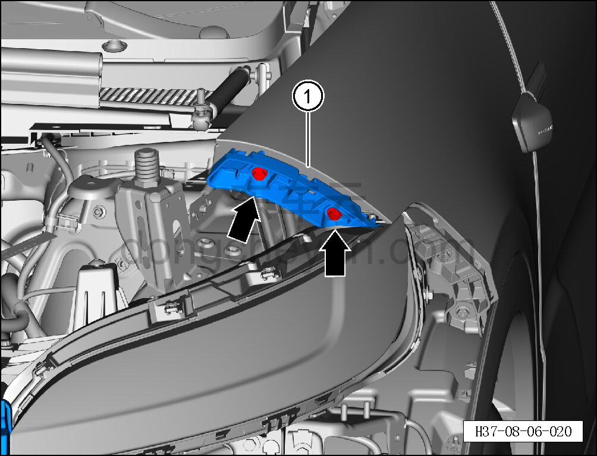

# Снятие и установка левого верхнего монтажного кронштейна переднего бампера

> Внутренняя и внешняя отделка › Наружные элементы отделки › Система бамперов и решёток  
> Оригинал: `拆卸与安装前保险杠左上安装座` · [dongcheyun 56746](https://dongcheyun.com/p/56746), страница `92b8e554fca547fdb29652aa6164e087` · [оглавление](../README.md)

**Порядок снятия**

**Примечание:**

**- Ниже описано снятие и установка левого верхнего монтажного кронштейна переднего бампера, правый выполняется по аналогии с левым.**

1. Выключите все электроприборы, отключите питание.

2. Выполните операцию обесточивания автомобиля для ремонта. См. [3.1.4.1 Обесточивание автомобиля](../03-техническое-обслуживание/005-обесточивание-автомобиля.md)

3. Снимите верхнюю часть переднего бампера в сборе. См. [8.6.3.20 Снятие и установка верхней части переднего бампера в сборе](180-снятие-и-установка-верхней-части-переднего-бампера-в.md)

4. Снимите левый верхний монтажный кронштейн переднего бампера.

a. Торцевой головкой на 10 мм выверните 2 крепёжных болта левого верхнего монтажного кронштейна переднего бампера.

Момент затяжки болта: 6±2 Н·м

b. Снимите левый верхний монтажный кронштейн переднего бампера ①.

**Примечание:**

**- При снятии и установке нижнего болта монтажного кронштейна бампера необходимо использовать карданный шарнир для торцевой головки.**

**Порядок установки**

Установка выполняется в обратном порядке.

**Внимание:**

**- После завершения установки проверьте зазоры; при несоответствии зазоров выполните установку повторно.**
