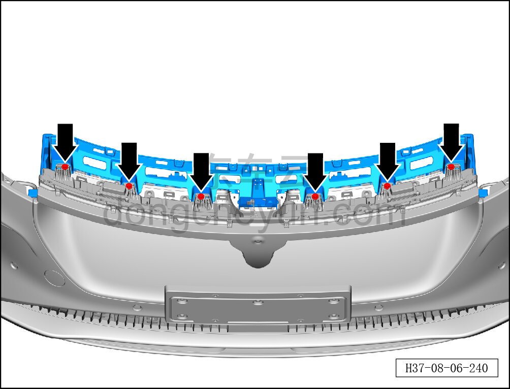
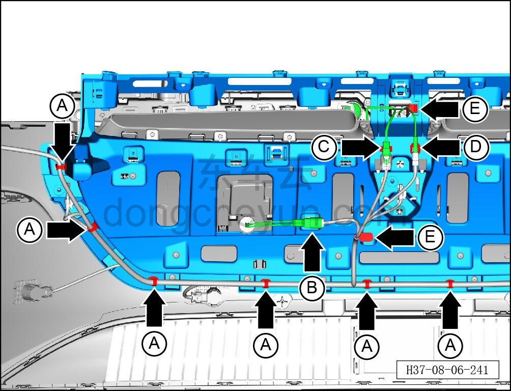
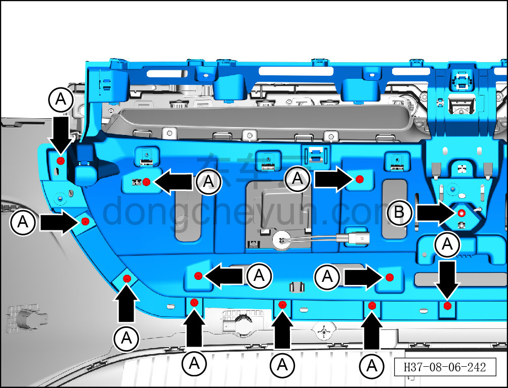
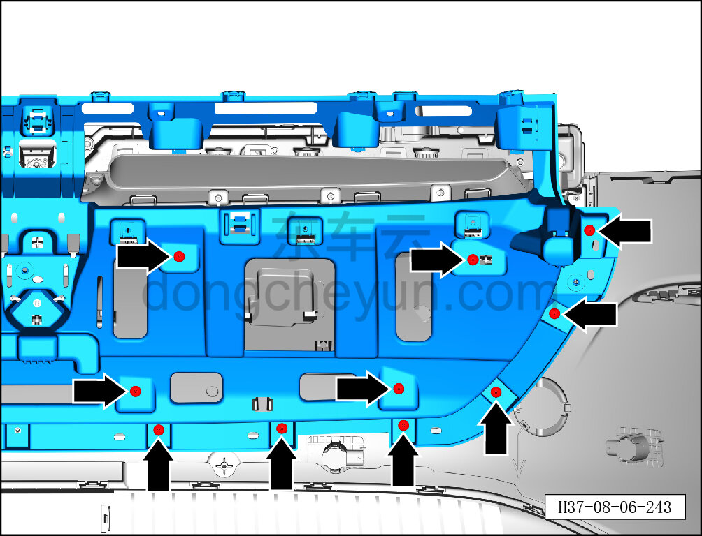
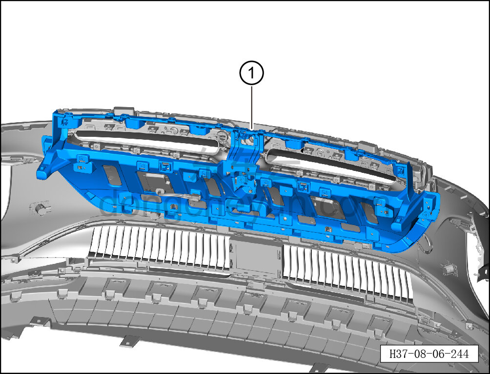

# Снятие и установка центральной опорной панели переднего бампера (светящаяся решётка)

> Внутренняя и внешняя отделка › Наружные элементы отделки › Система бамперов и решёток  
> Оригинал: `拆卸与安装前保险杠中支撑板（发光格栅）` · [dongcheyun 56746](https://dongcheyun.com/p/56746), страница `f2cbefc225c74141bff044547dfd9b75` · [оглавление](../README.md)

**Порядок снятия**

1. Выключите все электроприборы, отключите питание.

2. Выполните обесточивание автомобиля для ремонта. См. [3.1.4.1 Обесточивание автомобиля](../03-техническое-обслуживание/005-обесточивание-автомобиля.md)

3. Снимите передний бампер в сборе. См. [8.6.3.3 Снятие и установка переднего бампера в сборе](163-снятие-и-установка-переднего-бампера-в-сборе.md)

4. Снимите центральный кронштейн переднего бампера. См. [8.6.3.8 Снятие и установка центрального кронштейна переднего бампера](168-снятие-и-установка-центрального-кронштейна-переднего.md)

5. Снимите левый и правый верхние воздуховоды переднего бампера. См. [8.6.3.12 Снятие и установка левого верхнего воздуховода переднего бампера](172-снятие-и-установка-левого-верхнего-воздуховода.md)

6. Снимите центральную опорную панель переднего бампера.

a. Торцевой головкой на 10 мм выверните 6 крепёжных болтов сверху центральной опорной панели переднего бампера.

Момент затяжки болта: 4±0,5 Н·м

b. Съёмником обивки отсоедините 6 крепёжных защёлок A с левой стороны жгута проводов переднего бампера (всего с обеих сторон 10 защёлок).

c. Нажмите на фиксатор разъёма жгута проводов передней решётки, отсоедините разъём B жгута проводов передней решётки.

d. Нажмите на фиксатор разъёма жгута проводов переднего бампера, отсоедините разъём C жгута проводов переднего габаритного фонаря и отсоедините жгут проводов.

e. Нажмите на фиксатор разъёма жгута проводов переднего бампера, отсоедините разъём D жгута проводов передней камеры и отсоедините жгут проводов.

f. Отсоедините зажим E жгута проводов переднего бампера и жгута проводов передней камеры.

g. Крестовой отвёрткой выверните 11 крепёжных винтов A с левой стороны центральной опорной панели переднего бампера.

Момент затяжки винта: 1.5±0.5 Н·м

h. Торцевой головкой на 8 мм выверните крепёжную гайку B центральной опорной панели переднего бампера.

Момент затяжки гайки: 6±2 Н·м

i. Крестовой отвёрткой выверните 10 крепёжных винтов A с правой стороны центральной опорной панели переднего бампера.

Момент затяжки винта: 1.5±0.5 Н·м

j. Снимите центральную опорную панель переднего бампера ①.

**Порядок установки**

Установка выполняется в обратном порядке.

Внимание:

**- После завершения установки проверьте и убедитесь в исправной работе звукового сигнала, передних сигнальных фонарей, передней камеры; с помощью диагностического сканера проверьте наличие кодов неисправностей, при наличии — найдите причину и очистите коды неисправностей.**
