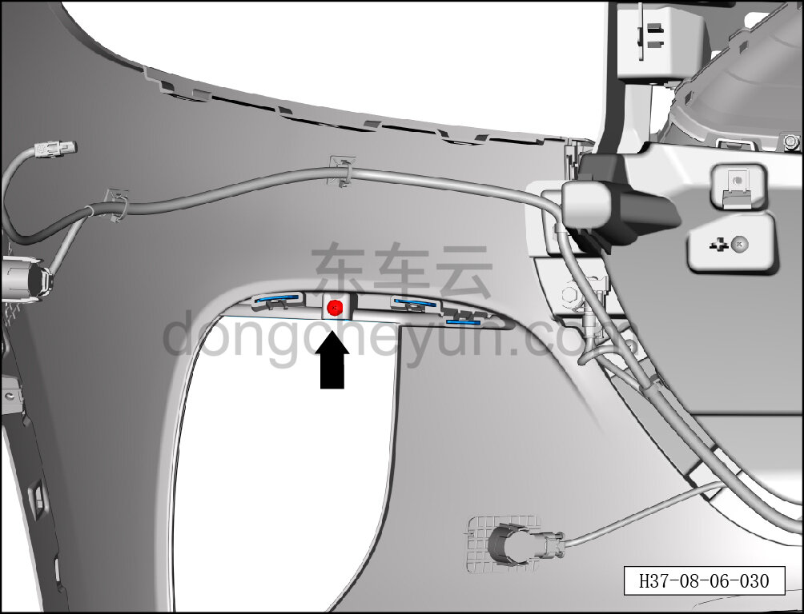
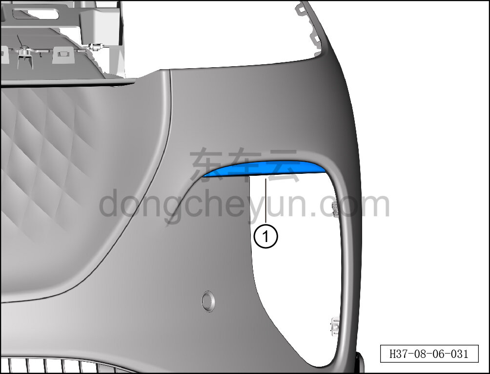

# Снятие и установка левой накладки переднего бампера

> Внутренняя и внешняя отделка › Наружные элементы отделки › Система бамперов и решёток  
> Оригинал: `拆卸与安装前保险杠左装饰板` · [dongcheyun 56746](https://dongcheyun.com/p/56746), страница `15bfaab658cb4fb99f6e1ce70d726426` · [оглавление](../README.md)

**Порядок снятия**

**Примечание:**

**- Ниже описано снятие и установка левой накладки переднего бампера, правая выполняется по аналогии с левой.**

1. Выключите все электроприборы, отключите питание.

2. Выполните операцию обесточивания автомобиля для ремонта. См. [3.1.4.1 Обесточивание автомобиля](../03-техническое-обслуживание/005-обесточивание-автомобиля.md)

3. Снимите передний бампер в сборе. См. [8.6.3.3 Снятие и установка переднего бампера в сборе](163-снятие-и-установка-переднего-бампера-в-сборе.md)

4. Снимите левую накладку переднего бампера.

a. Крестовой отвёрткой выверните крепёжный винт левой накладки переднего бампера.

Момент затяжки винта: 1.5±0.5 Н·м

b. Снимите левую накладку переднего бампера ①.

**Порядок установки**

Установка выполняется в обратном порядке.

**Внимание:**

**- После завершения установки проверьте и убедитесь в исправной работе звукового сигнала, передних сигнальных фонарей, передней камеры; с помощью диагностического сканера проверьте наличие кодов неисправностей, при наличии — найдите причину и очистите коды неисправностей.**
