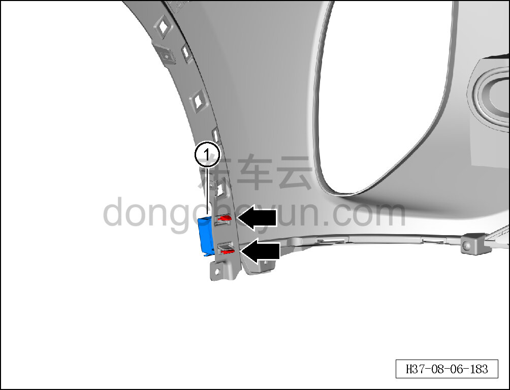

# Снятие и установка левой декоративной накладки переднего бампера

> Внутренняя и внешняя отделка › Наружные элементы отделки › Система бамперов и решёток  
> Оригинал: `拆卸与安装前保险杠左装饰条` · [dongcheyun 56746](https://dongcheyun.com/p/56746), страница `bb016c1078c0445db3ff1cbe7f264881` · [оглавление](../README.md)

**Порядок снятия**

**- Ниже описано снятие и установка левой декоративной накладки переднего бампера, правая выполняется по аналогии с левой.**

1. Выключите все электроприборы, отключите питание.

2. Выполните операцию обесточивания автомобиля для ремонта. См. [3.1.4.1 Обесточивание автомобиля](../03-техническое-обслуживание/005-обесточивание-автомобиля.md)

3. Снимите передний бампер в сборе. См. [8.6.3.3 Снятие и установка переднего бампера в сборе](163-снятие-и-установка-переднего-бампера-в-сборе.md)

4. Снимите нижнюю облицовку переднего бампера. См. [8.6.3.10 Снятие и установка нижней облицовки переднего бампера](170-снятие-и-установка-нижней-облицовки-переднего-бампера.md)

5. Снимите левую декоративную накладку переднего бампера.

a. Съёмником обивки отсоедините 2 крепёжные защёлки левой декоративной накладки переднего бампера в сборе.

b. Снимите левую декоративную накладку переднего бампера ①.

**Порядок установки**

Установка выполняется в обратном порядке.

**Внимание:**

**- Проверьте крепёжные защёлки на повреждения и при необходимости замените их.**

**- После завершения установки проверьте и убедитесь в исправной работе звукового сигнала, передних сигнальных фонарей, передней камеры; с помощью диагностического сканера проверьте наличие кодов неисправностей, при наличии — найдите причину и очистите коды неисправностей.**
