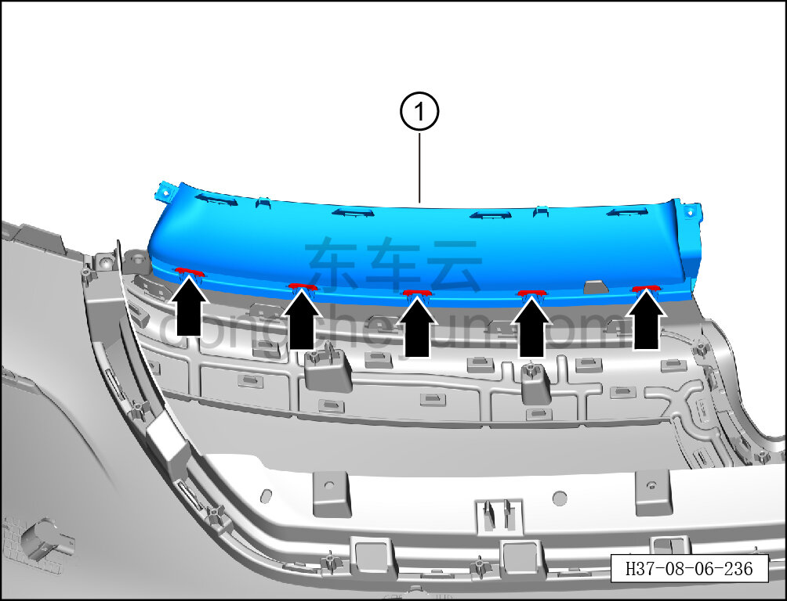

# Снятие и установка левой декоративной накладки передней решётки (несветящаяся решётка)

> Внутренняя и внешняя отделка › Наружные элементы отделки › Система бамперов и решёток  
> Оригинал: `拆卸与安装前格栅左装饰条（非发光格栅）` · [dongcheyun 56746](https://dongcheyun.com/p/56746), страница `551d50c232954f168f7a7f3ad14b30a9` · [оглавление](../README.md)

**Порядок снятия**

**Примечание:**

**- Ниже описано снятие и установка левой декоративной накладки передней решётки, правая выполняется по аналогии с левой.**

1. Выключите все электроприборы, отключите питание.

2. Выполните обесточивание автомобиля для ремонта. См. [3.1.4.1 Обесточивание автомобиля](../03-техническое-обслуживание/005-обесточивание-автомобиля.md)

3. Снимите передний бампер в сборе. См. [8.6.3.3 Снятие и установка переднего бампера в сборе](163-снятие-и-установка-переднего-бампера-в-сборе.md)

4. Снимите центральный кронштейн переднего бампера. См. [8.6.3.8 Снятие и установка центрального кронштейна переднего бампера](168-снятие-и-установка-центрального-кронштейна-переднего.md)

5. Снимите центральную опорную панель переднего бампера. См. [8.6.3.6 Снятие и установка центральной опорной панели переднего бампера (несветящаяся решётка)](166-снятие-и-установка-центральной-опорной-панели.md)

6. Снимите передний габаритный фонарь. См. [9.9.3.3 Снятие и установка переднего габаритного фонаря](../09-электрическая-и-электронная-система/079-снятие-и-установка-переднего-габаритного-огня.md)

7. Снимите переднюю накладку переднего габаритного фонаря. См. [8.6.3.13 Снятие и установка передней накладки переднего габаритного фонаря (несветящаяся решётка)](173-снятие-и-установка-передней-накладки-переднего.md)

8. Снимите заднюю накладку переднего габаритного фонаря. См. [8.6.3.14 Снятие и установка задней накладки переднего габаритного фонаря (несветящаяся решётка)](174-снятие-и-установка-задней-накладки-переднего.md)

9. Снимите левую декоративную накладку передней решётки.

a. Съёмником обивки отожмите 7 крепёжных защёлок левой декоративной накладки передней решётки.

b. Снимите левую декоративную накладку передней решётки ①.

**Порядок установки**

Установка выполняется в обратном порядке.

**Внимание:**

**- После завершения установки проверьте и убедитесь в исправной работе звукового сигнала, передних сигнальных фонарей, передней камеры; с помощью диагностического сканера проверьте наличие кодов неисправностей, при наличии — найдите причину и очистите коды неисправностей.**
