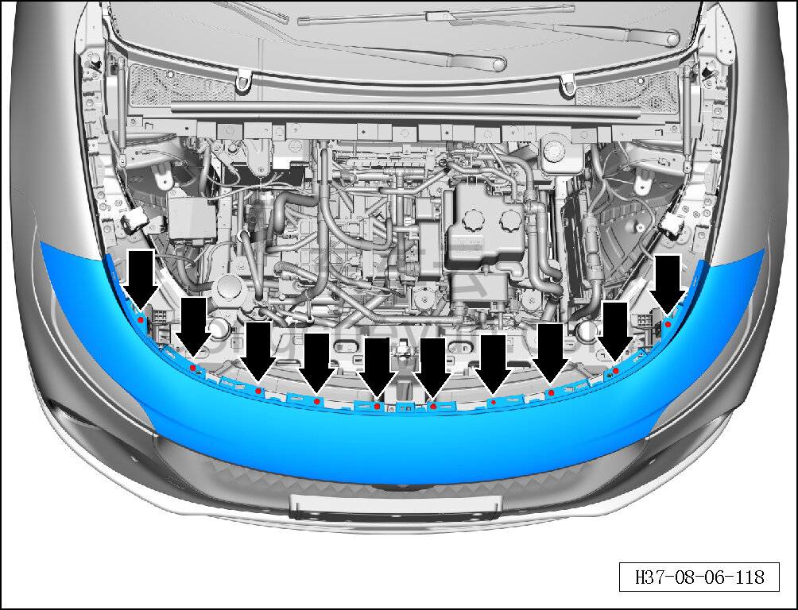
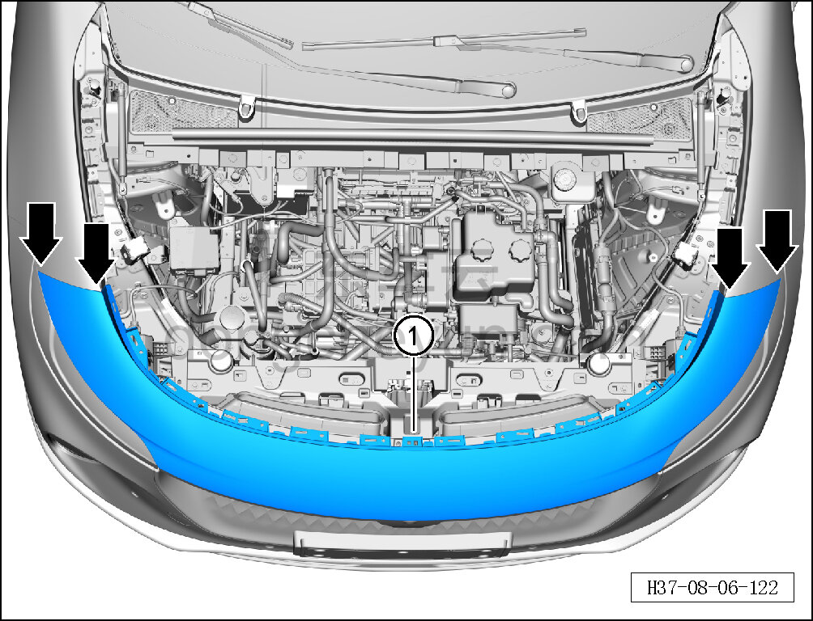

# Снятие и установка верхней части переднего бампера в сборе

> Внутренняя и внешняя отделка › Наружные элементы отделки › Система бамперов и решёток  
> Оригинал: `拆卸与安装前保险杠上部总成` · [dongcheyun 56746](https://dongcheyun.com/p/56746), страница `44ebf60053344387b2ec4140b6890f0b` · [оглавление](../README.md)

**Порядок снятия**

1. Выключите все электроприборы, отключите питание.

2. Выполните операцию обесточивания автомобиля для ремонта. См. [3.1.4.1 Обесточивание автомобиля](../03-техническое-обслуживание/005-обесточивание-автомобиля.md)

3. Снимите декоративную накладку моторного отсека. См. [8.6.6.10 Снятие и установка декоративной накладки моторного отсека](223-снятие-и-установка-декоративной-накладки-моторного.md)

4. Снимите верхнюю часть переднего бампера в сборе.

a. Головкой T25 выверните 10 крепёжных винтов верхней части переднего бампера в сборе.

Момент затяжки винта: 1.5±0.5 Н·м

b. Съёмником обивки отсоедините защёлки соединения верхней части переднего бампера в сборе с левым и правым верхними монтажными кронштейнами переднего бампера.

c. Снимите верхнюю часть переднего бампера в сборе ①.

**Внимание:**

**- При отжиме защёлок можно подложить под инструмент защитную накладку, чтобы не повредить лакокрасочное покрытие в процессе отжима.**

**Порядок установки**

Установка выполняется в обратном порядке.

**Внимание:**

**-Проверьте крепёжные клипсы на отсутствие повреждений, при необходимости замените.**

**- После завершения установки проверьте, что верхняя часть переднего бампера в сборе установлена без перекоса и не отходит.**
