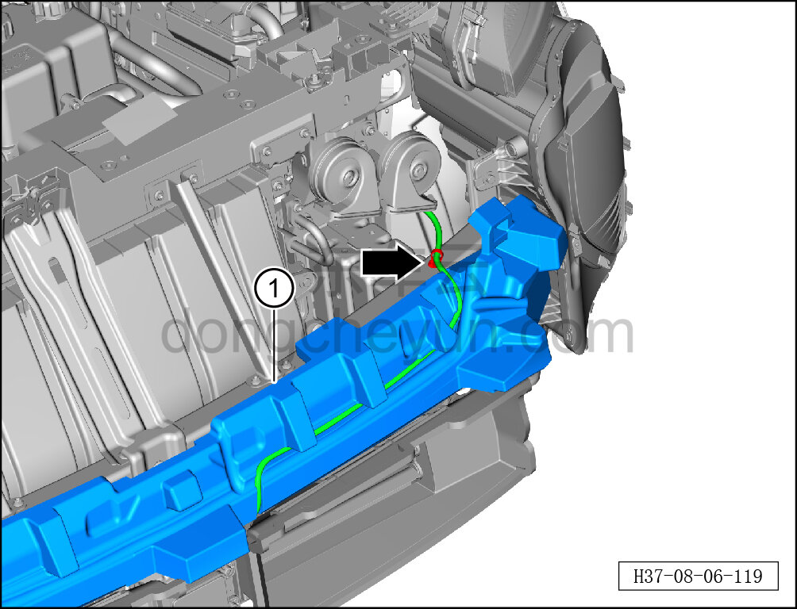

# Снятие и установка энергопоглощающего блока переднего бампера

> Внутренняя и внешняя отделка › Наружные элементы отделки › Система бамперов и решёток  
> Оригинал: `拆卸与安装前保险杠吸能块` · [dongcheyun 56746](https://dongcheyun.com/p/56746), страница `f65f360eb9a0402fa75abe397c38417f` · [оглавление](../README.md)

**Порядок снятия**

1. Выключите все электроприборы, отключите питание.

2. Выполните операцию обесточивания автомобиля для ремонта. См. [3.1.4.1 Обесточивание автомобиля](../03-техническое-обслуживание/005-обесточивание-автомобиля.md)

3. Снимите передний бампер в сборе. См. [8.6.3.3 Снятие и установка переднего бампера в сборе](163-снятие-и-установка-переднего-бампера-в-сборе.md)

4. Снимите энергопоглощающий блок переднего бампера.

a. Съёмником обивки отсоедините крепёжные защёлки жгута проводов переднего отсека.

b. Отсоедините жгут проводов переднего отсека от энергопоглощающего блока переднего бампера.

c. Извлеките энергопоглощающий блок переднего бампера ①.

**Порядок установки**

Установка выполняется в обратном порядке.

**Внимание:**

**- После завершения установки проверьте и убедитесь в исправной работе звукового сигнала, передних сигнальных фонарей, передней камеры; с помощью диагностического сканера проверьте наличие кодов неисправностей, при наличии — найдите причину и очистите коды неисправностей.**
