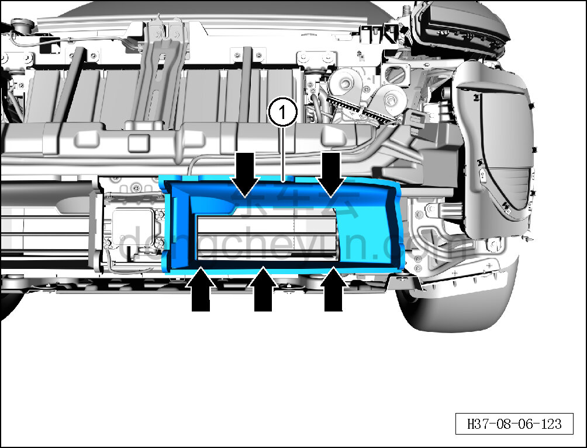

# Снятие и установка левого переднего направляющего короба активной решётки воздухозаборника

> Внутренняя и внешняя отделка › Наружные элементы отделки › Система бамперов и решёток  
> Оригинал: `拆卸与安装主动进气格栅左前导流框` · [dongcheyun 56746](https://dongcheyun.com/p/56746), страница `17bc86992fe848b0ac5b64fafbc6f1f8` · [оглавление](../README.md)

**Порядок снятия**

**Примечание:**

**- Ниже описано снятие и установка левого переднего направляющего короба активной решётки воздухозаборника, правый выполняется по аналогии с левым.**

1. Выключите все электроприборы, отключите питание.

2. Выполните операцию обесточивания автомобиля для ремонта. См. [3.1.4.1 Обесточивание автомобиля](../03-техническое-обслуживание/005-обесточивание-автомобиля.md)

3. Снимите передний бампер в сборе. См. [8.6.3.3 Снятие и установка переднего бампера в сборе](163-снятие-и-установка-переднего-бампера-в-сборе.md)

4. Снимите левый передний направляющий короб активной решётки воздухозаборника.

a. Съёмником обивки отсоедините 5 крепёжных защёлок левого переднего направляющего короба активной решётки воздухозаборника.

b. Снимите левый передний направляющий короб активной решётки воздухозаборника ①.

**Порядок установки**

Установка выполняется в обратном порядке.

**Внимание:**

**- Проверьте крепёжные защёлки на повреждения и при необходимости замените их.**

**- После завершения установки проверьте и убедитесь в исправной работе звукового сигнала, передних сигнальных фонарей, передней камеры; с помощью диагностического сканера проверьте наличие кодов неисправностей, при наличии — найдите причину и очистите коды неисправностей.**
