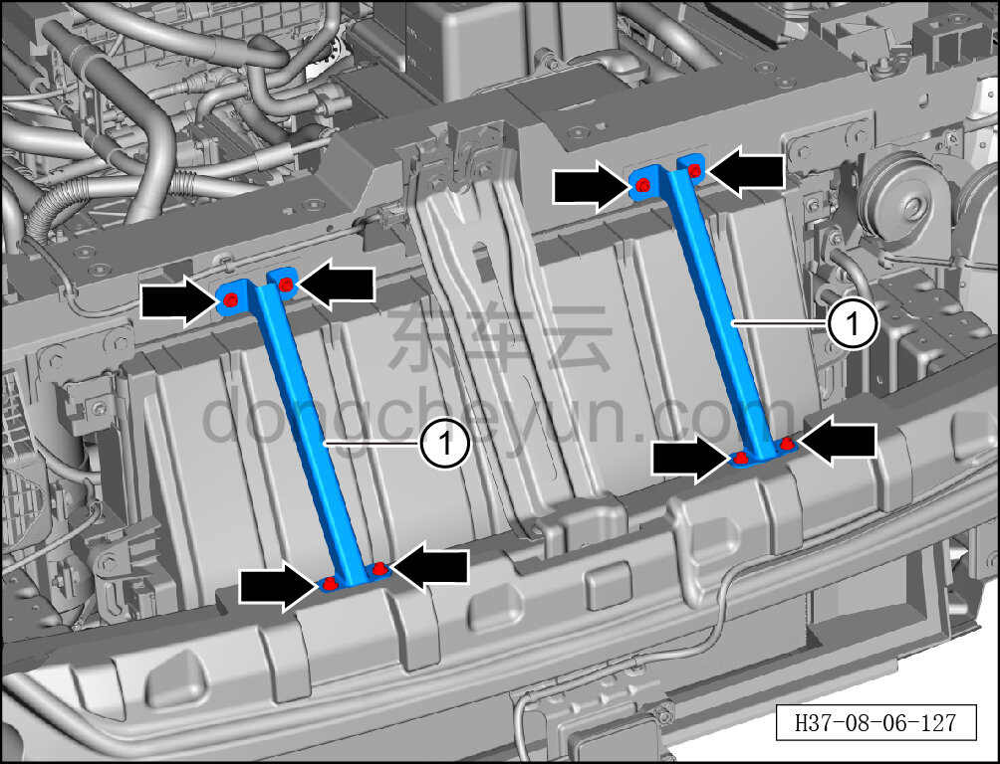
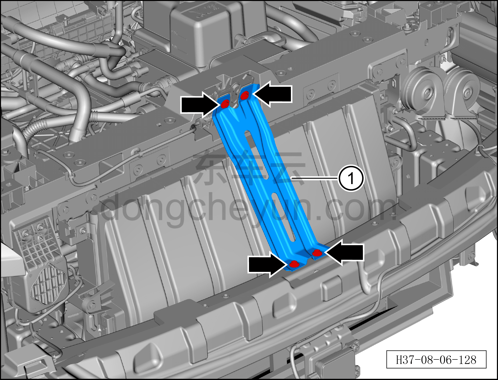
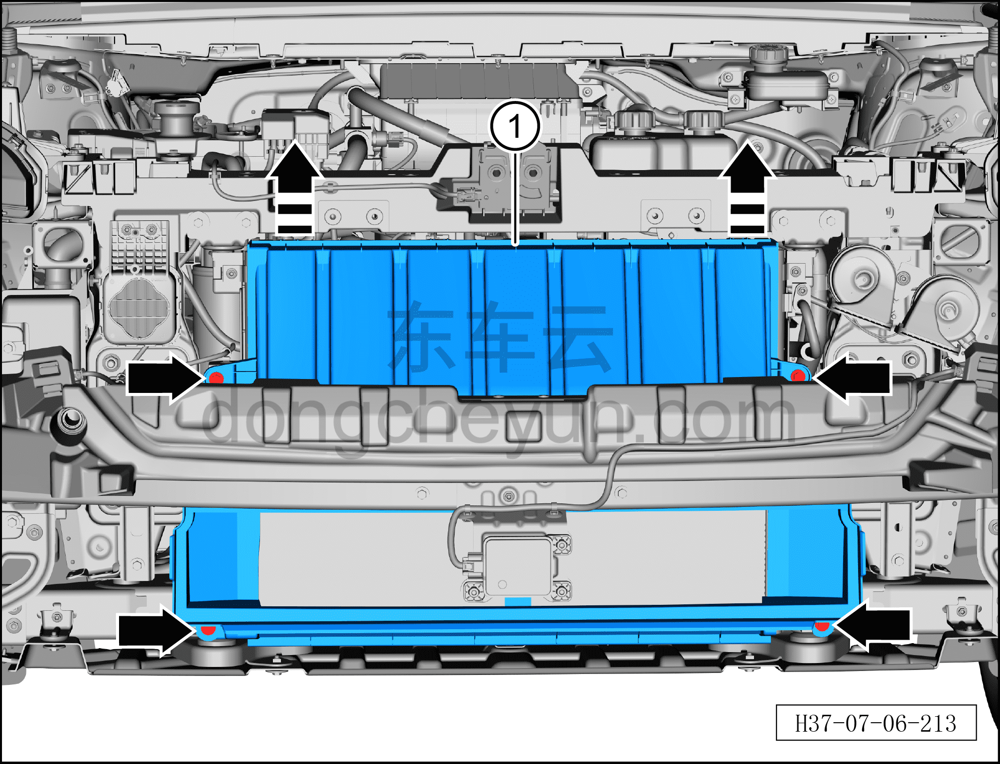

# Снятие и установка дефлектора в сборе

> Внутренняя и внешняя отделка › Наружные элементы отделки › Система бамперов и решёток  
> Оригинал: `拆卸与安装导风板总成` · [dongcheyun 56746](https://dongcheyun.com/p/56746), страница `0fbe0cc313c245a38ab222a2a7e40ae4` · [оглавление](../README.md)

**Порядок снятия**

1. Выключите все электроприборы, отключите питание.

2. Выполните операцию обесточивания автомобиля для ремонта. См. [3.1.4.1 Обесточивание автомобиля](../03-техническое-обслуживание/005-обесточивание-автомобиля.md)

3. Снимите передний бампер в сборе. См. [8.6.3.3 Снятие и установка переднего бампера в сборе](163-снятие-и-установка-переднего-бампера-в-сборе.md)

4. Снимите активную решётку воздухозаборника. См. [8.6.3.23 Снятие и установка активной решётки воздухозаборника](183-снятие-и-установка-активной-решётки-воздухозаборника.md)

5. Снимите дефлектор в сборе.

a. Торцевой головкой на 10 мм выверните 4 крепёжных болта опорного кронштейна радиатора переднего модуля.

Момент затяжки болтов: 10±1 Н·м

b. Снимите опорный кронштейн радиатора переднего модуля ①.

c. Торцевой головкой на 10 мм выверните 4 крепёжных болта кронштейна замка переднего модуля.

Момент затяжки болтов: 10±1 Н·м

d. Снимите кронштейн замка переднего модуля ①.

e. Торцевой головкой на 10 мм выверните 4 крепёжных болта дефлектора в сборе.

Момент затяжки болта: 6±1 Н·м

f. Выньте часть дефлектора в сборе, двигая её вверх в направлении стрелки, затем снимите дефлектор в сборе, опуская его вниз ①.

**Порядок установки**

Установка выполняется в обратном порядке.

**Внимание:**

**-Проверьте крепёжные клипсы на отсутствие повреждений, при необходимости замените.**

**- После завершения установки проверьте и убедитесь в исправной работе звукового сигнала, передних сигнальных фонарей, передней камеры; с помощью диагностического сканера проверьте наличие кодов неисправностей, при наличии — найдите причину и очистите коды неисправностей.**
