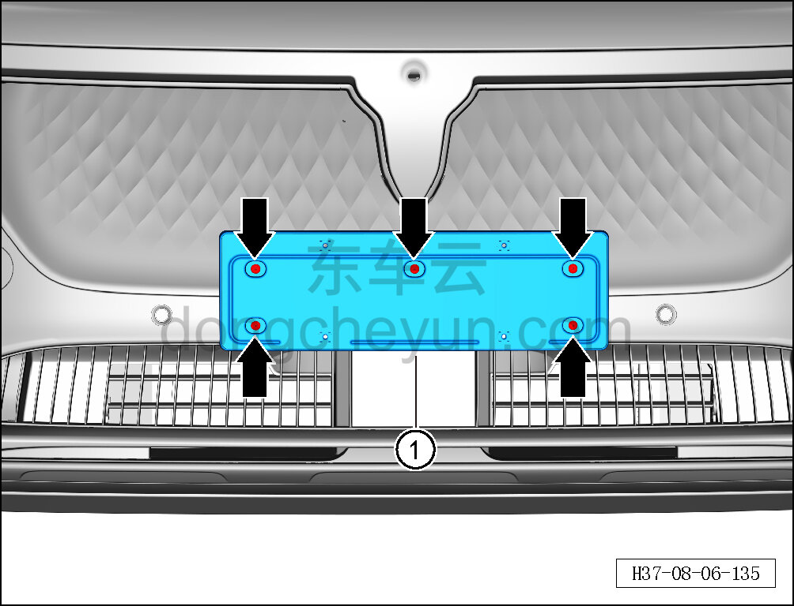

# Снятие и установка передней рамки номерного знака

> Внутренняя и внешняя отделка › Наружные элементы отделки › Система бамперов и решёток  
> Оригинал: `拆卸与安装前号牌架` · [dongcheyun 56746](https://dongcheyun.com/p/56746), страница `714de394aed948cb85c3e3b3863466cb` · [оглавление](../README.md)

**Порядок снятия**

1. Снимите переднюю рамку номерного знака.

a. Крестовой отвёрткой выверните 5 крепёжных винтов передней рамки номерного знака.

Момент затяжки винта: 1.5±0.5 Н·м

b. Снимите переднюю рамку номерного знака ①.

**Порядок установки**

Установка выполняется в обратном порядке.

**Примечание: **

**- Проверьте надёжность крепления передней рамки номерного знака.**
