# Снятие и установка заднего бампера в сборе

> Внутренняя и внешняя отделка › Наружные элементы отделки › Система бамперов и решёток  
> Оригинал: `拆卸与安装后保险杠总成` · [dongcheyun 56746](https://dongcheyun.com/p/56746), страница `aaaee15aa2c64d8ea1a65b27372bea10` · [оглавление](../README.md)

**Порядок снятия**

1. Выключите все электроприборы, отключите питание.

2. Выполните операцию обесточивания автомобиля для ремонта. См. [3.1.4.1 Обесточивание автомобиля](../03-техническое-обслуживание/005-обесточивание-автомобиля.md)

3. Снимите левую и правую передние накладки колёсных арок. См. [8.6.6.1 Снятие и установка левой передней накладки колёсной арки](214-снятие-и-установка-левой-передней-накладки-колёсной.md)

4. Снимите задний бампер в сборе.

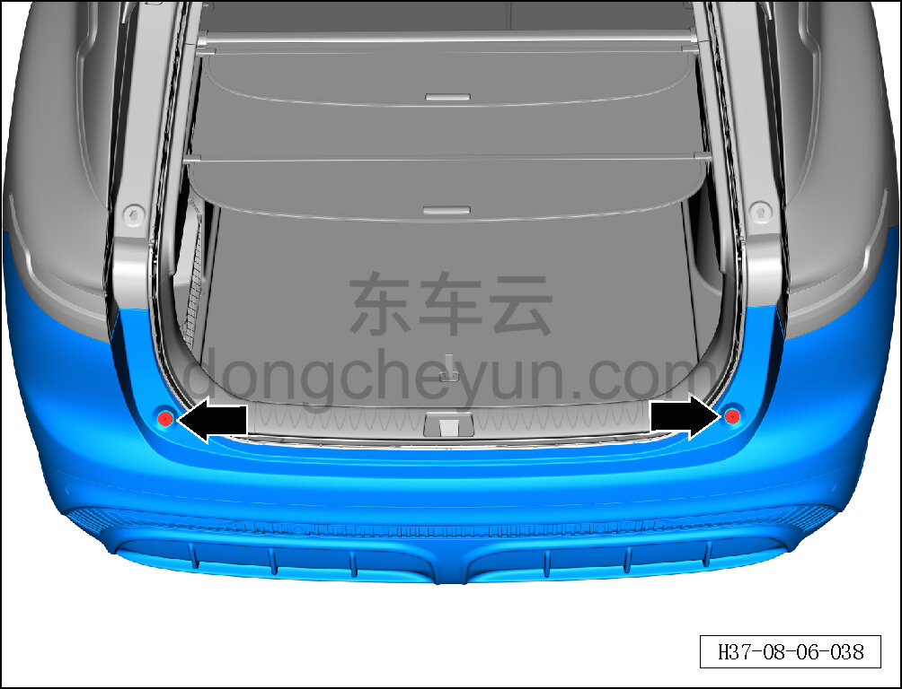

a. Головкой T30 выверните 2 крепёжных винта заднего бампера в сборе.

Момент затяжки винта: 2±0,2 Н·м

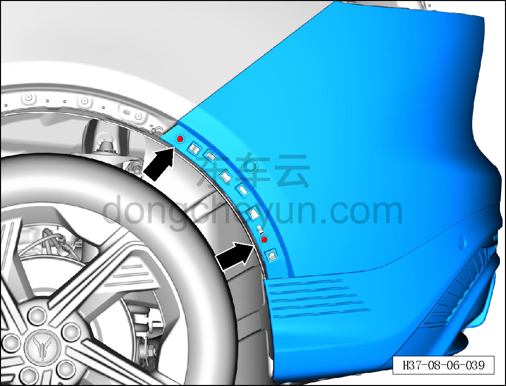

b. Крестовой отвёрткой выверните 2 крепёжных винта заднего бампера в сборе.

Момент затяжки винта: 2±0,2 Н·м

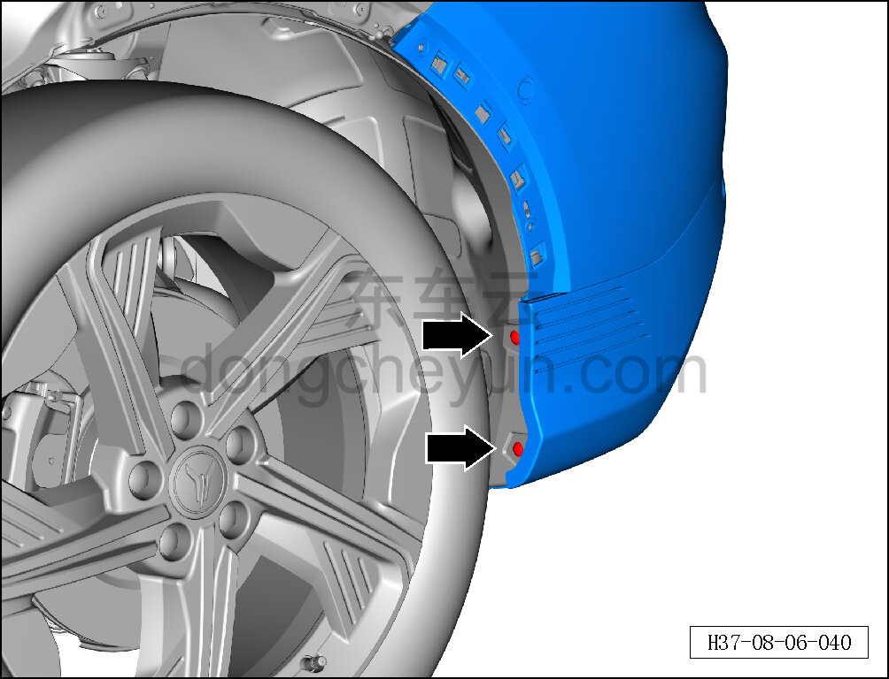

c. Головкой T25 выверните 2 крепёжных винта заднего бампера в сборе.

Момент затяжки винта: 2±0,2 Н·м

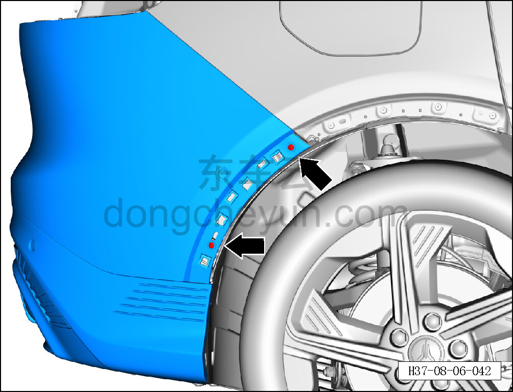

d. Крестовой отвёрткой выверните 2 крепёжных винта заднего бампера в сборе.

Момент затяжки винта: 2±0,2 Н·м

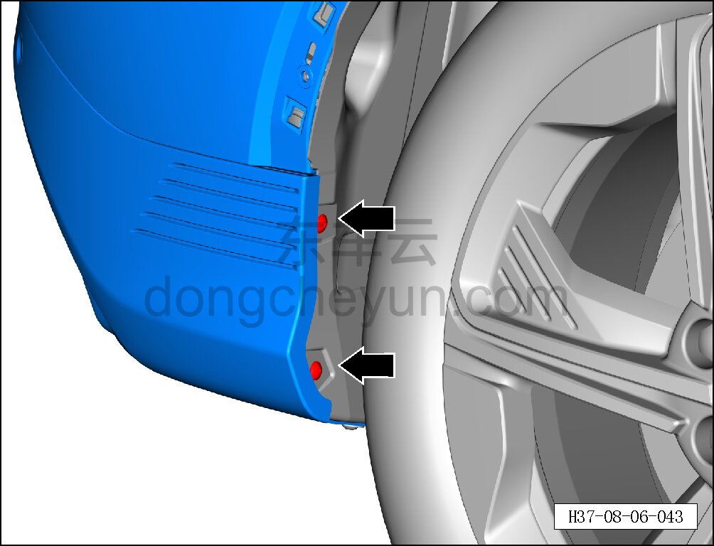

e. Головкой T25 выверните 2 крепёжных винта заднего бампера в сборе.

Момент затяжки винта: 2±0,2 Н·м

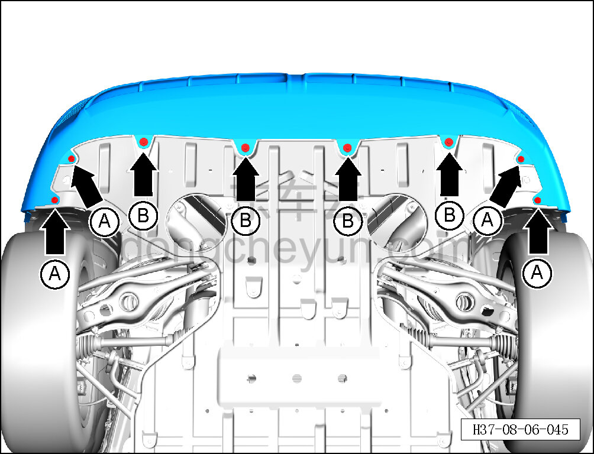

f. Головкой T25 выверните 4 крепёжных винта A заднего бампера в сборе.

Момент затяжки винта: 2±0,2 Н·м

g. Торцевой головкой на 10 мм выверните 4 крепёжных болта B заднего бампера в сборе.

Момент затяжки болта: 4±1 Н·м

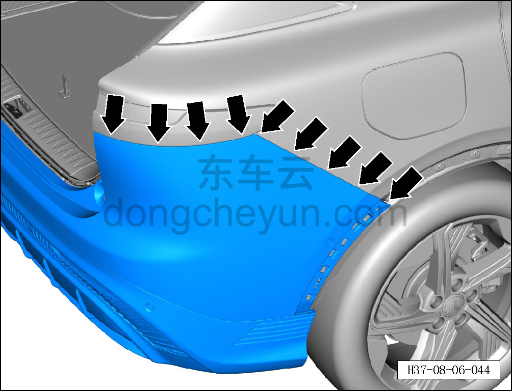

h. Вдвоём приподнимите нижнюю часть заднего бампера в сборе снизу вверх, отсоедините правую сторону заднего бампера в сборе наружу, чтобы паз отделился от посадочного места.

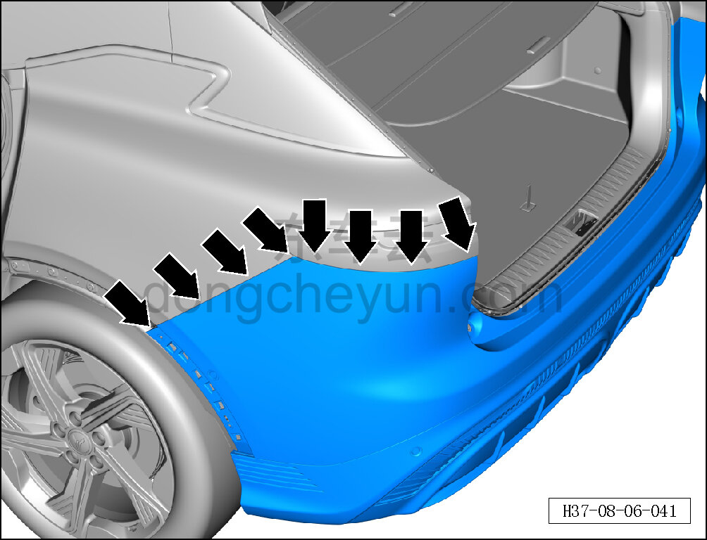

i. Вдвоём приподнимите нижнюю часть заднего бампера в сборе снизу вверх, отсоедините левую сторону заднего бампера в сборе наружу, чтобы паз отделился от посадочного места.

**Внимание:**

**- При отделении заднего бампера в сборе от кузова категорически запрещается применять силу, иначе это приведёт к повреждению бампера или посадочного места бампера.**

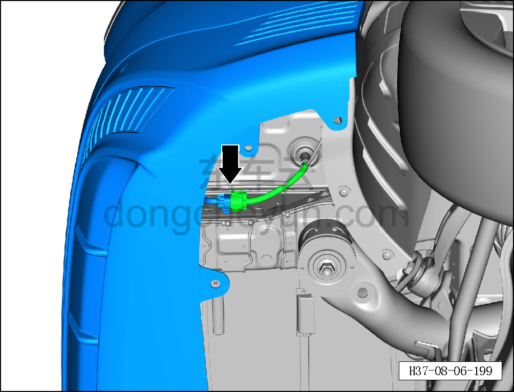

j. После отделения заднего бампера от кузова один человек удерживает задний бампер, второй нажимает на фиксаторы разъёма с обоих концов и отсоединяет разъём соединения жгута проводов заднего бампера с жгутом проводов кузова.

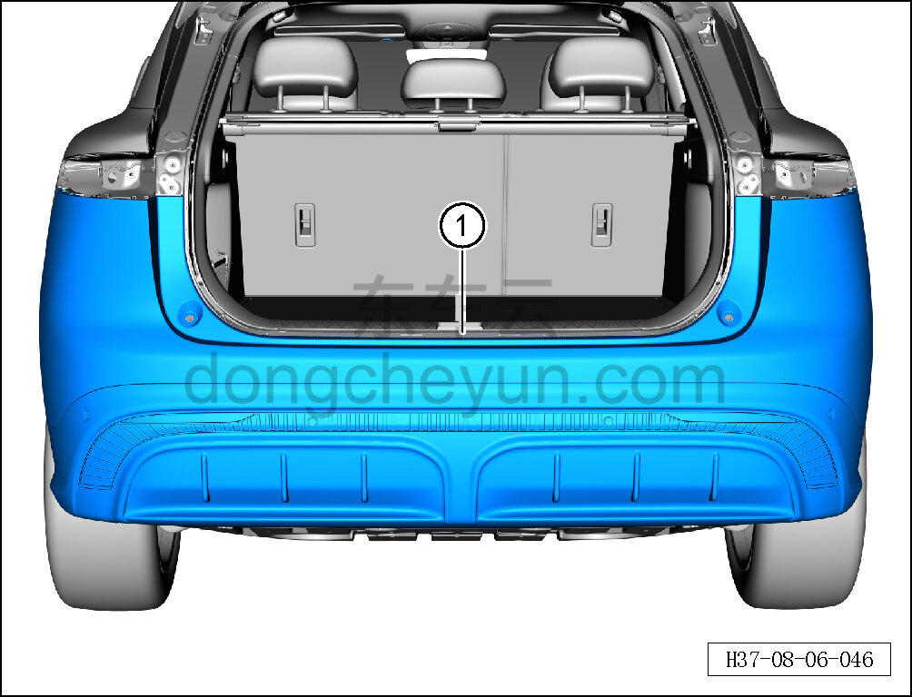

k. Снимите задний бампер в сборе ①.

**Порядок установки **

Установка выполняется в обратном порядке.

**Внимание:**

**- При замене бампера на новый необходимо снять с него навесные элементы, а также специальным инструментом просверлить отверстия в центре маркировки на новом бампере в месте установки радара.**

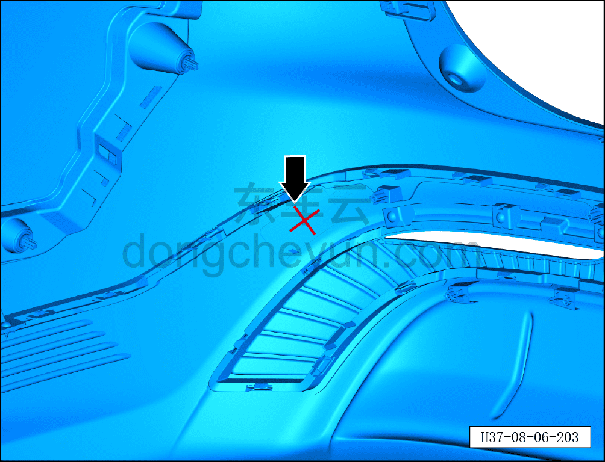

a. Электродрелью просверлите базовое отверстие в центре маркировки на облицовке заднего бампера, затем специальным инструментом произведите вырезание по контуру маркировки, вырезав монтажное отверстие для радара.

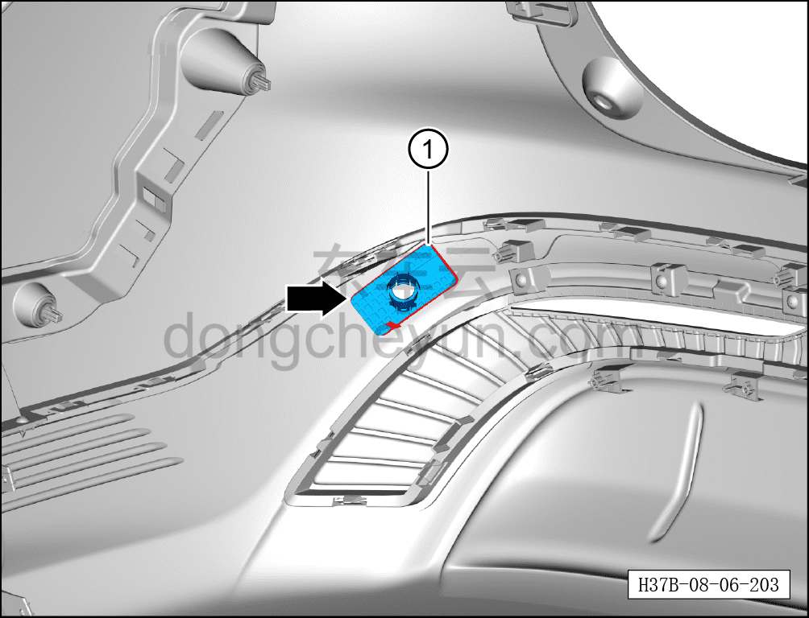

b. После вырезания монтажного отверстия для радара установите задний кронштейн радара ① в положение установки.

**Внимание:**

**- Перед установкой очистите соответствующее место приклеивания на 3M-скотч 50%-ным раствором изопропилового спирта; изопропиловый спирт можно заменить обычным спиртом; приклеивание производить только после испарения растворителя.**

**- Перед установкой нанесите на зону крепления кронштейна необходимое количество грунтовки, тип грунтовки: 3M 94#.**

**- Перед установкой слегка прогрейте фиксирующий клей заднего кронштейна радара строительным феном.**

**- После установки прижмите зажимом или грузом на некоторое время, чтобы не снизилась прочность склеивания.**

**- После завершения установки убедитесь в надёжности крепления заднего кронштейна радара.**

**-Проверьте крепёжные клипсы на отсутствие повреждений, при необходимости замените.**

**- После завершения установки проверьте нормальность зазоров заднего бампера.**

**- Подключите минусовой провод АКБ, проверьте и убедитесь в исправной работе системы автоматической парковки.**
