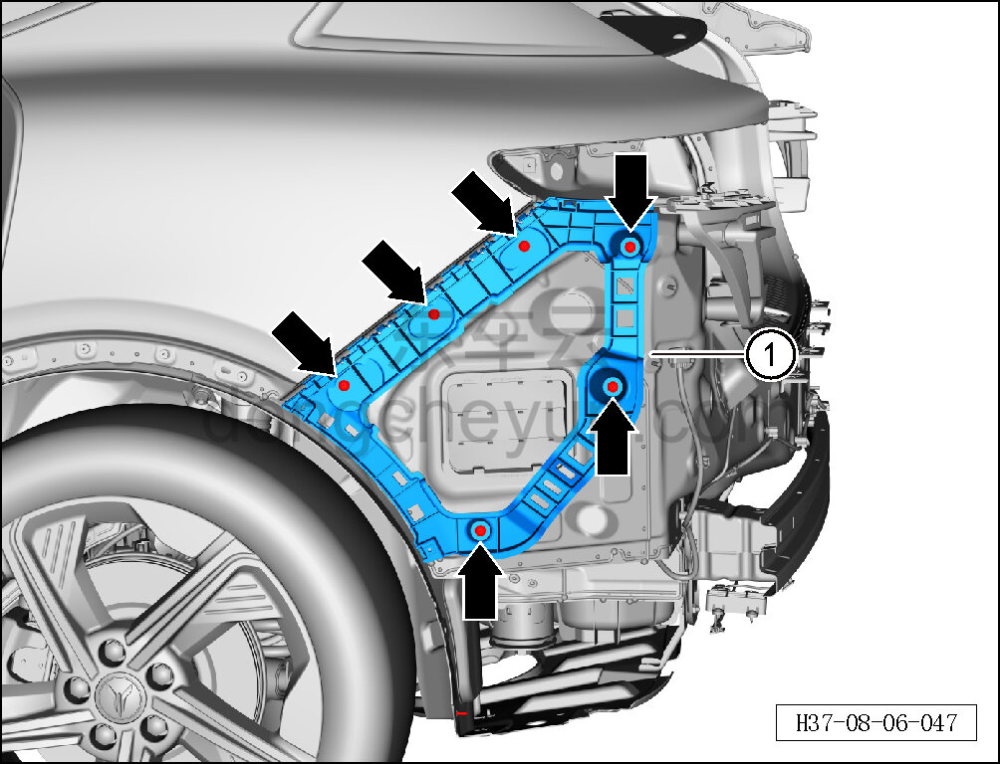

# Снятие и установка левого монтажного кронштейна заднего бампера

> Внутренняя и внешняя отделка › Наружные элементы отделки › Система бамперов и решёток  
> Оригинал: `拆卸与安装后保险杠左安装座` · [dongcheyun 56746](https://dongcheyun.com/p/56746), страница `0eb2167b3f5e44609a6dd34bd73e4a7d` · [оглавление](../README.md)

**Порядок снятия**

**Примечание:**

**- Ниже описано снятие и установка левого монтажного кронштейна переднего бампера, правый выполняется по аналогии с левым.**

1. Выключите все электроприборы, отключите питание.

2. Выполните операцию обесточивания автомобиля для ремонта. См. [3.1.4.1 Обесточивание автомобиля](../03-техническое-обслуживание/005-обесточивание-автомобиля.md)

3. Снимите задний бампер в сборе. См. [8.6.3.26 Снятие и установка заднего бампера в сборе](186-снятие-и-установка-заднего-бампера-в-сборе.md)

4. Снимите левый монтажный кронштейн заднего бампера.

a. Головкой T25 выверните 6 крепёжных винтов левого монтажного кронштейна заднего бампера.

Момент затяжки винта: 2±0,2 Н·м

b. Снимите левый монтажный кронштейн заднего бампера ①.

**Порядок установки**

Установка выполняется в обратном порядке.

**Внимание:**

**- После завершения установки подключите минусовой провод АКБ, проверьте и убедитесь в исправной работе системы автоматической парковки.**

**- Проверьте нормальность зазоров заднего бампера.**
