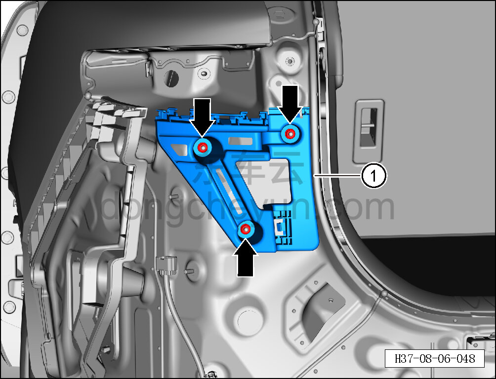

# Снятие и установка левого верхнего монтажного кронштейна заднего бампера

> Внутренняя и внешняя отделка › Наружные элементы отделки › Система бамперов и решёток  
> Оригинал: `拆卸与安装后保险杠左上安装座` · [dongcheyun 56746](https://dongcheyun.com/p/56746), страница `8d21cc017f294bf8b83f67d6dad126c7` · [оглавление](../README.md)

**Порядок снятия**

**Примечание:**

**- Ниже описано снятие и установка левого верхнего монтажного кронштейна заднего бампера, правый выполняется по аналогии с левым.**

1. Выключите все электроприборы, отключите питание.

2. Выполните операцию обесточивания автомобиля для ремонта. См. [3.1.4.1 Обесточивание автомобиля](../03-техническое-обслуживание/005-обесточивание-автомобиля.md)

3. Снимите задний бампер в сборе. См. [8.6.3.26 Снятие и установка заднего бампера в сборе](186-снятие-и-установка-заднего-бампера-в-сборе.md)

4. Выверните 2 болта крепления стороны крепления левого заднего комбинированного фонаря и отсоедините его. См. [9.9.4.1 Снятие и установка стороны крепления левого заднего комбинированного фонаря](../09-электрическая-и-электронная-система/080-снятие-и-установка-неподвижной-стороны-левого-заднего.md)

5. Снимите левый верхний монтажный кронштейн заднего бампера.

a. Торцевой головкой на 10 мм выверните 3 крепёжных болта левого верхнего монтажного кронштейна заднего бампера.

Момент затяжки болта: 4±1 Н·м

b. Снимите левый верхний монтажный кронштейн заднего бампера ①.

**Порядок установки**

Установка выполняется в обратном порядке.

**Внимание:**

**- После завершения установки подключите минусовой провод АКБ, проверьте и убедитесь в исправной работе системы автоматической парковки.**

**- Проверьте нормальность зазоров заднего бампера.**
