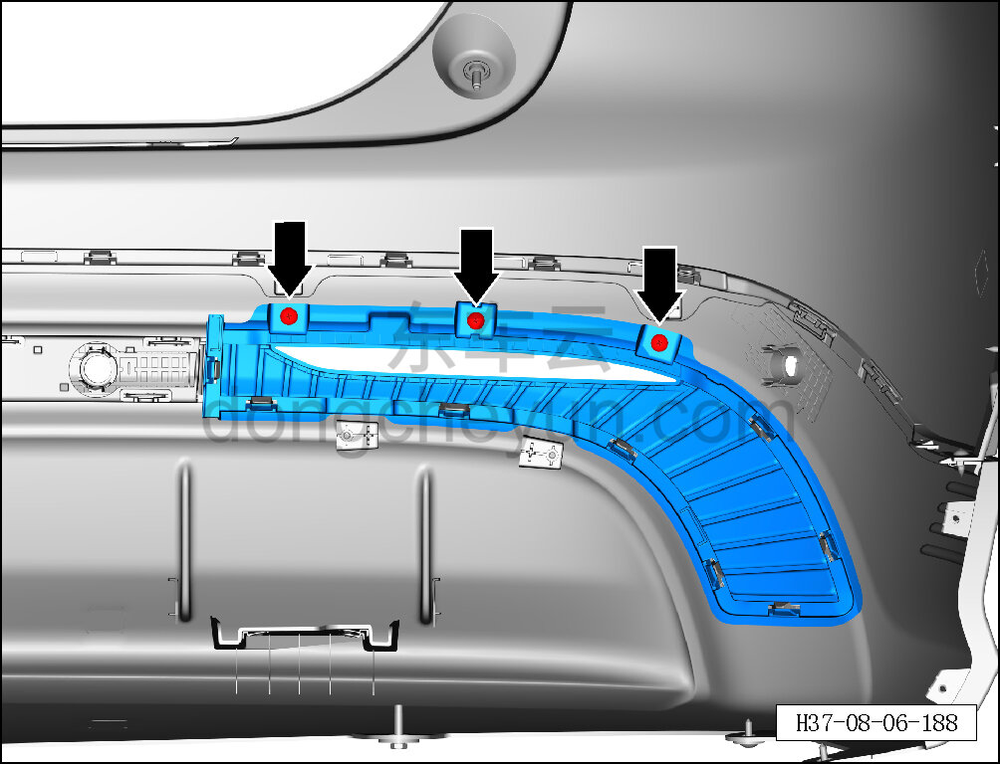
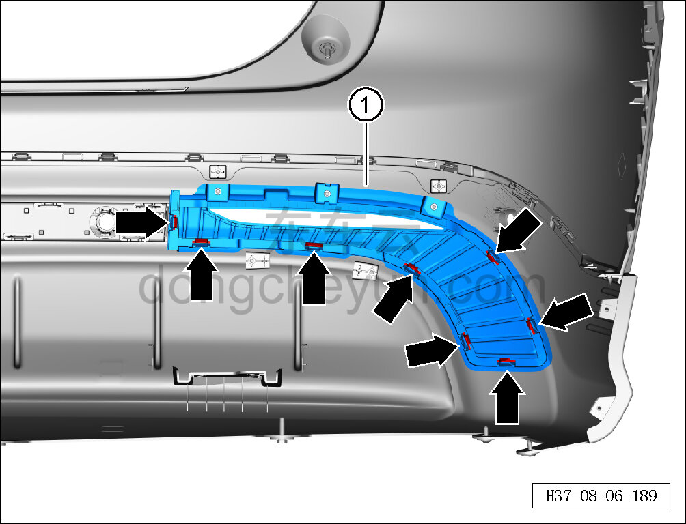

# Снятие и установка левой декоративной накладки заднего бампера

> Внутренняя и внешняя отделка › Наружные элементы отделки › Система бамперов и решёток  
> Оригинал: `拆卸与安装后保险杠左装饰条` · [dongcheyun 56746](https://dongcheyun.com/p/56746), страница `14f7dea3ab934b0db9fc0477284059f7` · [оглавление](../README.md)

**Порядок снятия**

**Примечание:**

**- Ниже описано снятие и установка левой декоративной накладки заднего бампера, правая выполняется по аналогии с левой.**

1. Выключите все электроприборы, отключите питание.

2. Выполните обесточивание автомобиля для ремонта. См. [3.1.4.1 Обесточивание автомобиля](../03-техническое-обслуживание/005-обесточивание-автомобиля.md)

3. Снимите задний бампер в сборе. См. [8.6.3.26 Снятие и установка заднего бампера в сборе](186-снятие-и-установка-заднего-бампера-в-сборе.md)

4. Снимите левую заднюю противотуманную фару. См. [9.9.6.1 Снятие и установка левой задней противотуманной фары](../09-электрическая-и-электронная-система/083-снятие-и-установка-левого-заднего-противотуманного.md)

5. Снимите левую декоративную накладку заднего бампера.

a. Крестовой отвёрткой выверните 3 крепёжных винта левой декоративной накладки заднего бампера.

Момент затяжки винта: 2±0,2 Н·м

b. Съёмником обивки отсоедините 8 крепёжных защёлок левой декоративной накладки заднего бампера.

c. Снимите левую декоративную накладку заднего бампера ①.

**Порядок установки**

Установка выполняется в обратном порядке.

**Внимание:**

**- После завершения установки подключите минусовой провод АКБ, проверьте и убедитесь в исправной работе системы автоматической парковки.**

**- Проверьте нормальность зазоров заднего бампера.**
