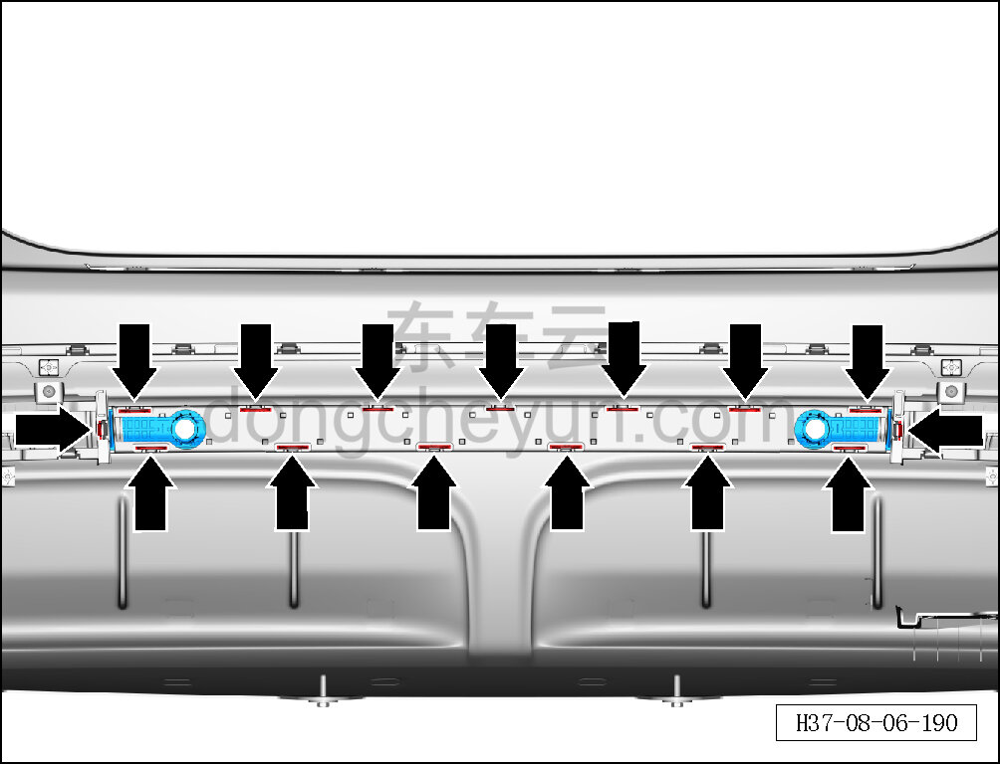
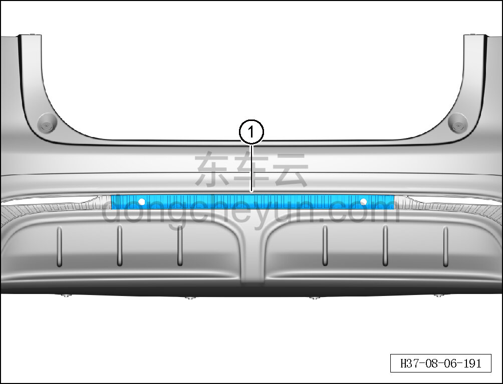

# Снятие и установка центральной декоративной накладки нижней облицовки заднего бампера

> Внутренняя и внешняя отделка › Наружные элементы отделки › Система бамперов и решёток  
> Оригинал: `拆卸与安装后保险杠下蒙皮中装饰条` · [dongcheyun 56746](https://dongcheyun.com/p/56746), страница `3a47308844fd4b72b78dd5e541284359` · [оглавление](../README.md)

**Порядок снятия**

1. Выключите все электроприборы, отключите питание.

2. Выполните обесточивание автомобиля для ремонта. См. [3.1.4.1 Обесточивание автомобиля](../03-техническое-обслуживание/005-обесточивание-автомобиля.md)

3. Снимите задний бампер в сборе. См. [8.6.3.26 Снятие и установка заднего бампера в сборе](186-снятие-и-установка-заднего-бампера-в-сборе.md)

4. Снимите ультразвуковой датчик парковки на центральной декоративной накладке нижней облицовки заднего бампера. См. [9.10.3.6 Снятие и установка ультразвукового датчика парковки (заднего)](../09-электрическая-и-электронная-система/100-снятие-и-установка-датчика-парковочного-радара-задний.md)

5. Снимите центральную декоративную накладку нижней облицовки заднего бампера.

a. Съёмником обивки отсоедините 15 крепёжных защёлок центральной декоративной накладки нижней облицовки заднего бампера.

b. Снимите центральную декоративную накладку нижней облицовки заднего бампера ①.

**Порядок установки**

Установка выполняется в обратном порядке.

**Внимание:**

**- После завершения установки подключите минусовой провод АКБ, проверьте и убедитесь в исправной работе системы автоматической парковки.**

**- Проверьте нормальность зазоров заднего бампера.**
