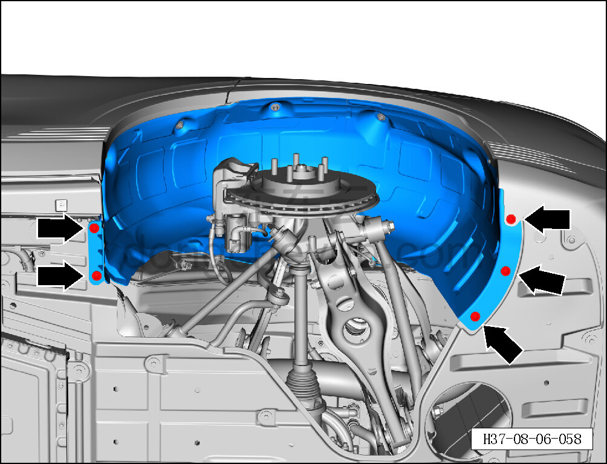
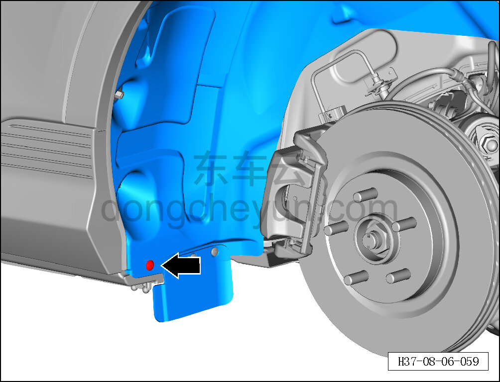
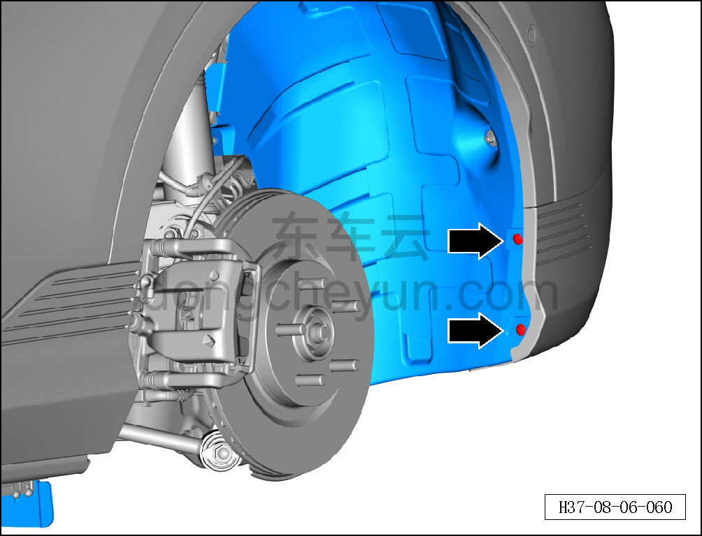
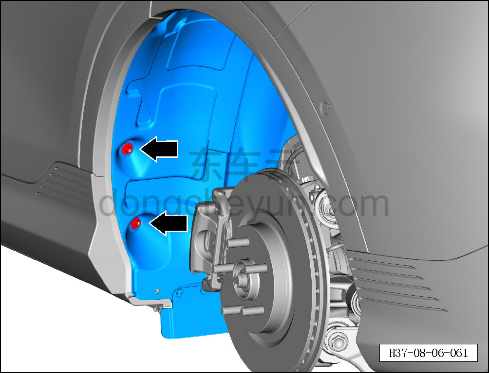
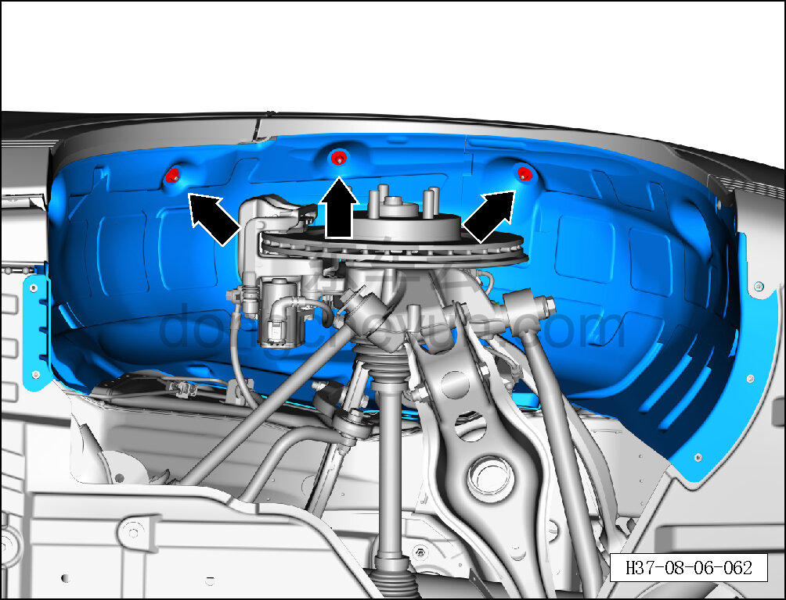
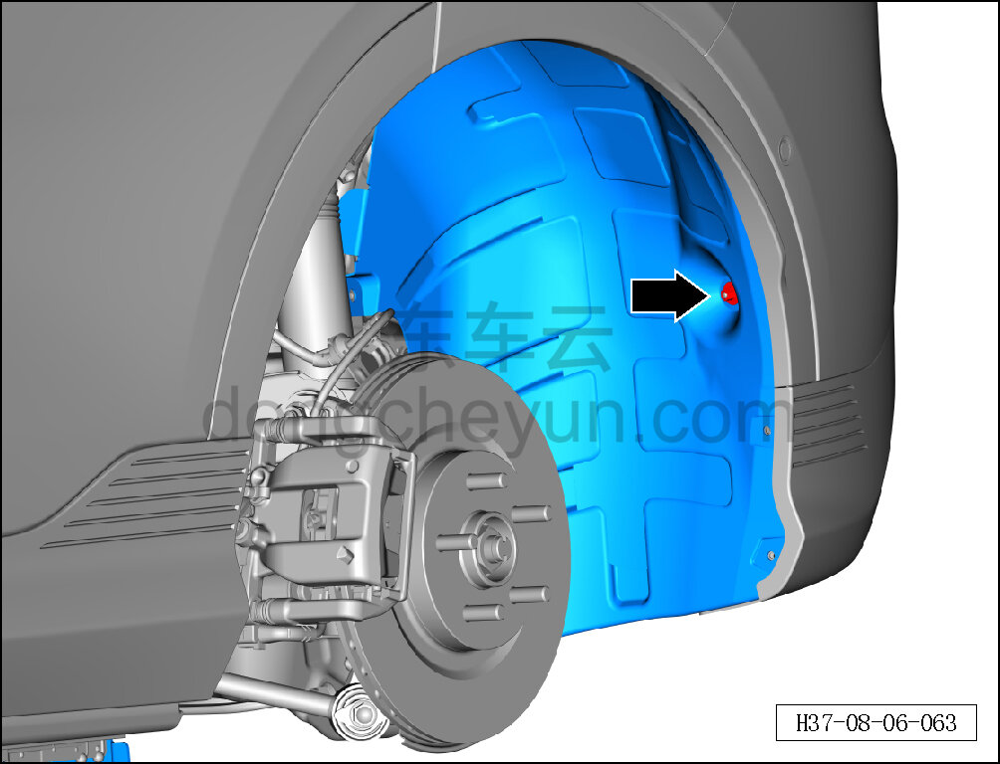
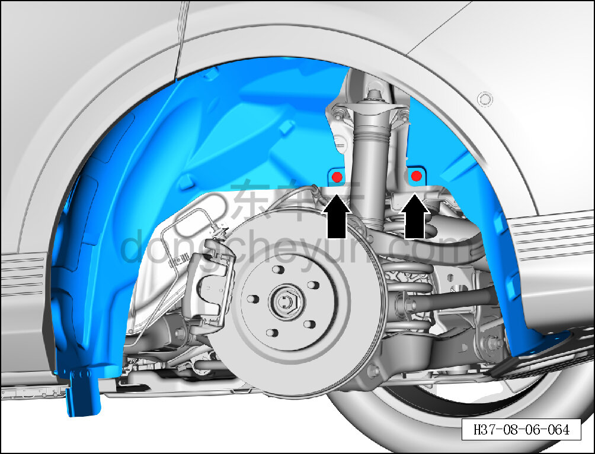
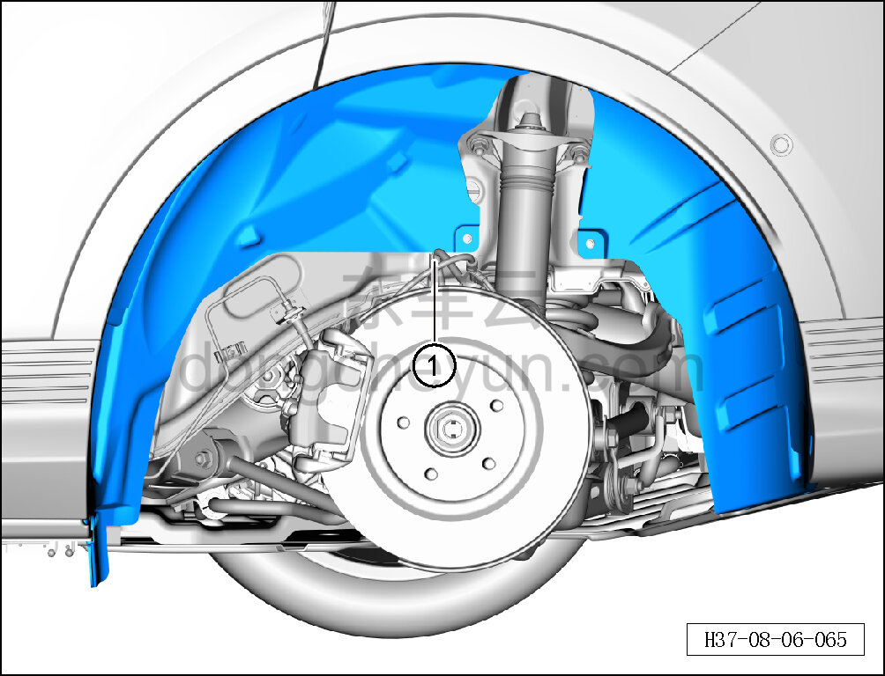

# Снятие и установка левого подкрылка задней колёсной арки

> Внутренняя и внешняя отделка › Наружные элементы отделки › Система вспомогательных устройств  
> Оригинал: `拆卸与安装左后轮罩挡泥板` · [dongcheyun 56746](https://dongcheyun.com/p/56746), страница `fee8288bb8dd4daf95bca7b4df4af3fe` · [оглавление](../README.md)

**Порядок снятия**

**Примечание:**

**- Ниже описано снятие и установка левого подкрылка задней колёсной арки, правый выполняется по аналогии с левым.**

1. Снимите левое переднее колесо. См. [6.5.8.1 Снятие и установка колеса](../06-система-шасси/064-снятие-и-установка-колеса.md)

2. Снимите левый подкрылок задней колёсной арки.

a. Головкой T25 выверните 5 крепёжных винтов левого подкрылка задней колёсной арки.

Момент затяжки винта: 1.5±0.5 Н·м

b. Головкой T25 выверните крепёжный винт левого подкрылка задней колёсной арки.

Момент затяжки винта: 1.5±0.5 Н·м

c. Головкой T25 выверните 2 крепёжных винта левого подкрылка задней колёсной арки.

Момент затяжки винта: 1.5±0.5 Н·м

d. Торцевой головкой на 11 мм выверните 2 пластиковые гайки левого подкрылка передней колёсной арки.

e. Торцевой головкой на 10 мм выверните 3 крепёжные гайки левого подкрылка задней колёсной арки.

Момент затяжки гайки: 1,5±0,5 Н·м

f. Торцевой головкой на 11 мм выверните пластиковую гайку левого подкрылка передней колёсной арки.

g. Съёмником обивки отсоедините 2 крепёжные защёлки левого подкрылка задней колёсной арки.

h. Снимите левый подкрылок задней колёсной арки ①.

**Порядок установки **

Установка выполняется в обратном порядке.

**Внимание:**

**-Проверьте крепёжные клипсы на отсутствие повреждений, при необходимости замените.**

**- После завершения установки проверьте, что подкрылок задней колёсной арки установлен правильно, без помех и не отходит.**
