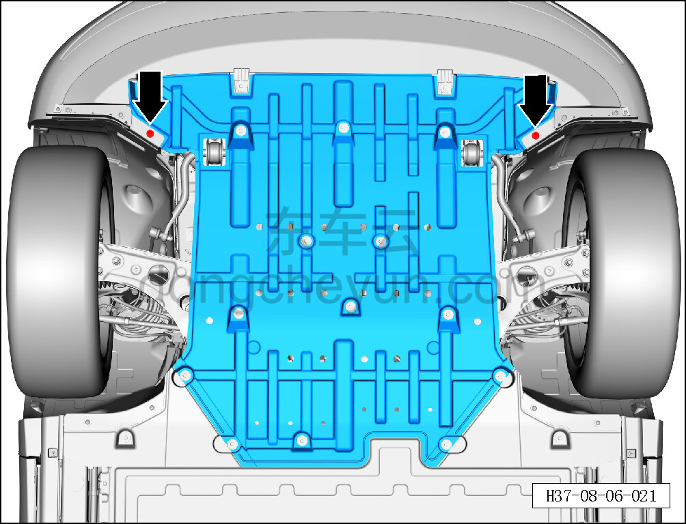
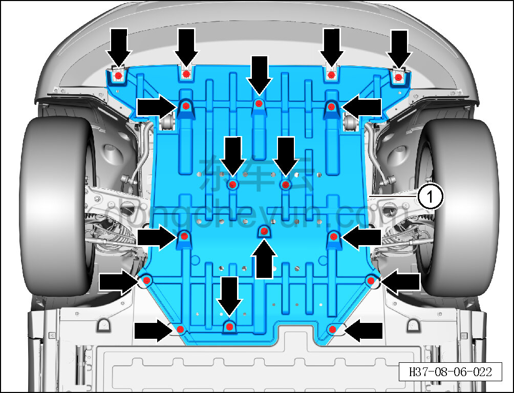

# Снятие и установка переднего нижнего защитного щитка

> Внутренняя и внешняя отделка › Наружные элементы отделки › Система вспомогательных устройств  
> Оригинал: `拆卸与安装前部下防护板` · [dongcheyun 56746](https://dongcheyun.com/p/56746), страница `ef447837f5c8461580bedec9222b0880` · [оглавление](../README.md)

**Порядок снятия**

1. Поднять автомобиль на подъёмнике.

2. Снимите передний нижний защитный щиток.

a. Головкой T25 выверните 2 крепёжных винта переднего нижнего защитного щитка.

Момент затяжки винта: 1.5±0.5 Н·м

b. Торцевой головкой на 10 мм выверните 17 крепёжных болтов переднего нижнего защитного щитка.

Момент затяжки болта: 4±1 Н·м

c. Снимите передний нижний защитный щиток ①.

**Порядок установки**

Установка выполняется в обратном порядке.

**Внимание:**

**- Не сгибайте и не заламывайте передний нижний защитный щиток.**

**- После завершения установки проверьте правильность установки, отсутствие люфта и посторонних шумов.**
