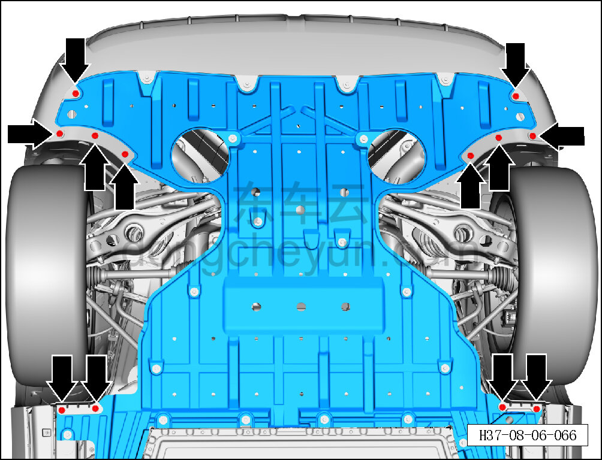
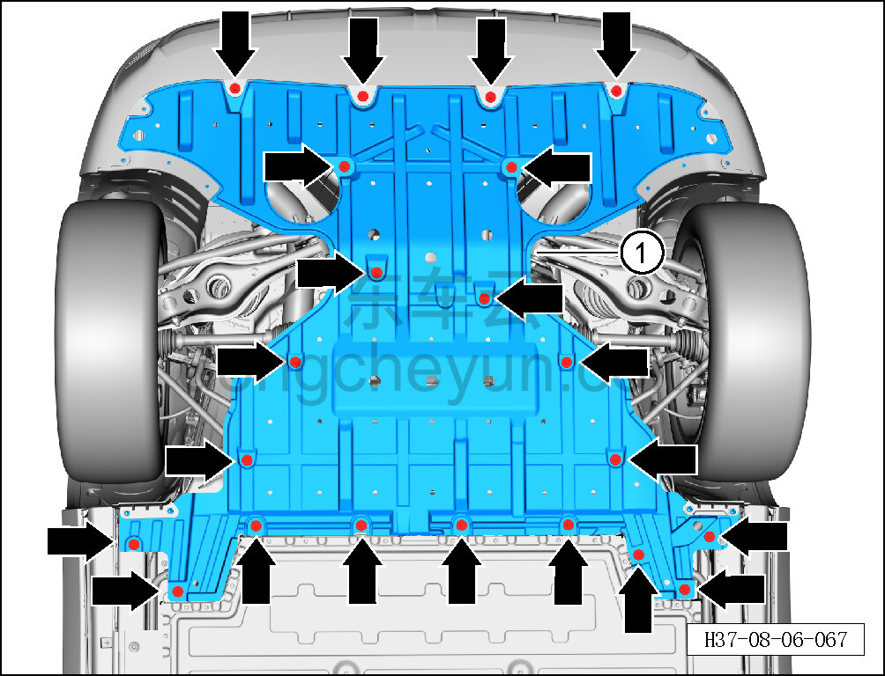

# Снятие и установка заднего нижнего защитного щитка

> Внутренняя и внешняя отделка › Наружные элементы отделки › Система вспомогательных устройств  
> Оригинал: `拆卸与安装后部下防护板` · [dongcheyun 56746](https://dongcheyun.com/p/56746), страница `2594d928743148f6ab72baa45048fe59` · [оглавление](../README.md)

**Порядок снятия**

1. Поднять автомобиль на подъёмнике.

2. Снимите задний нижний защитный щиток.

a. Головкой T25 выверните 12 крепёжных винтов заднего нижнего защитного щитка.

Момент затяжки винта: 1.5±0.5 Н·м

b. Торцевой головкой на 10 мм выверните 21 крепёжный болт заднего нижнего защитного щитка.

Момент затяжки болта: 4±1 Н·м

c. Снимите передний нижний защитный щиток ①.

**Порядок установки**

Установка выполняется в обратном порядке.

**Внимание:**

**- Не сгибайте и не заламывайте задний нижний защитный щиток.**

**- После завершения установки проверьте правильность установки, отсутствие люфта и посторонних шумов.**
