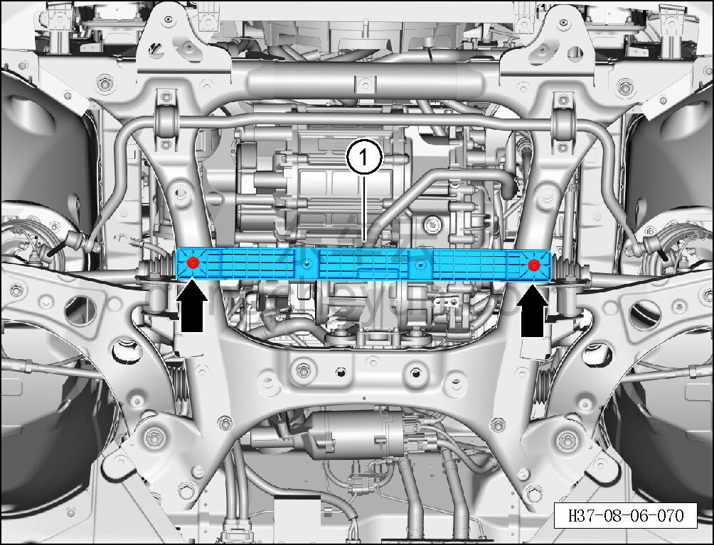

# Снятие и установка кронштейна переднего нижнего защитного щитка

> Внутренняя и внешняя отделка › Наружные элементы отделки › Система вспомогательных устройств  
> Оригинал: `拆卸与安装前部下防护板支架` · [dongcheyun 56746](https://dongcheyun.com/p/56746), страница `8886ad908bd6452ca6fc1ab2696b5966` · [оглавление](../README.md)

**Порядок снятия**

1. Снимите передний нижний защитный щиток. См. [8.6.4.3 Снятие и установка переднего нижнего защитного щитка](193-снятие-и-установка-переднего-нижнего-защитного-щитка.md)

2. Снимите кронштейн переднего нижнего защитного щитка.

a. Торцевой головкой на 10 мм выверните 2 крепёжных болта кронштейна переднего нижнего защитного щитка.

Момент затяжки болта: 8±1 Н·м

b. Снимите кронштейн переднего нижнего защитного щитка ①.

**Внимание:**

**- Необходимо заменить крепёжные болты на новые.**

**Порядок установки**

Установка выполняется в обратном порядке.

**Внимание:**

**- При установке на крепёжные болты необходимо нанести фиксатор резьбы.**
