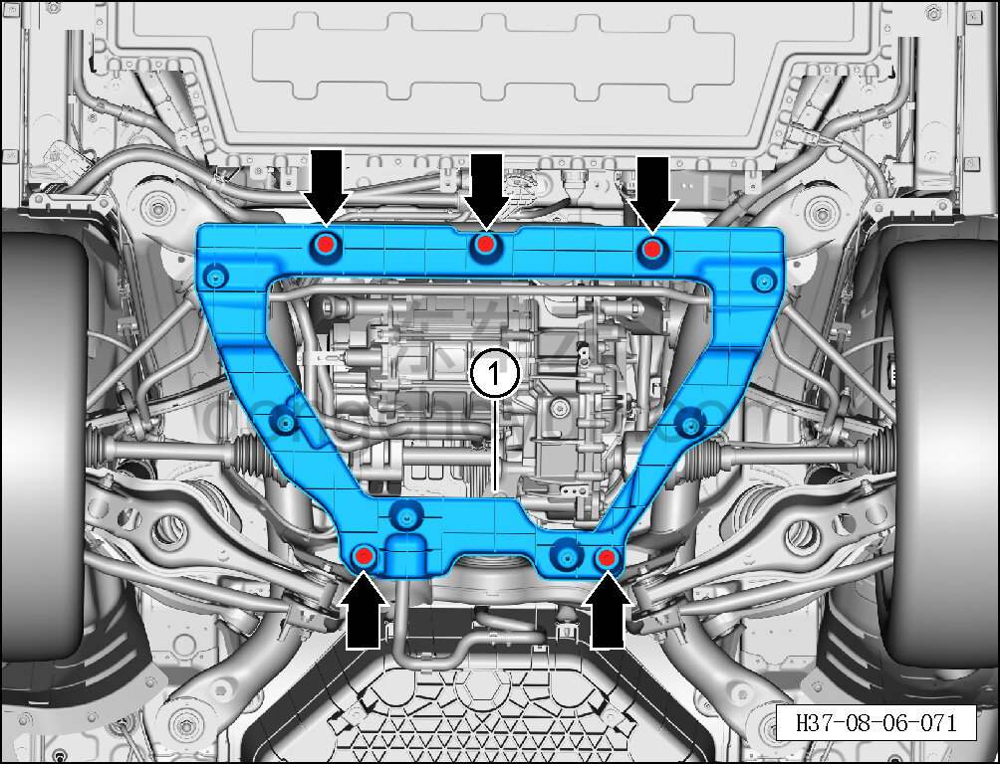

# Снятие и установка вспомогательного кронштейна заднего защитного щитка пола

> Внутренняя и внешняя отделка › Наружные элементы отделки › Система вспомогательных устройств  
> Оригинал: `拆卸与安装后底护板副支架` · [dongcheyun 56746](https://dongcheyun.com/p/56746), страница `6efe75ac14574b92ad1feb9d2de8abe1` · [оглавление](../README.md)

**Порядок снятия**

1. Снимите задний нижний защитный щиток. См. [8.6.4.4 Снятие и установка заднего нижнего защитного щитка](194-снятие-и-установка-заднего-нижнего-защитного-щитка.md)

2. Снимите вспомогательный кронштейн заднего защитного щитка пола.

a. Торцевой головкой на 10 мм выверните 5 крепёжных болтов вспомогательного кронштейна заднего защитного щитка пола.

Момент затяжки болта: 8±1 Н·м

b. Снимите вспомогательный кронштейн заднего защитного щитка пола ①.

**Внимание:**

**- Необходимо заменить крепёжные болты на новые.**

**Порядок установки**

Установка выполняется в обратном порядке.

**Внимание:**

**- При установке на крепёжные болты необходимо нанести фиксатор резьбы.**
