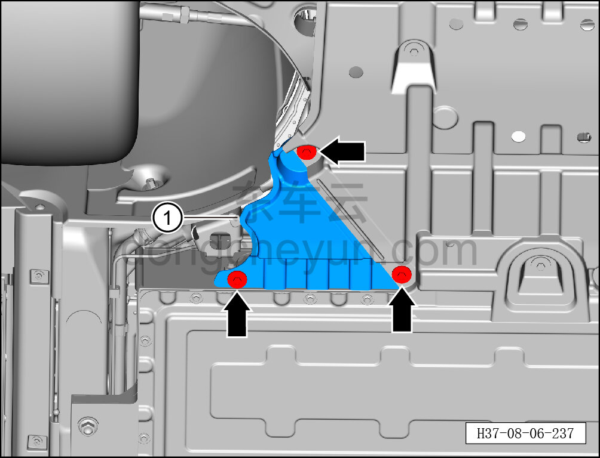

# Снятие и установка левой задней накладки переднего нижнего защитного щитка (800 В)

> Внутренняя и внешняя отделка › Наружные элементы отделки › Система вспомогательных устройств  
> Оригинал: `拆卸与安装前部下防护板后部左护板（800V）` · [dongcheyun 56746](https://dongcheyun.com/p/56746), страница `24ec6bcb0e9c4669b97756316b00658d` · [оглавление](../README.md)

**Порядок снятия**

**Примечание:**

**- Ниже описано снятие и установка левой задней накладки переднего нижнего защитного щитка, правая выполняется по аналогии с левой.**

1. Поднимите автомобиль на подъёмнике.

2. Снимите левую заднюю накладку переднего нижнего защитного щитка.

a. Торцевой головкой на 10 мм выверните 3 крепёжных болта левой задней накладки переднего нижнего защитного щитка.

Момент затяжки болта: 4±1 Н·м

b. Снимите левую заднюю накладку переднего нижнего защитного щитка ①.

**Порядок установки**

Установка выполняется в обратном порядке.

**Внимание:**

**- Не сгибайте и не заламывайте левую заднюю накладку переднего нижнего защитного щитка.**
