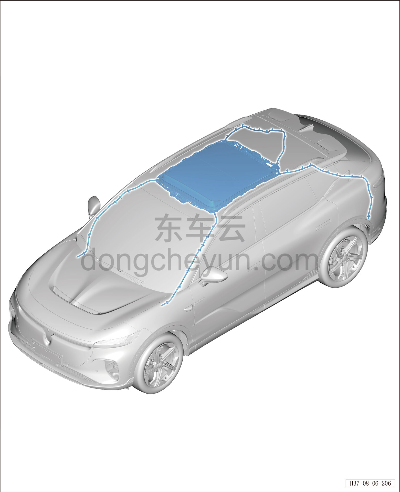

# Расположение компонентов

> Внутренняя и внешняя отделка › Наружные элементы отделки › Система открывания и закрывания крыши  
> Оригинал: `零部件位置图` · [dongcheyun 56746](https://dongcheyun.com/p/56746), страница `21fdeb69ae3f4895a9b5263f1a65a386` · [оглавление](../README.md)

