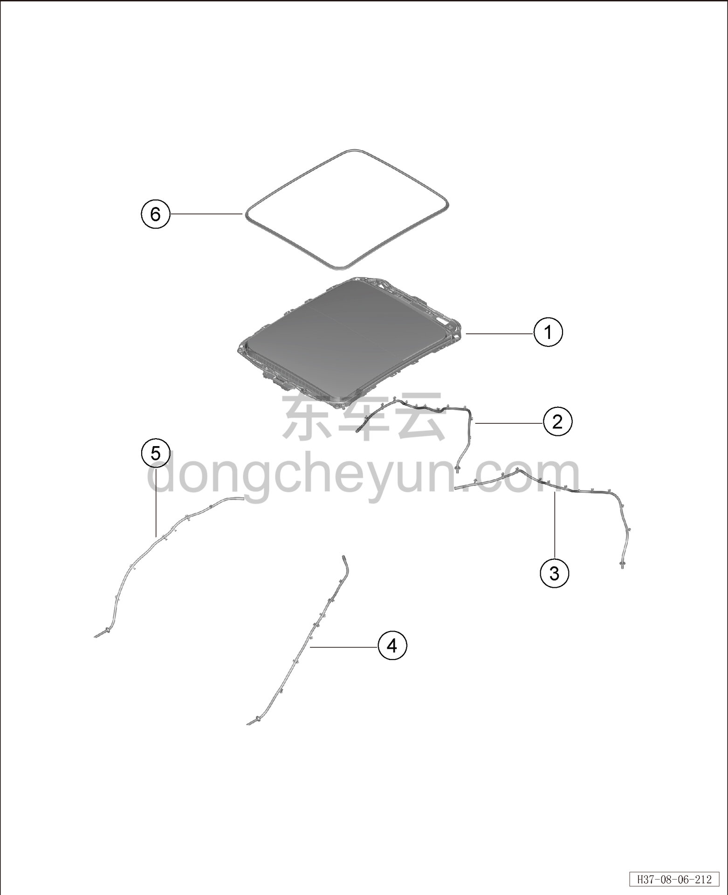

# Покомпонентный вид (деталировка)

> Внутренняя и внешняя отделка › Наружные элементы отделки › Система открывания и закрывания крыши  
> Оригинал: `结构分解图` · [dongcheyun 56746](https://dongcheyun.com/p/56746), страница `d617d4d8bdf34c249891abbfe7e7b299` · [оглавление](../README.md)

| № | Наименование детали | Кол-во на автомобиль | Примечание |
|---|---|---|---|
| 1 | Люк в сборе | 1 | - |
| 2 | Правый задний дренажный шланг люка | 1 | - |
| 3 | Левый задний дренажный шланг люка | 1 | - |
| 4 | Левый передний дренажный шланг люка | 1 | - |
| 5 | Правый передний дренажный шланг люка | 1 | - |
| 6 | Уплотнитель люка | 1 | - |
