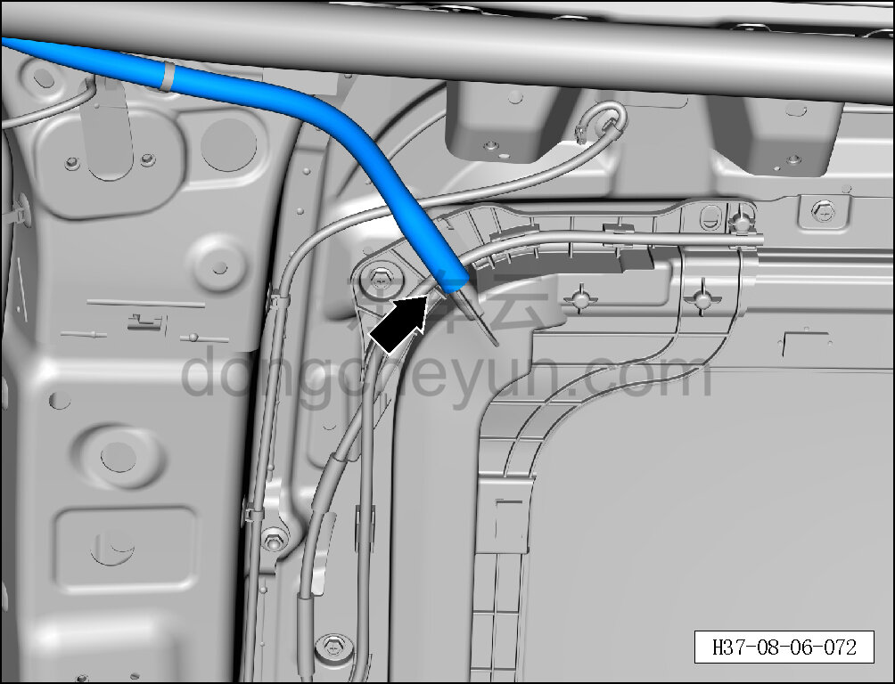
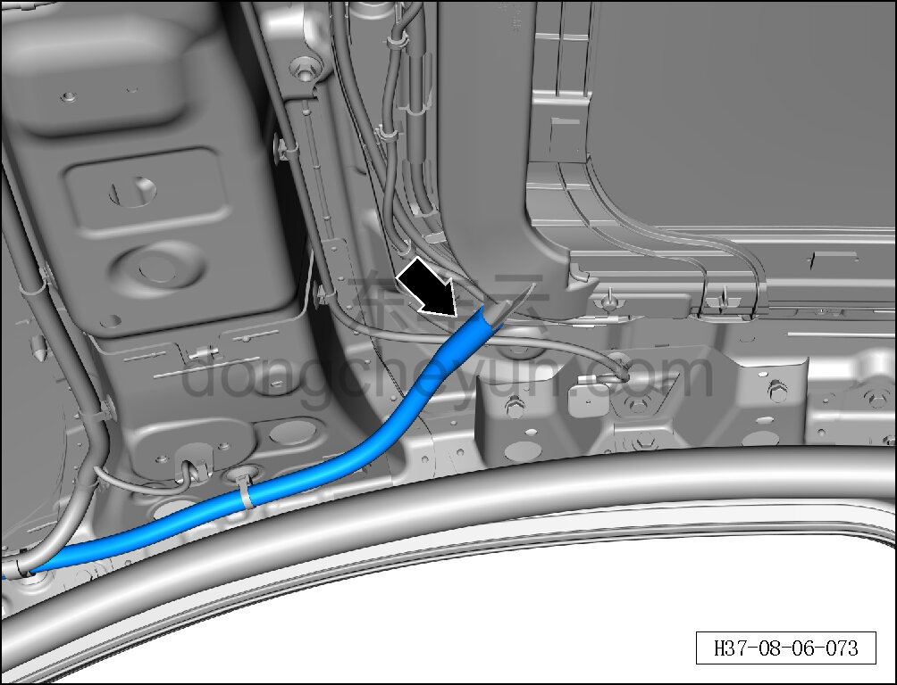
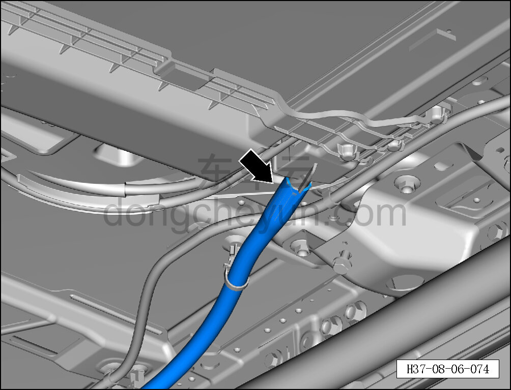
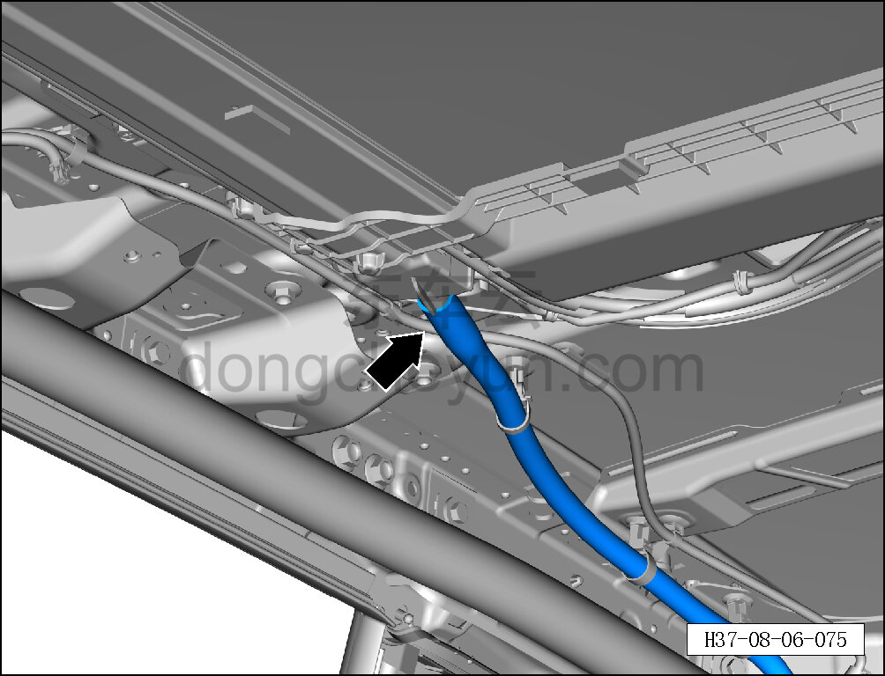
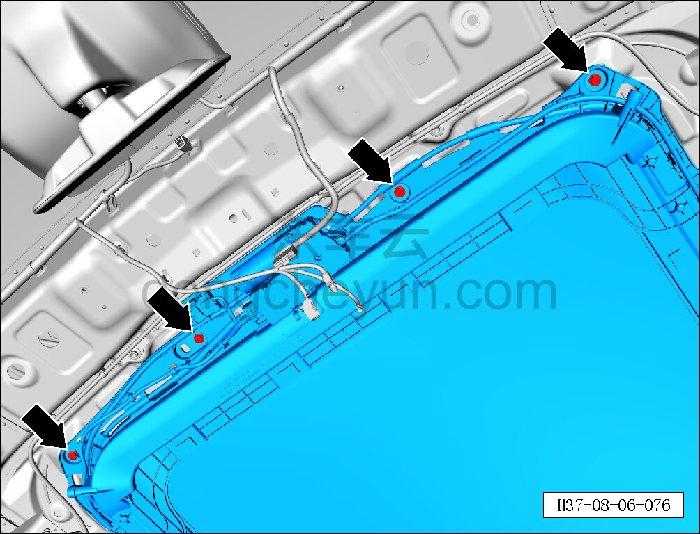
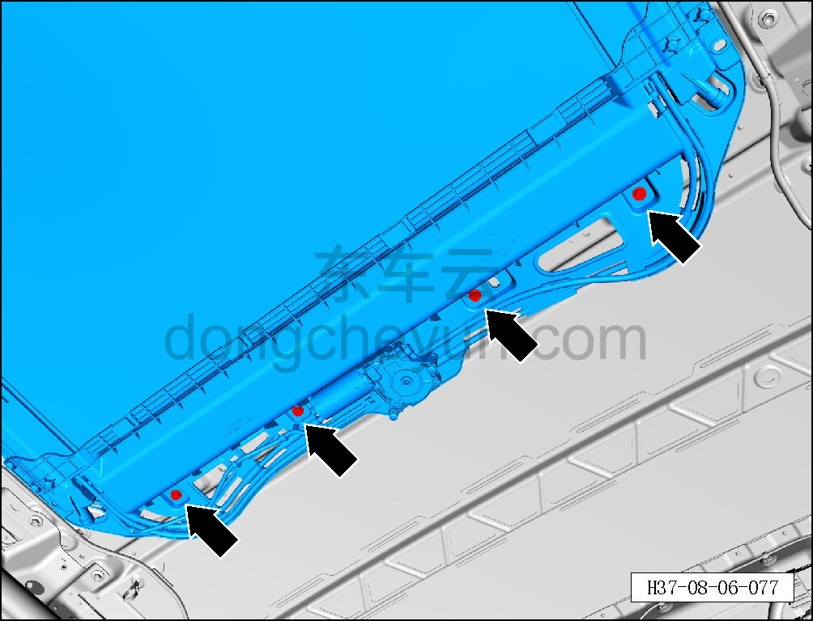
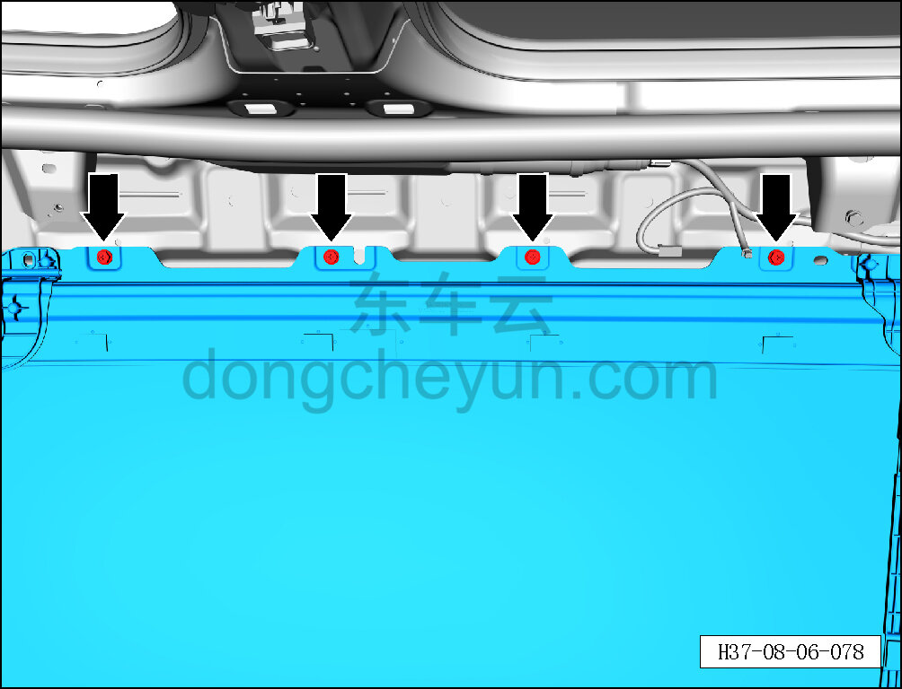
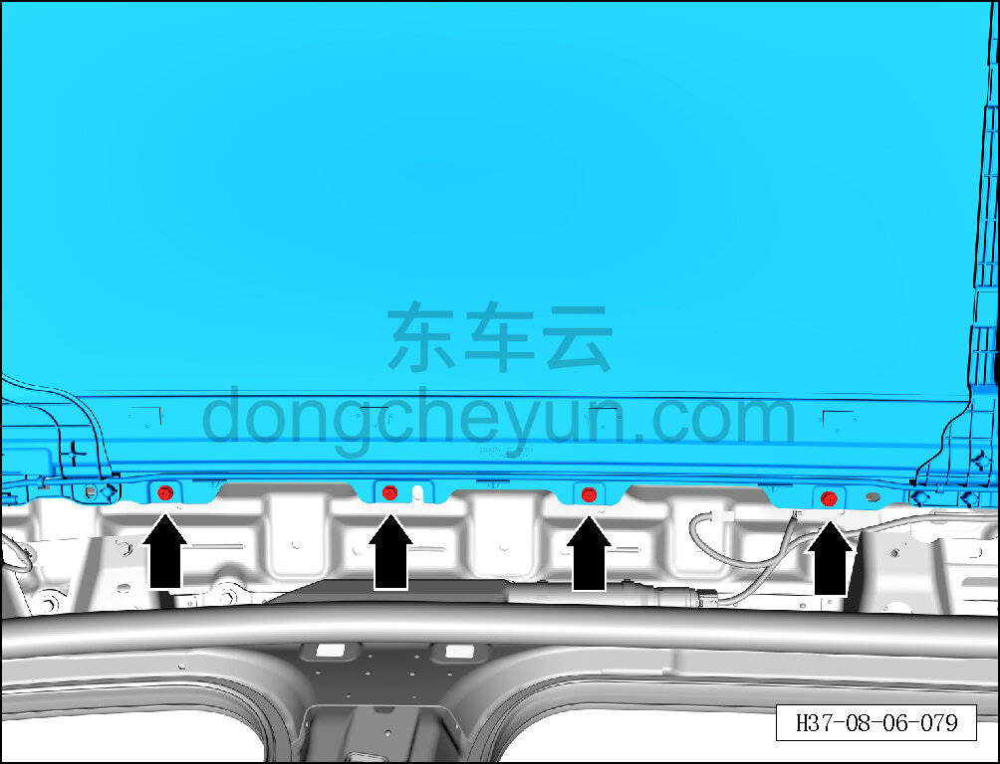
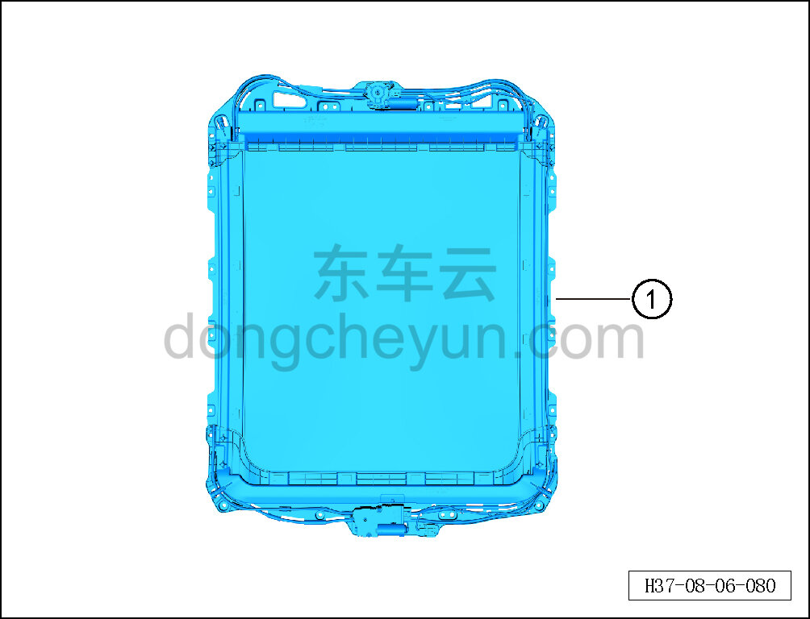

# Снятие и установка люка в сборе

> Внутренняя и внешняя отделка › Наружные элементы отделки › Система открывания и закрывания крыши  
> Оригинал: `拆卸与安装天窗总成` · [dongcheyun 56746](https://dongcheyun.com/p/56746), страница `77a8c559b8974de49d1c7dd5eccae5c5` · [оглавление](../README.md)

**Порядок снятия**

1. Выключите все электроприборы, отключите питание.

2. Выполните операцию обесточивания автомобиля для ремонта. См. [3.1.4.1 Обесточивание автомобиля](../03-техническое-обслуживание/005-обесточивание-автомобиля.md)

3. Снимите обивку крыши. См. [8.5.6.1 Снятие и установка обивки крыши](142-снятие-и-установка-обивки-потолка.md)

4. Снимите люк в сборе.

a. Отсоедините левый передний дренажный шланг люка.

b. Отсоедините правый передний дренажный шланг люка.

c. Отсоедините левый задний дренажный шланг люка.

d. Отсоедините правый задний дренажный шланг люка.

e. Один человек должен рукой удерживать люк в сборе, а второй торцевой головкой на 10 мм вывернуть 4 крепёжных болта люка в сборе.

Момент затяжки болта: 8±1 Н·м

**Внимание:**

**- При снятии ослабьте все крепёжные болты люка, но не вынимайте их полностью, чтобы люк не упал внезапно и не повредил детали или не травмировал работника.**

f. Торцевой головкой на 10 мм выверните 4 крепёжных болта люка в сборе.

Момент затяжки болта: 8±1 Н·м

**Внимание:**

**- При снятии ослабьте все крепёжные болты люка, но не вынимайте их полностью, чтобы люк не упал внезапно и не повредил детали или не травмировал работника.**

g. Торцевой головкой на 10 мм выверните 4 крепёжных болта люка в сборе.

Момент затяжки болта: 8±1 Н·м

**Внимание:**

**- При снятии ослабьте все крепёжные болты люка, но не вынимайте их полностью, чтобы люк не упал внезапно и не повредил детали или не травмировал работника.**

h. Торцевой головкой на 10 мм выверните 4 крепёжных болта люка в сборе.

Момент затяжки болта: 8±1 Н·м

**Внимание:**

**- При снятии ослабьте все крепёжные болты люка, но не вынимайте их полностью, чтобы люк не упал внезапно и не повредил детали или не травмировал работника.**

i. Вдвоём совместно снимите люк в сборе ①.

**Внимание:**

**- В конце, с помощью помощника, выверните оставленные крепёжные болты, снимите люк в сборе и извлеките его через проём двери багажника.**

**- После снятия положите люк в сборе на мягкую подставку и накройте защитным чехлом, чтобы избежать царапин.**

**Порядок установки**

Установка выполняется в обратном порядке.

**Внимание:**

**- После завершения установки выполните инициализацию люка.**

**- Поработайте люком и понаблюдайте за отсутствием заеданий и посторонних шумов при полном закрывании и открывании.**

**- Проверьте, что люк в сборе не перекошен.**

**- Проверьте работоспособность функции защиты люка в сборе от зажатия.**

**- При полностью закрытом люке облейте водой место стыка люка с крышей и проверьте отсутствие протечек.**
