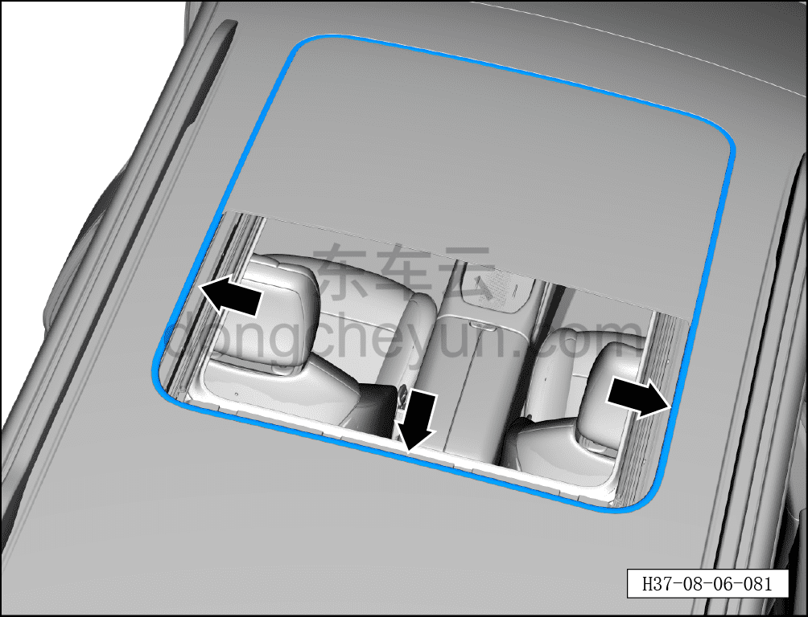
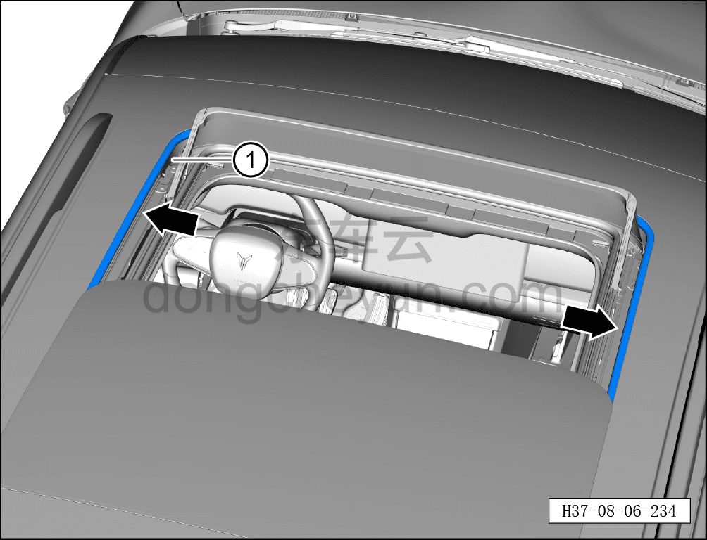

# Снятие и установка уплотнителя люка

> Внутренняя и внешняя отделка › Наружные элементы отделки › Система открывания и закрывания крыши  
> Оригинал: `拆卸与安装天窗密封条` · [dongcheyun 56746](https://dongcheyun.com/p/56746), страница `b92a063b83554c989998daf7acf3d253` · [оглавление](../README.md)

**Порядок снятия**

1. Снимите заднее стекло люка. См. [8.6.5.12 Снятие и установка заднего стекла люка](209-снятие-и-установка-заднего-стекла-люка.md)

2. Снимите уплотнитель люка.

a. Техническим феном нагрейте уплотнительную полосу до 300-350°C в течение примерно 5 секунд и постепенно, участок за участком, отделите заднюю часть уплотнителя люка.

b. Переместите переднее стекло люка в крайнее заднее положение.

c. Техническим феном нагрейте уплотнительную полосу до 300-350°C в течение примерно 5 секунд и постепенно, участок за участком, отделите переднюю часть уплотнителя люка, затем снимите уплотнитель люка ①.

**Примечание:**

**- После снятия уплотнителя люка необходимо удалить остатки клея 3M с кузова и протереть кузовную панель тканью, смоченной в очистителе.**

**Порядок установки**

Установка выполняется в обратном порядке.

**Внимание:**

**- После завершения установки выполните инициализацию люка.**

**- Поработайте люком и понаблюдайте за отсутствием заеданий и посторонних шумов при полном закрывании и открывании.**

**- Проверьте, что люк в сборе не перекошен.**

**- Проверьте работоспособность функции защиты люка в сборе от зажатия.**

**- При полностью закрытом люке облейте водой место стыка люка с крышей и проверьте отсутствие протечек.**
