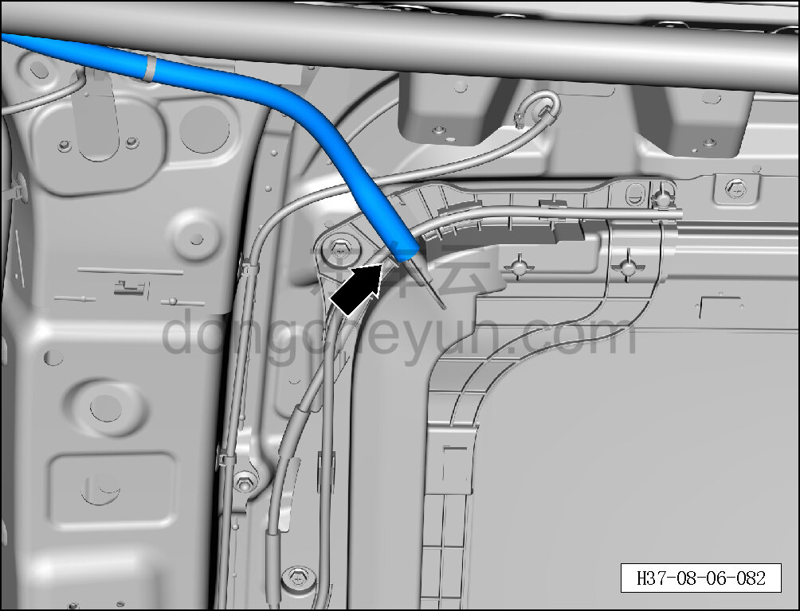
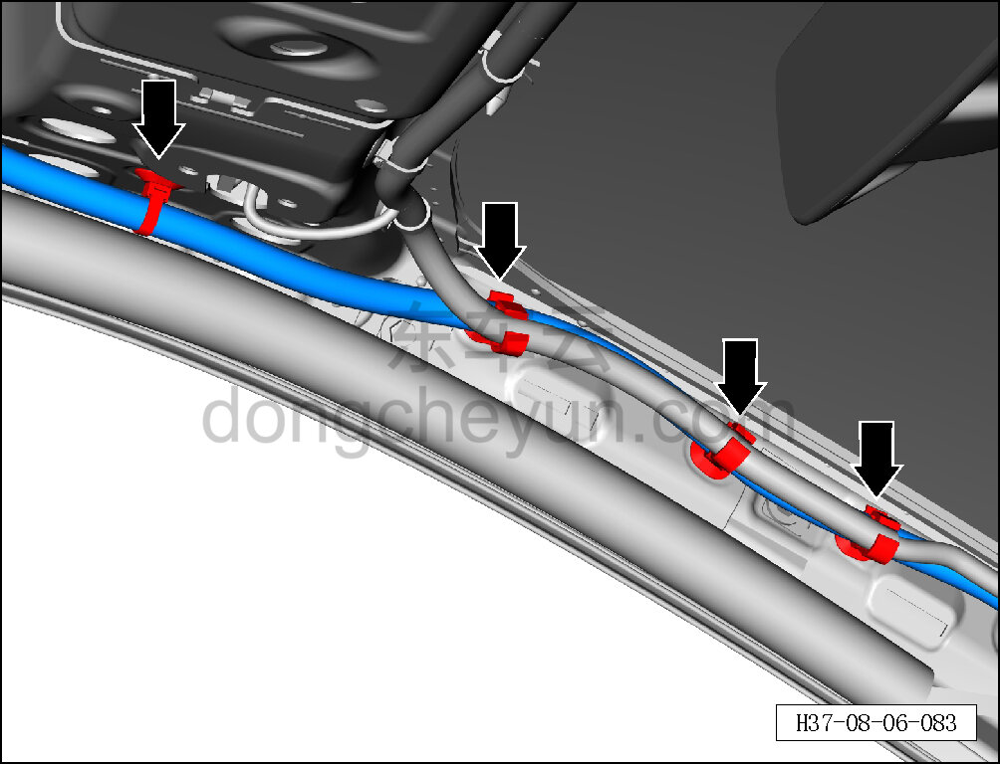
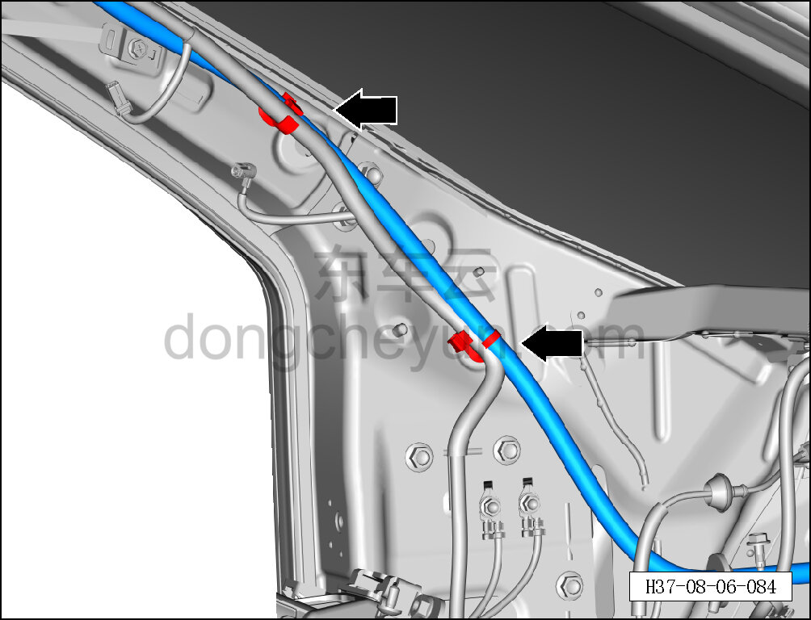
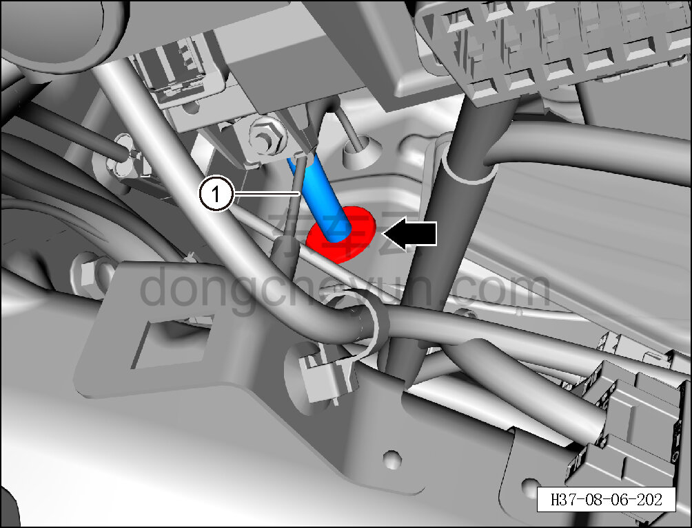

# Снятие и установка левого переднего дренажного шланга люка

> Внутренняя и внешняя отделка › Наружные элементы отделки › Система открывания и закрывания крыши  
> Оригинал: `拆卸与安装左前天窗排水管` · [dongcheyun 56746](https://dongcheyun.com/p/56746), страница `7d95aa4621bd456a87f07c8bba8f37e9` · [оглавление](../README.md)

**Порядок снятия**

**Примечание:**

**- Далее описаны снятие и установка левого переднего дренажного шланга люка, для правой стороны действия аналогичны левой.**

1. Выключите все электроприборы, отключите питание.

2. Выполните операцию обесточивания автомобиля для ремонта. См. [3.1.4.1 Обесточивание автомобиля](../03-техническое-обслуживание/005-обесточивание-автомобиля.md)

3. Снимите обивку крыши. См. [8.5.6.1 Снятие и установка обивки крыши](142-снятие-и-установка-обивки-потолка.md)

4. Снимите левую нижнюю защитную накладку в сборе. См. [8.2.4.2 Снятие и установка левой нижней защитной накладки в сборе](055-снятие-и-установка-нижней-левой-защитной-накладки-в.md)

5. Снимите левый передний дренажный шланг люка.

a. Отсоедините левый передний дренажный шланг люка от люка в сборе.

b. С помощью съёмника обивки отсоедините 4 фиксирующие клипсы левого переднего дренажного шланга люка.

c. С помощью съёмника обивки отсоедините 2 фиксирующие клипсы левого переднего дренажного шланга люка.

d. С помощью съёмника обивки отсоедините резиновую проходную втулку левого переднего дренажного шланга люка.

e. Извлеките левый передний дренажный шланг люка ①.

**Порядок установки**

Установка выполняется в обратном порядке.

**Внимание:**

**- При полностью закрытом люке облейте водой место стыка люка с крышей и проверьте отсутствие протечек.**
