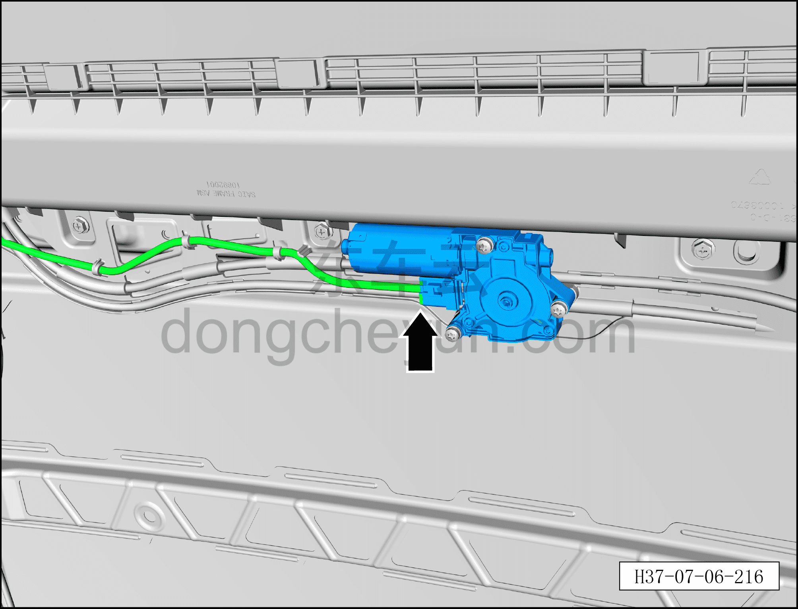
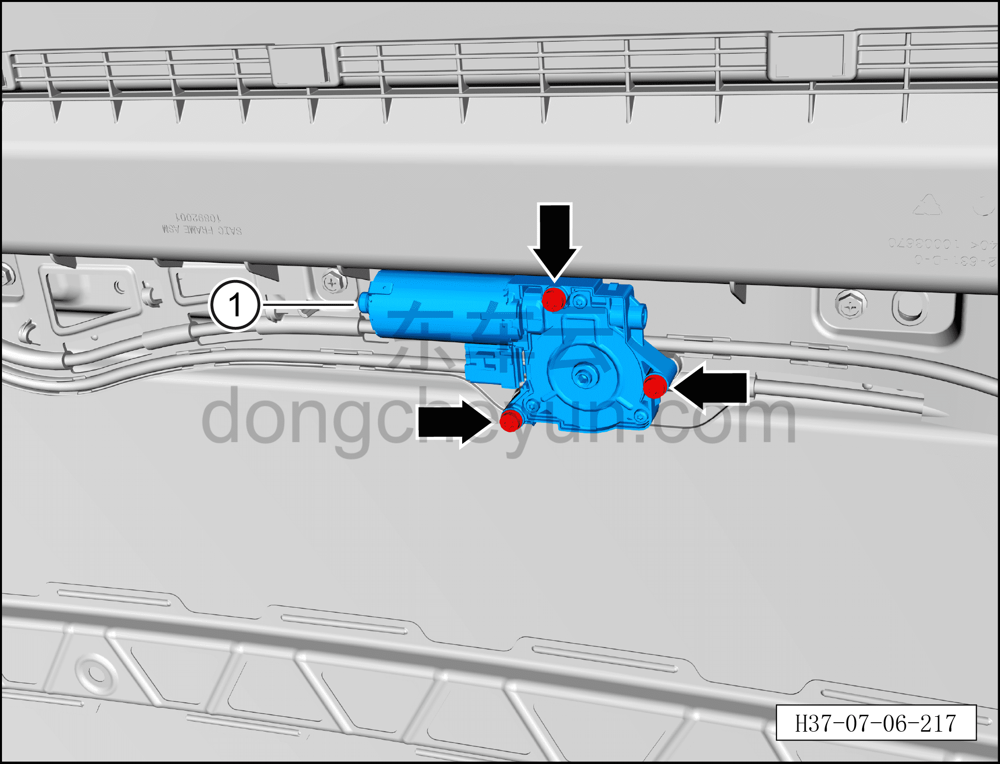

# Снятие и установка электродвигателя шторки люка

> Внутренняя и внешняя отделка › Наружные элементы отделки › Система открывания и закрывания крыши  
> Оригинал: `拆卸与安装天窗卷帘电机` · [dongcheyun 56746](https://dongcheyun.com/p/56746), страница `7f84530295aa4fdb9c2c9363c56ae127` · [оглавление](../README.md)

**Порядок снятия**

1. Выключите все электроприборы, отключите питание.

2. Выполните операцию обесточивания автомобиля для ремонта. См. [3.1.4.1 Обесточивание автомобиля](../03-техническое-обслуживание/005-обесточивание-автомобиля.md)

3. Снимите обивку крыши. См. [8.5.6.1 Снятие и установка обивки крыши](142-снятие-и-установка-обивки-потолка.md)

4. Снимите электродвигатель шторки люка.

a. Нажав на фиксатор разъёма, отсоедините разъём электродвигателя шторки люка от жгута проводов люка в сборе.

b. С помощью биты T25 выверните 3 крепёжных винта электродвигателя шторки люка, извлеките электродвигатель шторки люка ①.

**Порядок установки**

Установка выполняется в обратном порядке.

**Внимание:**

**- После завершения установки выполните инициализацию люка.**

**- Поработайте люком и понаблюдайте за отсутствием заеданий и посторонних шумов при полном закрывании и открывании.**

**- Проверьте работоспособность функции защиты люка в сборе от зажатия.**
