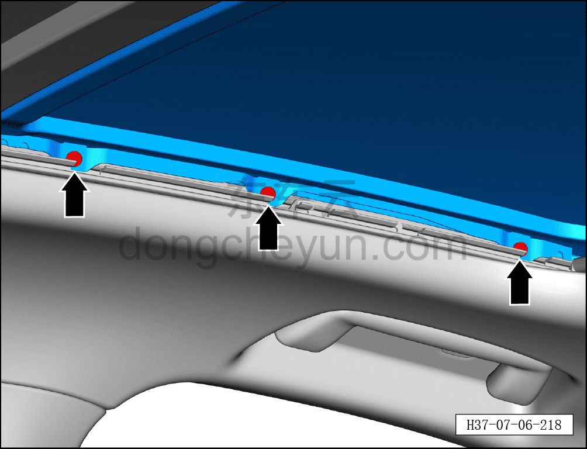
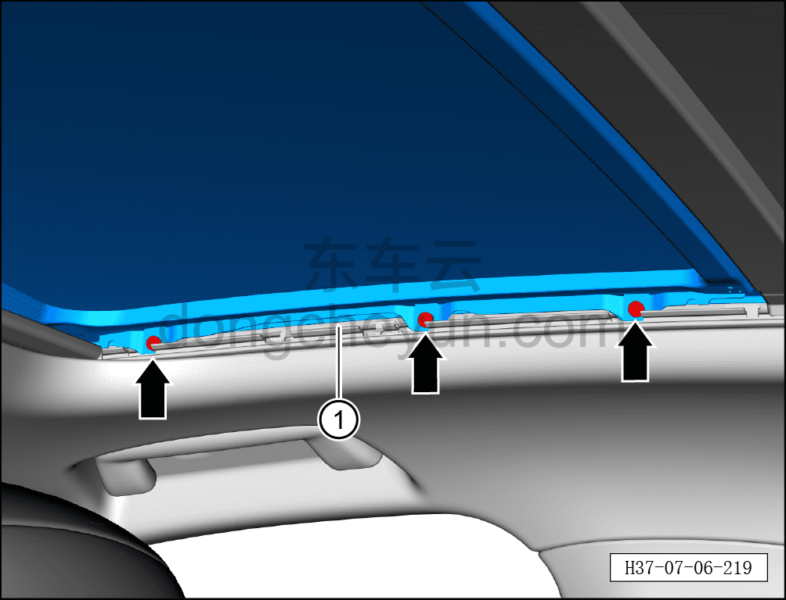

# Снятие и установка переднего стекла люка

> Внутренняя и внешняя отделка › Наружные элементы отделки › Система открывания и закрывания крыши  
> Оригинал: `拆卸与安装天窗前玻璃` · [dongcheyun 56746](https://dongcheyun.com/p/56746), страница `04d4895d9304412da1e31f7ccb18c5b3` · [оглавление](../README.md)

**Порядок снятия**

1. Откройте шторку люка.

2. Снимите внутренний уплотнитель люка. См. [8.6.5.13 Снятие и установка внутреннего уплотнителя люка](210-снятие-и-установка-внутреннего-уплотнителя-люка.md)

3. Снимите переднее стекло люка.

a. С помощью биты T25 выверните 3 крепёжных винта переднего стекла люка.

b. С помощью биты T25 выверните 3 крепёжных винта переднего стекла люка, вдвоём совместно извлеките переднее стекло люка ① вверх.

**Порядок установки**

Установка выполняется в обратном порядке.

**Внимание:**

**- После завершения установки выполните инициализацию люка.**

**- Поработайте люком и понаблюдайте за отсутствием заеданий и посторонних шумов при полном закрывании и открывании.**

**- Проверьте работоспособность функции защиты люка в сборе от зажатия.**
