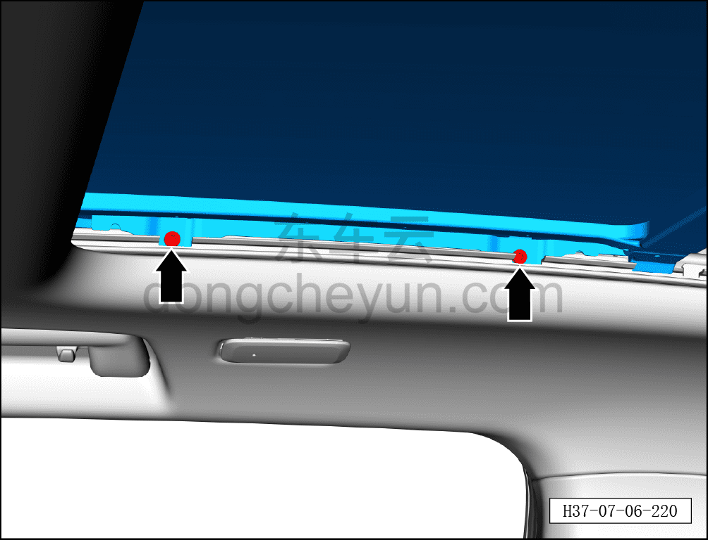
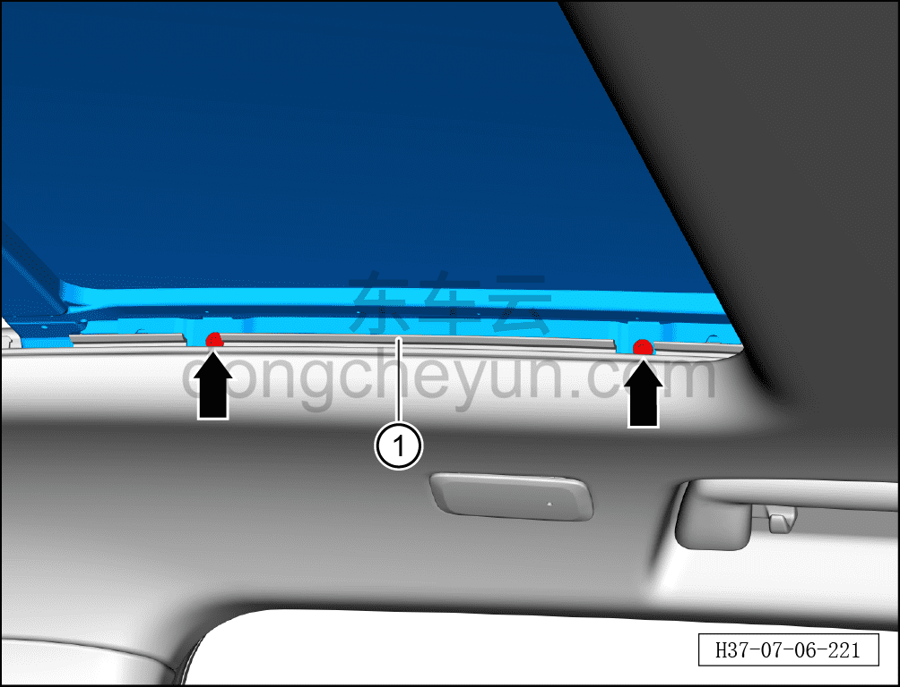

# Снятие и установка заднего стекла люка

> Внутренняя и внешняя отделка › Наружные элементы отделки › Система открывания и закрывания крыши  
> Оригинал: `拆卸与安装天窗后玻璃` · [dongcheyun 56746](https://dongcheyun.com/p/56746), страница `884c9294a53b49439a7a93e80d59ee8a` · [оглавление](../README.md)

**Порядок снятия**

1. Откройте шторку люка.

2. Откройте переднее стекло люка, поднимите его до самого верхнего положения.

3. Снимите заднее стекло люка.

a. С помощью биты T25 выверните 2 крепёжных винта заднего стекла люка.

b. С помощью биты T25 выверните 2 крепёжных винта заднего стекла люка, вдвоём совместно извлеките заднее стекло люка ①.

**Порядок установки**

Установка выполняется в обратном порядке.

**Внимание:**

**- После завершения установки выполните инициализацию люка.**

**- Поработайте люком и понаблюдайте за отсутствием заеданий и посторонних шумов при полном закрывании и открывании.**

**- Проверьте работоспособность функции защиты люка в сборе от зажатия.**
