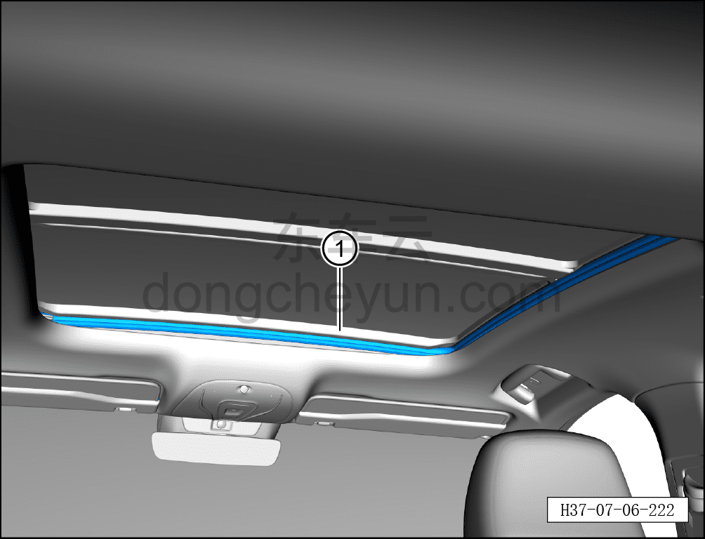

# Снятие и установка внутреннего уплотнителя люка

> Внутренняя и внешняя отделка › Наружные элементы отделки › Система открывания и закрывания крыши  
> Оригинал: `拆卸与安装天窗内密封条` · [dongcheyun 56746](https://dongcheyun.com/p/56746), страница `5e80f03442024eec92a6237146d3c509` · [оглавление](../README.md)

**Порядок снятия**

1. Откройте шторку люка.

2. Снимите внутренний уплотнитель люка.

a. Отсоедините внутренний уплотнитель люка ①.

**Порядок установки**

Установка выполняется в обратном порядке.

**Внимание:**

**- Поработайте люком и понаблюдайте за отсутствием заеданий и посторонних шумов при полном закрывании и открывании.**

**- Проверьте работоспособность функции защиты люка в сборе от зажатия.**
