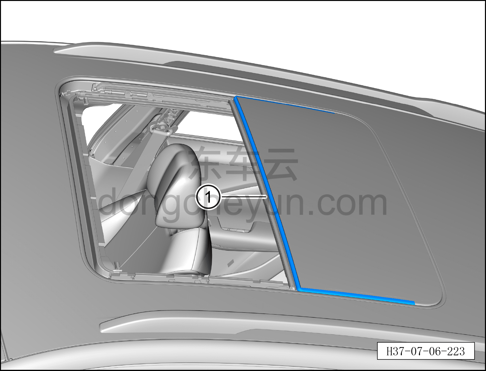

# Снятие и установка уплотнителя заднего стекла люка

> Внутренняя и внешняя отделка › Наружные элементы отделки › Система открывания и закрывания крыши  
> Оригинал: `拆卸与安装天窗后玻璃密封条` · [dongcheyun 56746](https://dongcheyun.com/p/56746), страница `2e2330be5c374adc82ee43dc306c7996` · [оглавление](../README.md)

**Порядок снятия**

1. Откройте шторку люка.

2. Снимите переднее стекло люка. См. [8.6.5.11 Снятие и установка переднего стекла люка](208-снятие-и-установка-переднего-стекла-люка.md)

3. Снимите уплотнитель заднего стекла люка.

a. Извлеките уплотнитель заднего стекла люка ①.

**Порядок установки**

Установка выполняется в обратном порядке.

**Внимание:**

**- После завершения установки выполните инициализацию люка.**

**- Поработайте люком и понаблюдайте за отсутствием заеданий и посторонних шумов при полном закрывании и открывании.**

**- Проверьте работоспособность функции защиты люка в сборе от зажатия.**
