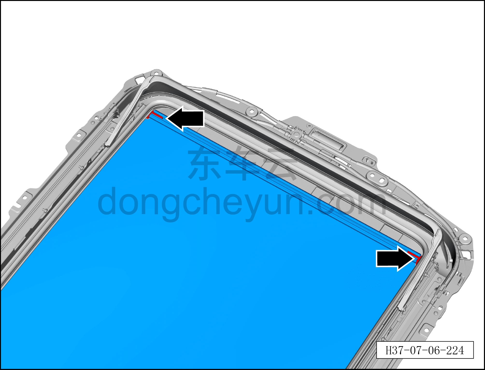
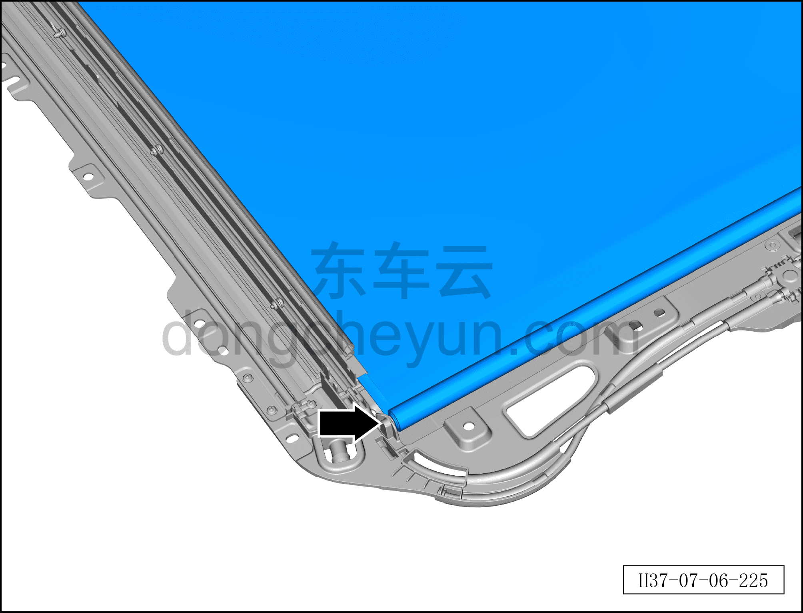
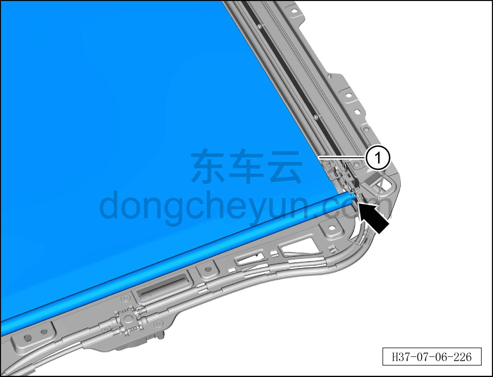

# Снятие и установка шторки люка

> Внутренняя и внешняя отделка › Наружные элементы отделки › Система открывания и закрывания крыши  
> Оригинал: `拆卸与安装遮阳帘` · [dongcheyun 56746](https://dongcheyun.com/p/56746), страница `88caa1d00e814096ba76b7ce6dce5968` · [оглавление](../README.md)

**Порядок снятия**

1. Выключите все электроприборы, отключите питание.

2. Выполните операцию обесточивания автомобиля для ремонта. См. [3.1.4.1 Обесточивание автомобиля](../03-техническое-обслуживание/005-обесточивание-автомобиля.md)

3. Снимите люк в сборе. См. [8.6.5.5 Снятие и установка люка в сборе](202-снятие-и-установка-люка-в-сборе.md)

4. Снимите шторку люка.

a. Отсоедините шторку люка от бегунка рамки люка.

b. Отсоедините шторку люка от правой стороны рамки люка.

c. Отсоедините шторку люка от левой стороны рамки люка, извлеките шторку люка ①.

**Порядок установки**

Установка выполняется в обратном порядке.

**Внимание:**

**- После завершения установки выполните инициализацию люка.**

**- Поработайте люком и понаблюдайте за отсутствием заеданий и посторонних шумов при полном закрывании и открывании.**

**- Проверьте, что люк в сборе не перекошен.**

**- Проверьте работоспособность функции защиты люка в сборе от зажатия.**

**- При полностью закрытом люке облейте водой место стыка люка с крышей и проверьте отсутствие протечек.**
