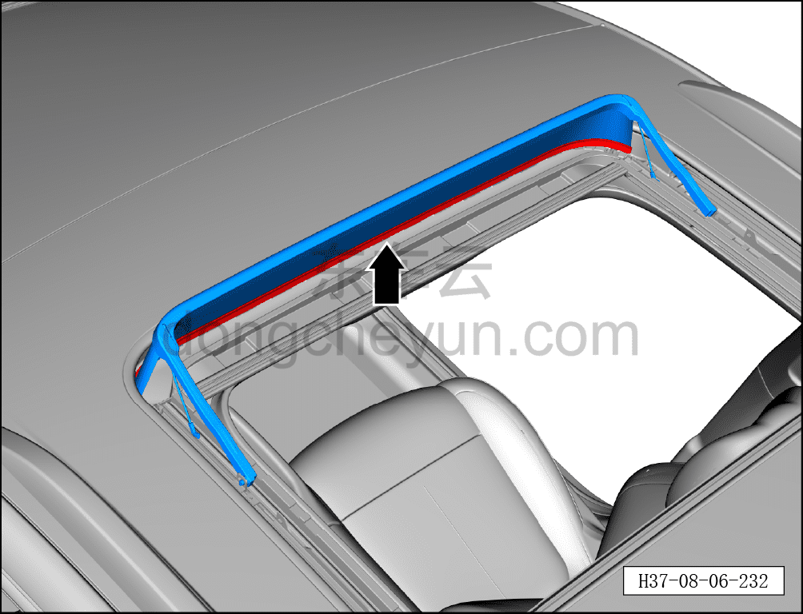
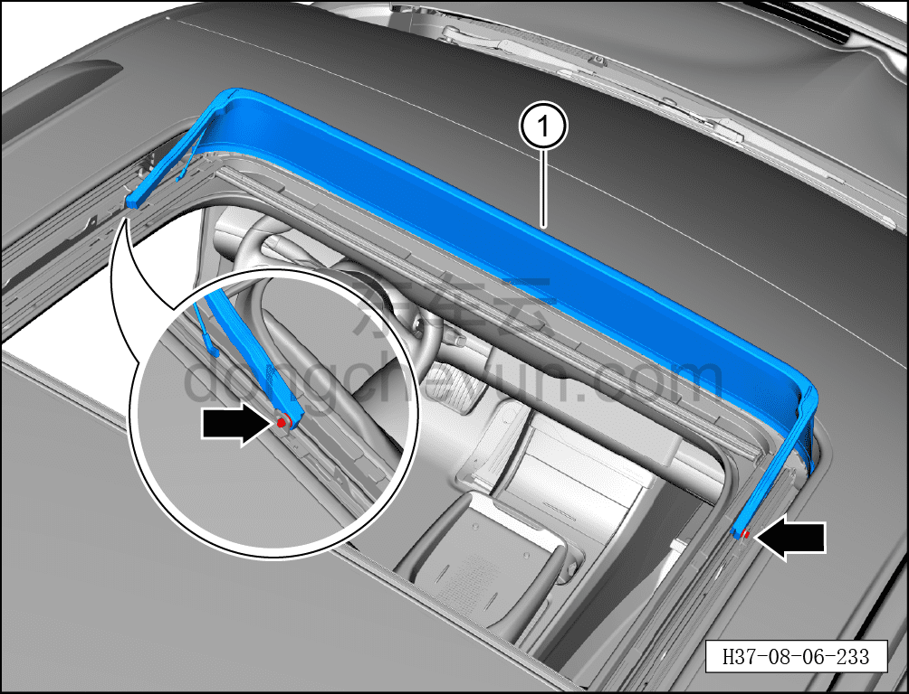

# Снятие и установка ветрозащитной сетки люка

> Внутренняя и внешняя отделка › Наружные элементы отделки › Система открывания и закрывания крыши  
> Оригинал: `拆卸与安装天窗挡风网` · [dongcheyun 56746](https://dongcheyun.com/p/56746), страница `94b2fac42fc3440189ee010f7805eca4` · [оглавление](../README.md)

**Порядок снятия**

1. Откройте шторку люка.

2. Откройте переднее стекло люка и переместите его в крайнее заднее положение.

3. Снимите ветрозащитную сетку люка.

a. Отсоедините ветрозащитную сетку люка от рамки люка.

b. Поверните обе стороны ветрозащитной сетки люка против часовой стрелки, нажмите на кронштейны с обеих сторон ветрозащитной сетки люка ① внутрь и извлеките её.

**Порядок установки**

Установка выполняется в обратном порядке.

**Внимание:**

**- После завершения установки выполните инициализацию люка.**

**- Поработайте люком и понаблюдайте за отсутствием заеданий и посторонних шумов при полном закрывании и открывании.**

**- Проверьте работоспособность функции защиты люка в сборе от зажатия.**
