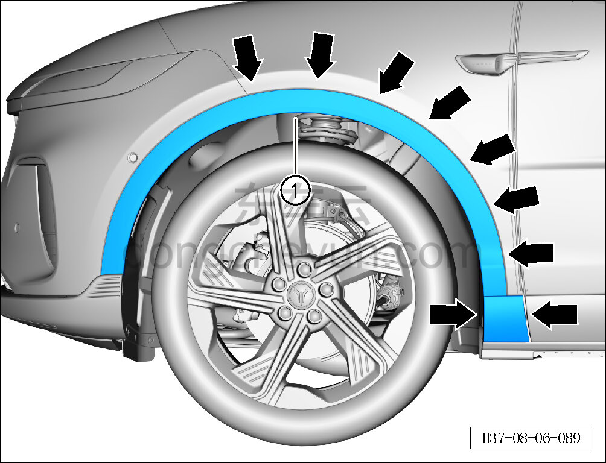
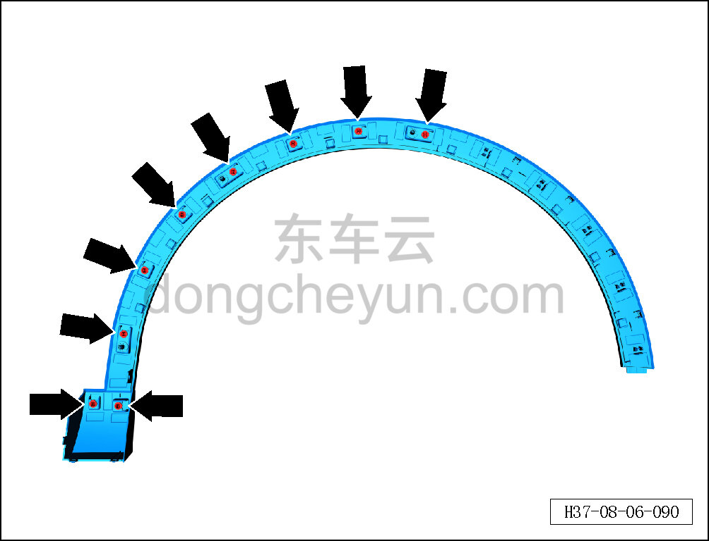

# Снятие и установка левой передней накладки колёсной арки

> Внутренняя и внешняя отделка › Наружные элементы отделки › Система наружных декоративных элементов  
> Оригинал: `拆卸与安装左前轮眉` · [dongcheyun 56746](https://dongcheyun.com/p/56746), страница `0b8e0ca64346421faeebfb3938bf27b9` · [оглавление](../README.md)

**Порядок снятия**

**Примечание:**

**- Далее описаны снятие и установка левой передней накладки колёсной арки, для правой стороны действия аналогичны левой.**

1. Снимите левую переднюю накладку колёсной арки.

a. С помощью съёмника обивки, двигаясь снизу вверх, отсоедините 9 фиксирующих клипс левой передней накладки колёсной арки.

b. Извлеките левую переднюю накладку колёсной арки ①.

**Внимание:**

**- При отжиме передней накладки колёсной арки инструментом для снятия обивки можно подложить под инструмент нетканый материал, чтобы избежать повреждения окружающих внешних декоративных элементов в процессе снятия.**

c. Расположение фиксирующих клипс левой передней накладки колёсной арки показано на рисунке слева.

**Порядок установки**

Установка выполняется в обратном порядке.

**Внимание:**

**-Проверьте крепёжные клипсы на отсутствие повреждений, при необходимости замените.**

**- После завершения установки проверьте, что передняя накладка колёсной арки установлена ровно, без перекосов и отставаний.**
