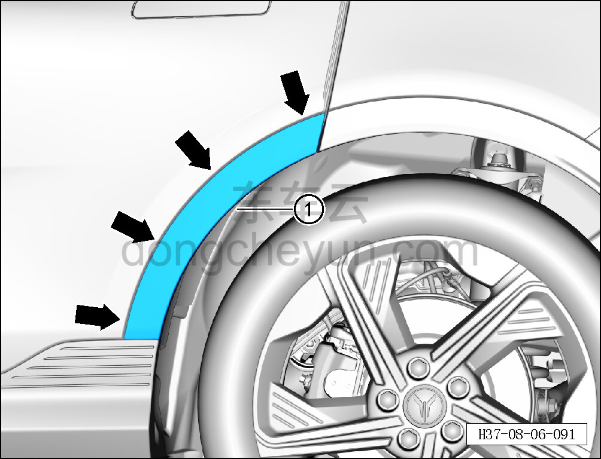
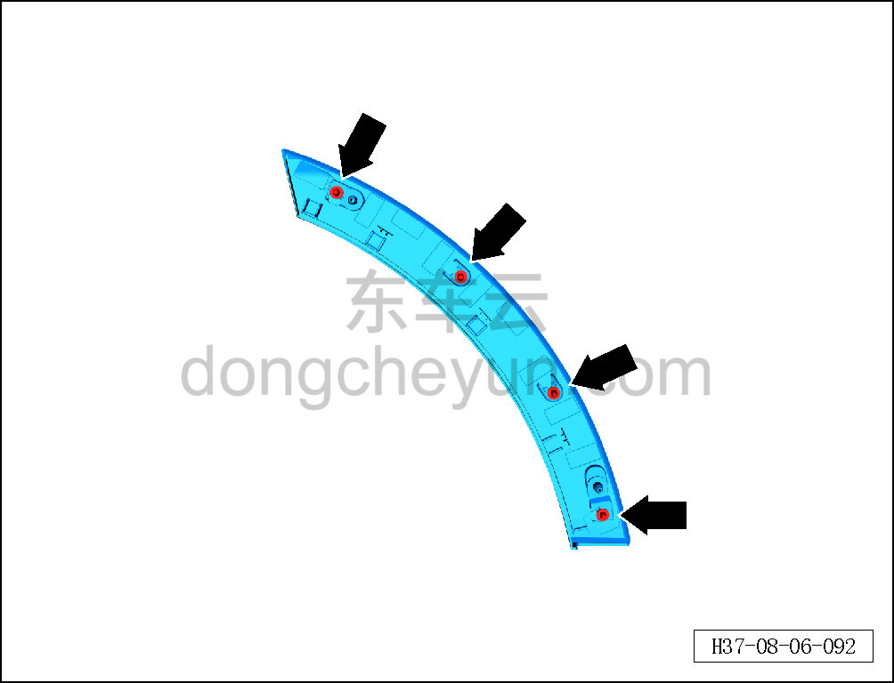

# Снятие и установка передней части левой задней накладки колёсной арки

> Внутренняя и внешняя отделка › Наружные элементы отделки › Система наружных декоративных элементов  
> Оригинал: `拆卸与安装左后轮眉前段` · [dongcheyun 56746](https://dongcheyun.com/p/56746), страница `ceccd5ab37944226aeaddb8a675c6cfb` · [оглавление](../README.md)

**Порядок снятия**

**Примечание:**

**- Далее описаны снятие и установка передней части левой задней накладки колёсной арки, для правой стороны действия аналогичны левой.**

1. Снимите переднюю часть левой задней накладки колёсной арки.

a. С помощью съёмника обивки отсоедините 4 фиксирующие клипсы передней части левой задней накладки колёсной арки.

b. Извлеките переднюю часть левой задней накладки колёсной арки ①.

**Внимание:**

**- При отжиме передней части задней накладки колёсной арки инструментом для снятия обивки можно подложить под инструмент нетканый материал, чтобы избежать повреждения окружающих внешних декоративных элементов в процессе снятия.**

c. Расположение фиксирующих клипс передней части левой задней накладки колёсной арки показано на рисунке слева.

**Порядок установки**

Установка выполняется в обратном порядке.

**Внимание:**

**-Проверьте крепёжные клипсы на отсутствие повреждений, при необходимости замените.**

**- После завершения установки проверьте, что передняя часть задней накладки колёсной арки установлена ровно, без перекосов и отставаний.**
