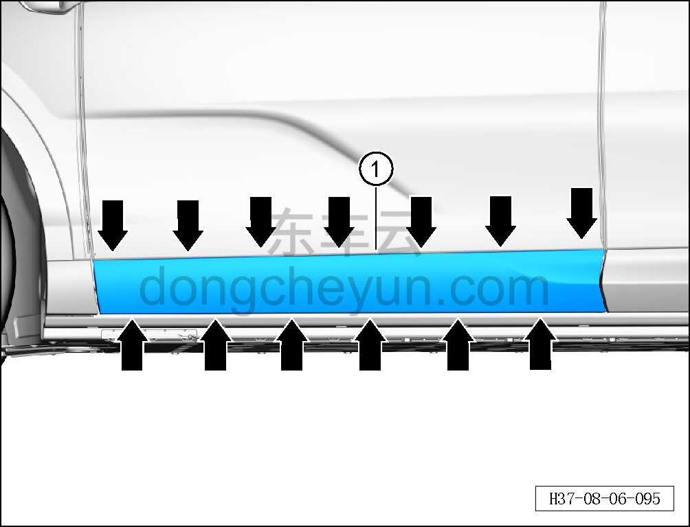
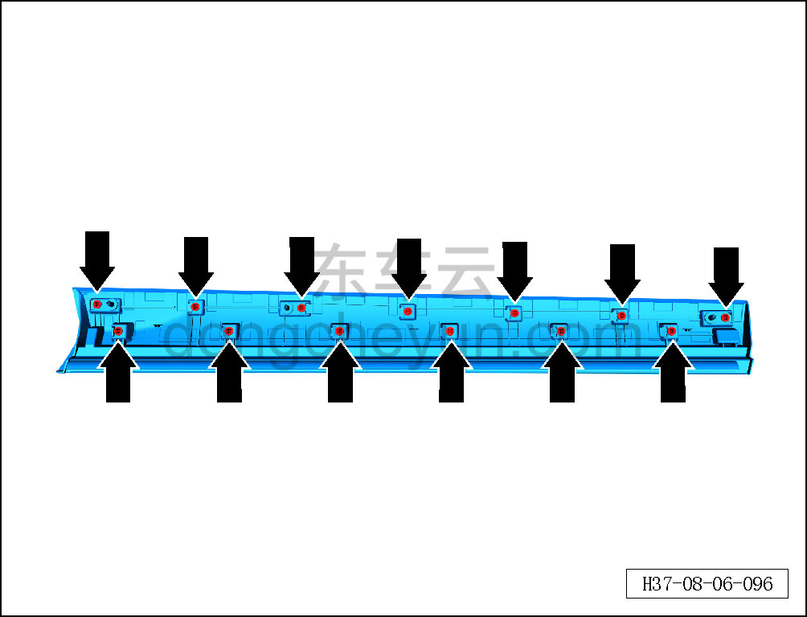

# Снятие и установка наружной накладки левой передней двери

> Внутренняя и внешняя отделка › Наружные элементы отделки › Система наружных декоративных элементов  
> Оригинал: `拆卸与安装左前车门外饰板` · [dongcheyun 56746](https://dongcheyun.com/p/56746), страница `d8e5b015cccd486484da17d29a2216f4` · [оглавление](../README.md)

**Порядок снятия**

**Примечание:**

**- Далее описаны снятие и установка наружной накладки левой передней двери, для правой стороны действия аналогичны левой.**

1. Снимите наружную накладку левой передней двери.

a. С помощью съёмника обивки отсоедините 13 фиксирующих клипс наружной накладки левой передней двери.

b. Снимите наружную накладку левой передней двери ①.

**Внимание:**

**- При отжиме наружной накладки двери инструментом для снятия обивки можно подложить под инструмент нетканый материал, чтобы избежать повреждения окружающих внешних декоративных элементов в процессе снятия.**

c. Расположение фиксирующих клипс наружной накладки левой передней двери показано на рисунке слева.

**Порядок установки**

Установка выполняется в обратном порядке.

**Внимание:**

**-Проверьте крепёжные клипсы на отсутствие повреждений, при необходимости замените.**

**- После завершения установки проверьте, что наружная накладка передней двери установлена ровно, без перекосов и отставаний.**
