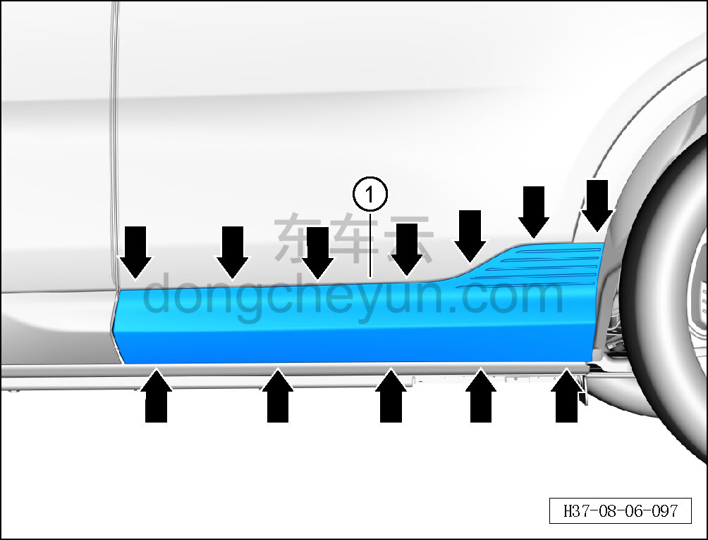
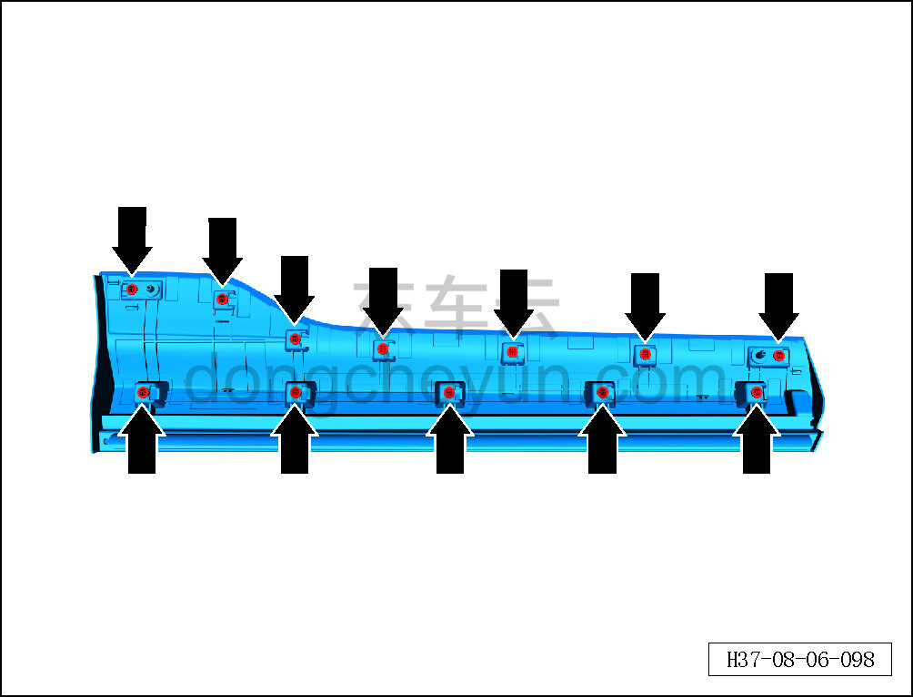

# Снятие и установка наружной накладки левой задней двери

> Внутренняя и внешняя отделка › Наружные элементы отделки › Система наружных декоративных элементов  
> Оригинал: `拆卸与安装左后车门外饰板` · [dongcheyun 56746](https://dongcheyun.com/p/56746), страница `bee43d095dc04f9e8c78f5bfe7944e31` · [оглавление](../README.md)

**Порядок снятия**

**Примечание:**

**- Далее описаны снятие и установка наружной накладки левой задней двери, для правой стороны действия аналогичны левой.**

1. Снимите наружную накладку левой задней двери.

a. С помощью съёмника обивки отсоедините 12 фиксирующих клипс наружной накладки левой задней двери.

b. Снимите наружную накладку левой задней двери ①.

**Внимание:**

**- При отжиме наружной накладки двери инструментом для снятия обивки можно подложить под инструмент нетканый материал, чтобы избежать повреждения окружающих внешних декоративных элементов в процессе снятия.**

c. Расположение фиксирующих клипс наружной накладки левой задней двери показано на рисунке слева.

**Порядок установки**

Установка выполняется в обратном порядке.

**Внимание:**

**-Проверьте крепёжные клипсы на отсутствие повреждений, при необходимости замените.**

**- После завершения установки проверьте, что наружная накладка задней двери установлена ровно, без перекосов и отставаний.**
