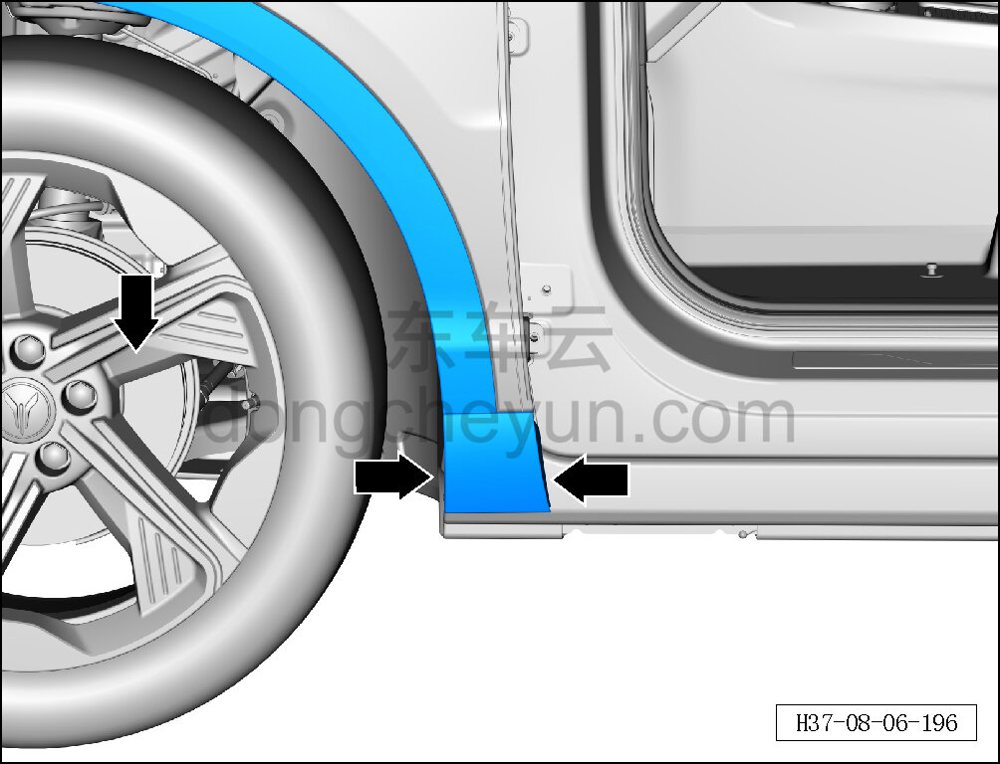
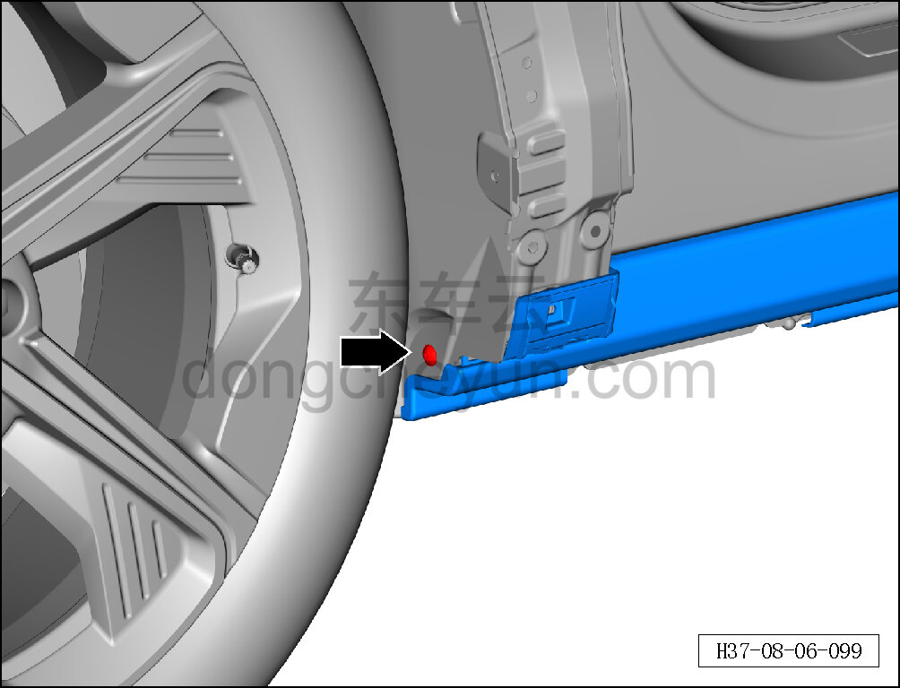
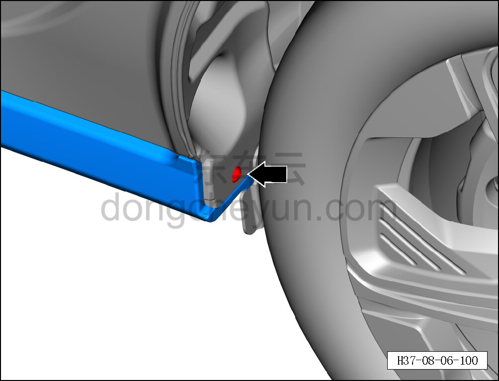
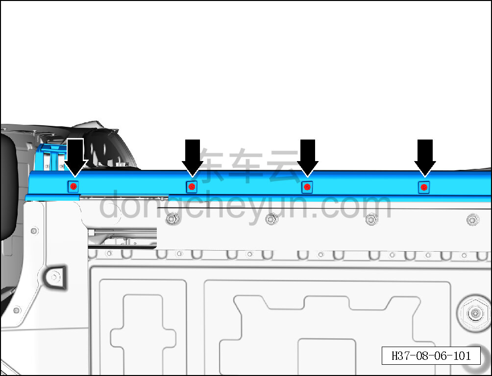
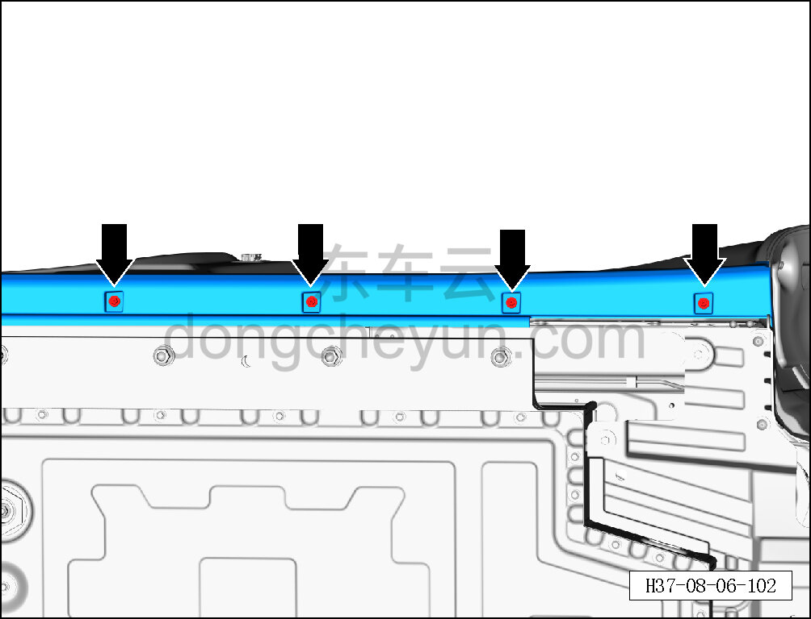
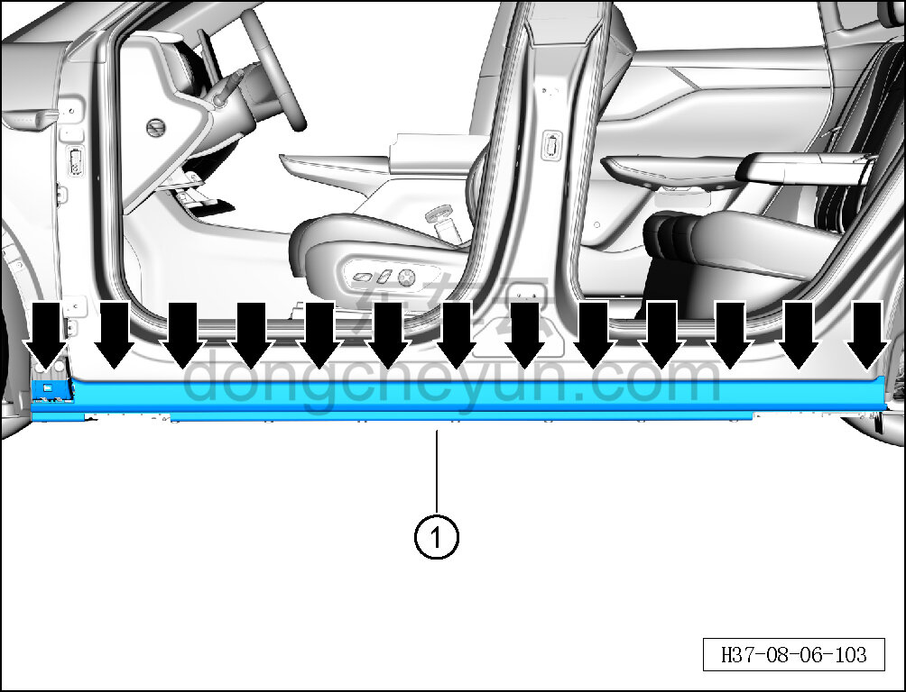
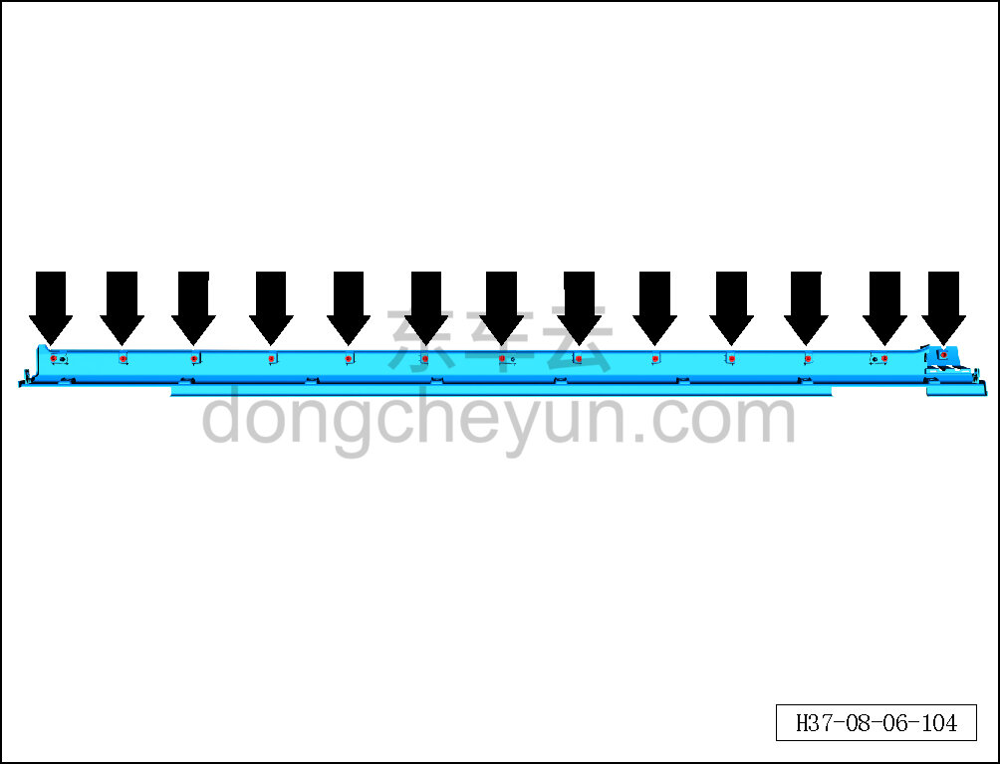

# Снятие и установка левой нижней накладки порога

> Внутренняя и внешняя отделка › Наружные элементы отделки › Система наружных декоративных элементов  
> Оригинал: `拆卸与安装左下裙板` · [dongcheyun 56746](https://dongcheyun.com/p/56746), страница `ce6f06b4243a4c41a35590a03313d0c2` · [оглавление](../README.md)

**Порядок снятия**

**Примечание:**

**- Далее описаны снятие и установка левой нижней накладки порога, для правой стороны действия аналогичны левой.**

1. Снимите левую нижнюю накладку порога.

a. С помощью съёмника обивки отсоедините участок левой передней накладки колёсной арки.

b. С помощью биты T25 выверните крепёжный винт левой нижней накладки порога.

Момент затяжки винта: 2±0.5 Н·м

c. С помощью биты T25 выверните крепёжный винт левой нижней накладки порога.

Момент затяжки винта: 2±0.5 Н·м

d. С помощью торцевой головки на 10 мм выверните 4 крепёжных винта левой нижней накладки порога.

Момент затяжки винта: 2±0.5 Н·м

e. С помощью торцевой головки на 10 мм выверните 4 крепёжных винта левой нижней накладки порога.

Момент затяжки винта: 2±0.5 Н·м

f. С помощью съёмника обивки отсоедините 13 фиксирующих клипс левой нижней накладки порога.

g. Извлеките левую нижнюю накладку порога ①.

h. Расположение фиксирующих клипс левой нижней накладки порога показано на рисунке слева.

**Порядок установки**

Установка выполняется в обратном порядке.

**Внимание:**

**-Проверьте крепёжные клипсы на отсутствие повреждений, при необходимости замените.**

**- После завершения установки проверьте, что левая нижняя накладка порога установлена ровно, без перекосов и отставаний.**
