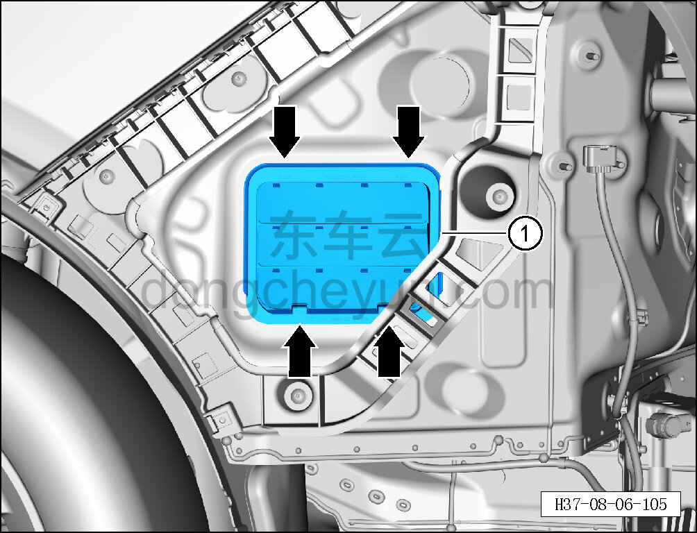
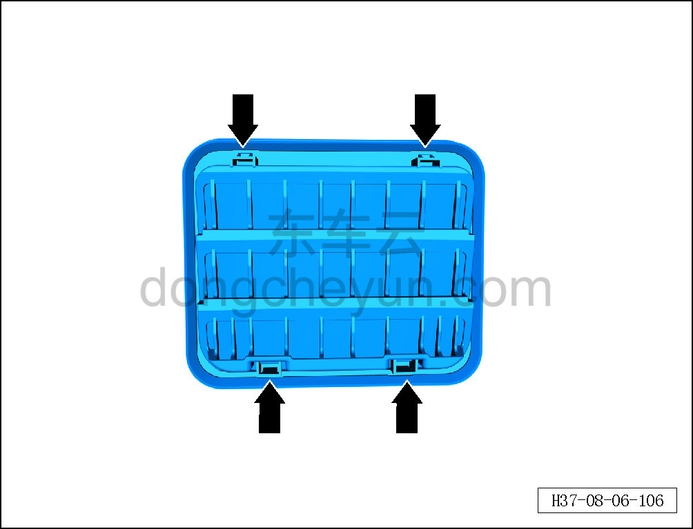

# Снятие и установка клапана сброса давления в сборе

> Внутренняя и внешняя отделка › Наружные элементы отделки › Система наружных декоративных элементов  
> Оригинал: `拆卸与安装泄压阀总成` · [dongcheyun 56746](https://dongcheyun.com/p/56746), страница `fd15f456c3994dc8b4f377bcaee11302` · [оглавление](../README.md)

**Порядок снятия**

**Примечание:**

**- Далее описаны снятие и установка левого клапана сброса давления в сборе, для правой стороны действия аналогичны левой.**

1. Выключите все электроприборы, отключите питание.

2. Выполните операцию обесточивания автомобиля для ремонта. См. [3.1.4.1 Обесточивание автомобиля](../03-техническое-обслуживание/005-обесточивание-автомобиля.md)

3. Снимите задний бампер в сборе. См. [8.6.3.26 Снятие и установка заднего бампера в сборе](186-снятие-и-установка-заднего-бампера-в-сборе.md)

4. Снимите левый клапан сброса давления в сборе.

a. С помощью съёмника обивки отсоедините 4 фиксирующие клипсы левого клапана сброса давления в сборе.

b. Снимите левый клапан сброса давления в сборе ①.

c. Расположение фиксирующих клипс левого клапана сброса давления в сборе показано на рисунке слева.

**Порядок установки**

Установка выполняется в обратном порядке.

**Внимание:**

**- Проверьте крепёжные защёлки на повреждения и при необходимости замените их.**
