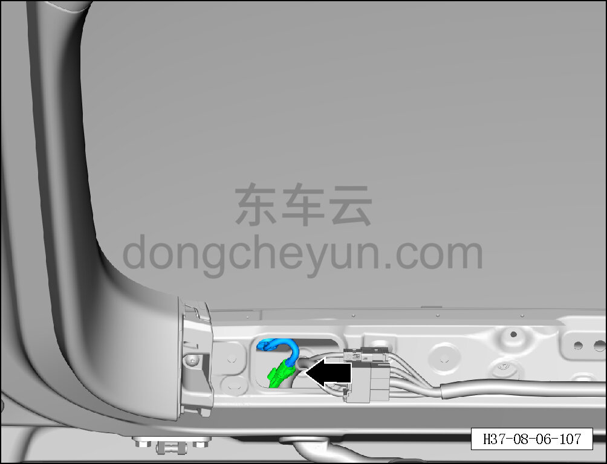
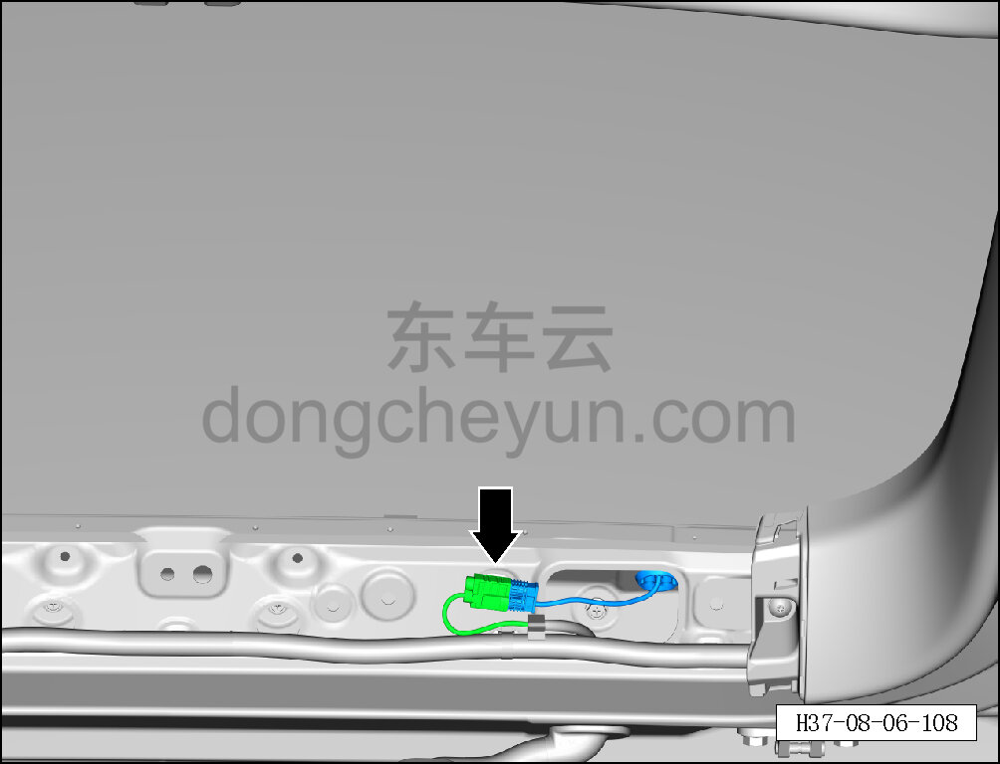
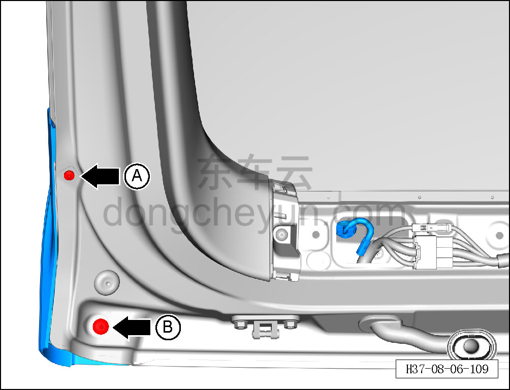
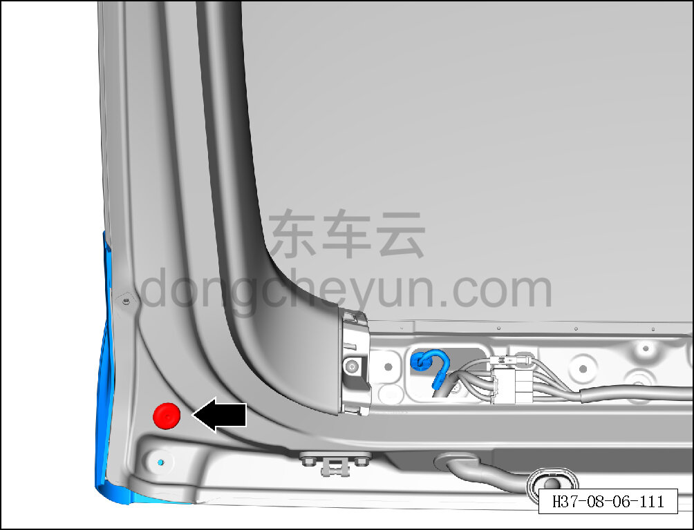
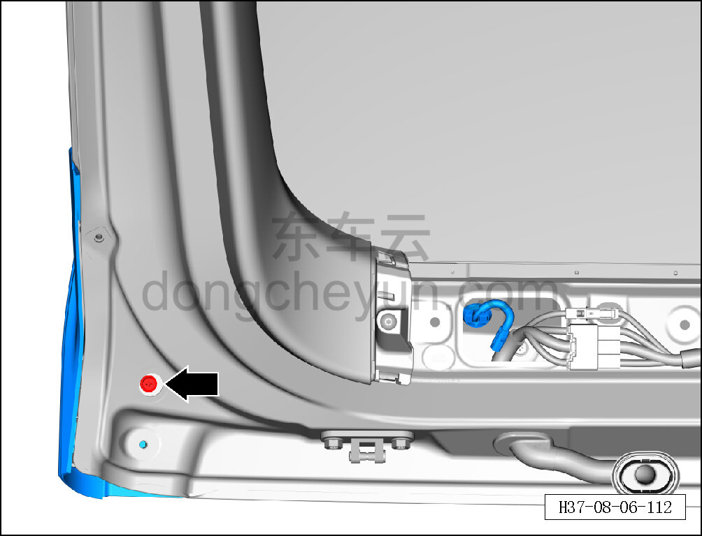
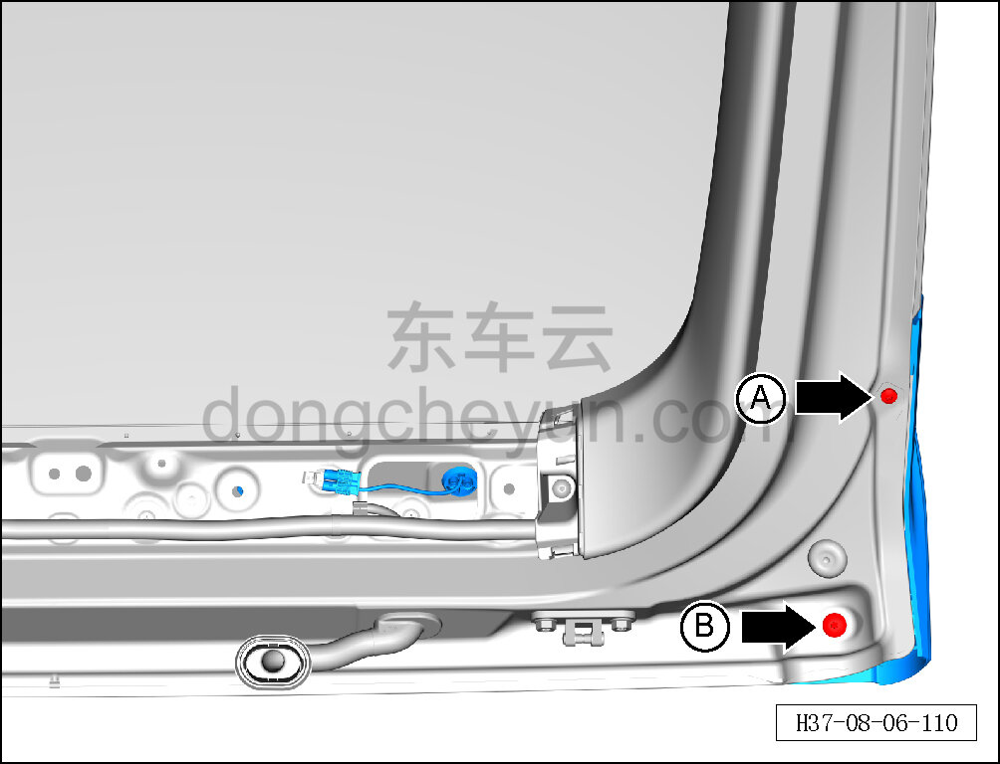
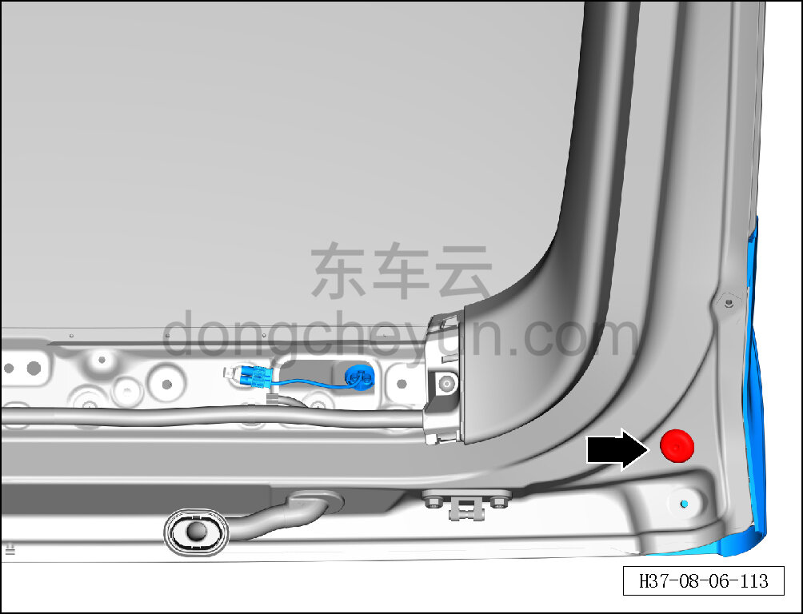
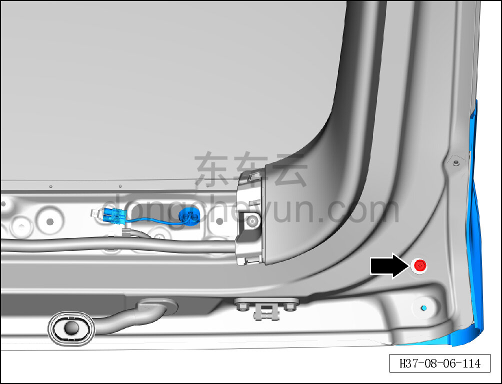
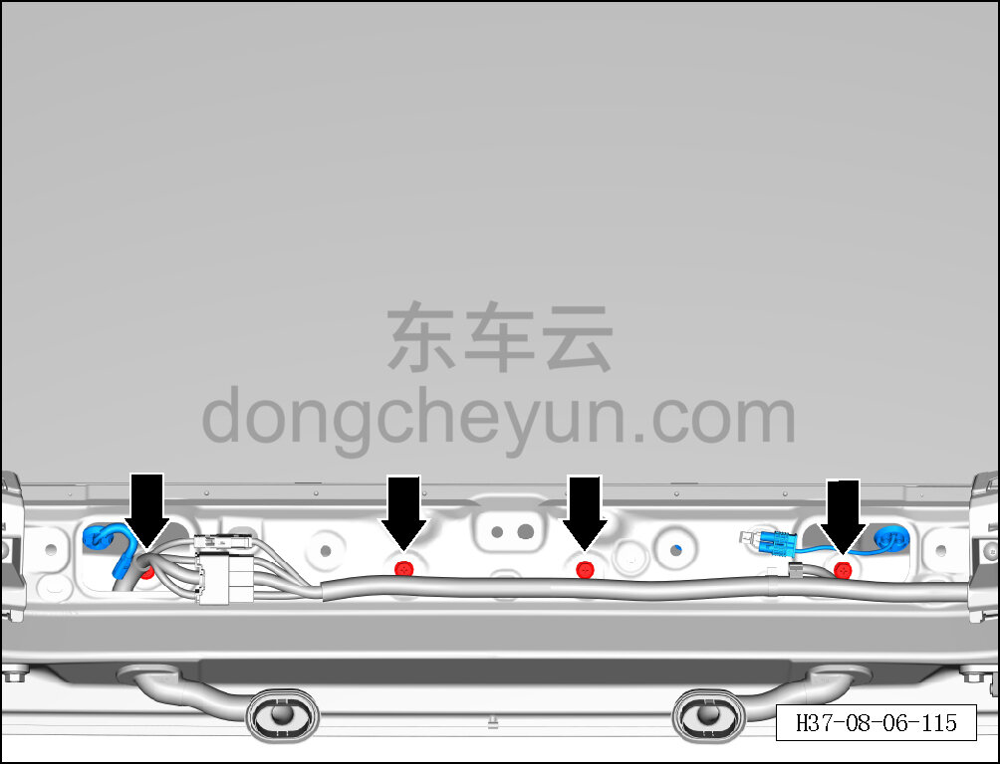
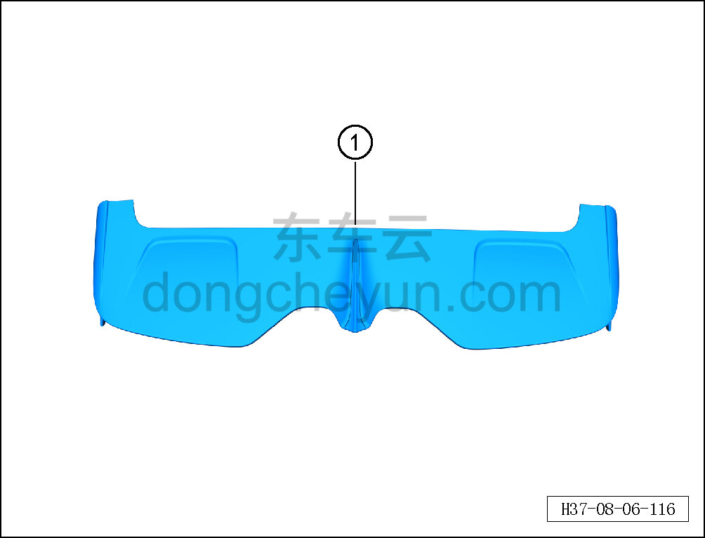

# Снятие и установка спойлера

> Внутренняя и внешняя отделка › Наружные элементы отделки › Система наружных декоративных элементов  
> Оригинал: `拆卸与安装扰流板` · [dongcheyun 56746](https://dongcheyun.com/p/56746), страница `61f89a9dc1fa45789f6cdd38512f55b9` · [оглавление](../README.md)

**Порядок снятия**

1. Выключите все электроприборы, отключите питание.

2. Выполните операцию обесточивания автомобиля для ремонта. См. [3.1.4.1 Обесточивание автомобиля](../03-техническое-обслуживание/005-обесточивание-автомобиля.md)

3. Снимите верхнюю декоративную накладку двери багажника. См. [8.4.4.1 Снятие и установка верхней декоративной накладки двери багажника](121-снятие-и-установка-верхней-накладки-двери-багажника.md)

4. Снимите спойлер.

a. Отогните фиксатор разъёма, отсоедините разъём левого жгута проводов двери багажника от жгута проводов кузова.

b. Нажав на фиксатор разъёма, отсоедините разъём правого жгута проводов двери багажника от жгута проводов кузова.

c. С помощью биты T25 выверните крепёжный винт A спойлера.

Момент затяжки винта: 4±1 Н·м

d. С помощью биты T25 выверните крепёжный винт B спойлера.

Момент затяжки винта: 4±1 Н·м

e. С помощью съёмника обивки снимите заглушку с левой стороны спойлера.

f. С помощью торцевой головки на 10 мм выверните крепёжный болт спойлера.

Момент затяжки болта: 4±1 Н·м

g. С помощью биты T25 выверните крепёжный винт A спойлера.

Момент затяжки винта: 4±1 Н·м

h. С помощью биты T25 выверните крепёжный винт B спойлера.

Момент затяжки винта: 4±1 Н·м

l. С помощью съёмника обивки снимите заглушку с правой стороны спойлера.

m. С помощью торцевой головки на 10 мм выверните крепёжный болт спойлера.

Момент затяжки болта: 4±1 Н·м

n. С помощью торцевой головки на 10 мм выверните 4 крепёжных болта спойлера.

Момент затяжки болта: 4±1 Н·м

o. Снимите спойлер ①.

**Порядок установки**

Установка выполняется в обратном порядке.

**Внимание:**

**-Проверьте крепёжные клипсы на отсутствие повреждений, при необходимости замените.**

**- После завершения установки проверьте, что спойлер установлен ровно, без перекосов и отставаний.**
