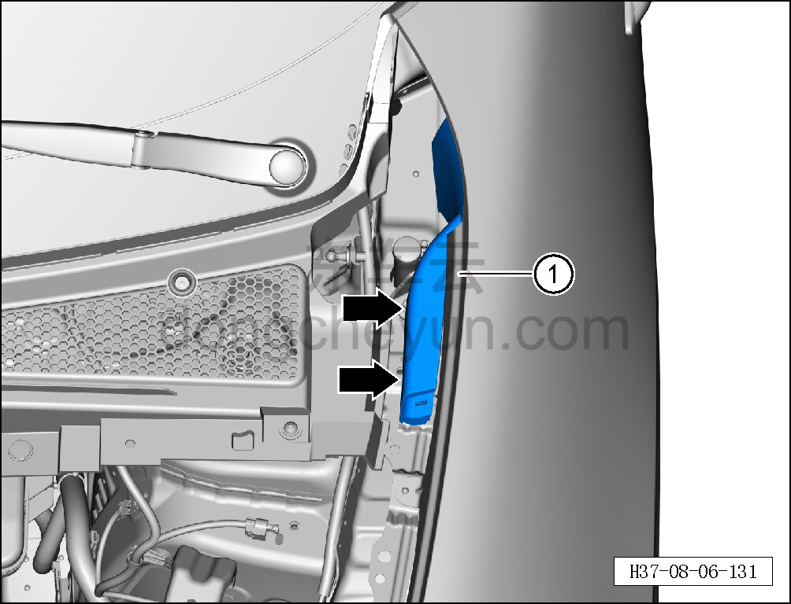
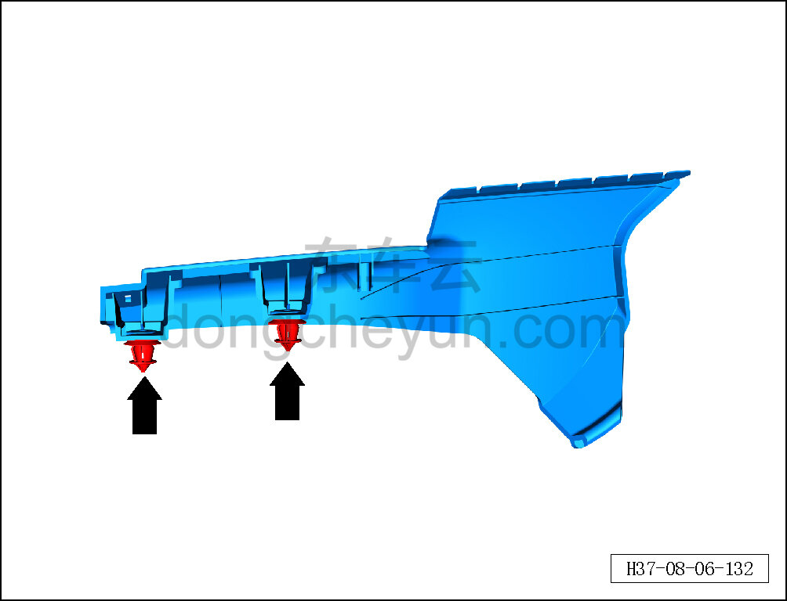

# Снятие и установка левой задней декоративной накладки моторного отсека

> Внутренняя и внешняя отделка › Наружные элементы отделки › Система наружных декоративных элементов  
> Оригинал: `拆卸与安装机舱左后装饰板` · [dongcheyun 56746](https://dongcheyun.com/p/56746), страница `802aed39d53444af9313f888b53cc2ec` · [оглавление](../README.md)

**Порядок снятия**

**Примечание:**

**- Далее описаны снятие и установка левой задней декоративной накладки моторного отсека, для правой стороны действия аналогичны левой.**

1. Снимите декоративную накладку моторного отсека. См. [8.6.6.10 Снятие и установка декоративной накладки моторного отсека](223-снятие-и-установка-декоративной-накладки-моторного.md)

2. Снимите левую заднюю декоративную накладку моторного отсека.

a. С помощью съёмника обивки отсоедините 2 фиксирующие клипсы левой задней декоративной накладки моторного отсека.

b. Извлеките левое уплотнение крышки воздухозаборника ①.

c. Расположение фиксирующих клипс левой задней декоративной накладки моторного отсека показано на рисунке слева.

**Порядок установки**

Установка выполняется в обратном порядке.

**Внимание:**

**-Проверьте крепёжные клипсы на отсутствие повреждений, при необходимости замените.**

**- После завершения установки проверьте, что задняя декоративная накладка моторного отсека установлена ровно, без перекосов и отставаний.**
