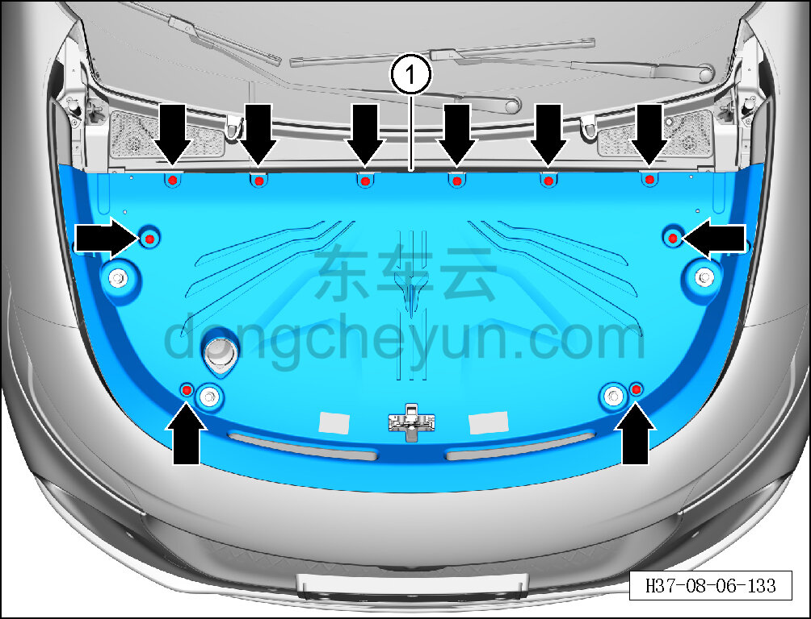

# Снятие и установка декоративной накладки моторного отсека

> Внутренняя и внешняя отделка › Наружные элементы отделки › Система наружных декоративных элементов  
> Оригинал: `拆卸与安装机舱装饰板` · [dongcheyun 56746](https://dongcheyun.com/p/56746), страница `1d4f3d2471ef49e9836052bf8aa32142` · [оглавление](../README.md)

**Порядок снятия**

1. Снимите декоративную накладку моторного отсека.

a. С помощью съёмника обивки отсоедините 10 фиксирующих клипс декоративной накладки моторного отсека.

b. Снимите декоративную накладку моторного отсека, начиная от воздуховода, движением вверх, извлеките декоративную накладку моторного отсека ①.

**Порядок установки**

Установка выполняется в обратном порядке.

**Внимание:**

**-Проверьте крепёжные клипсы на отсутствие повреждений, при необходимости замените.**

**- После завершения установки проверьте, что декоративная накладка моторного отсека установлена ровно, без перекосов и отставаний.**
