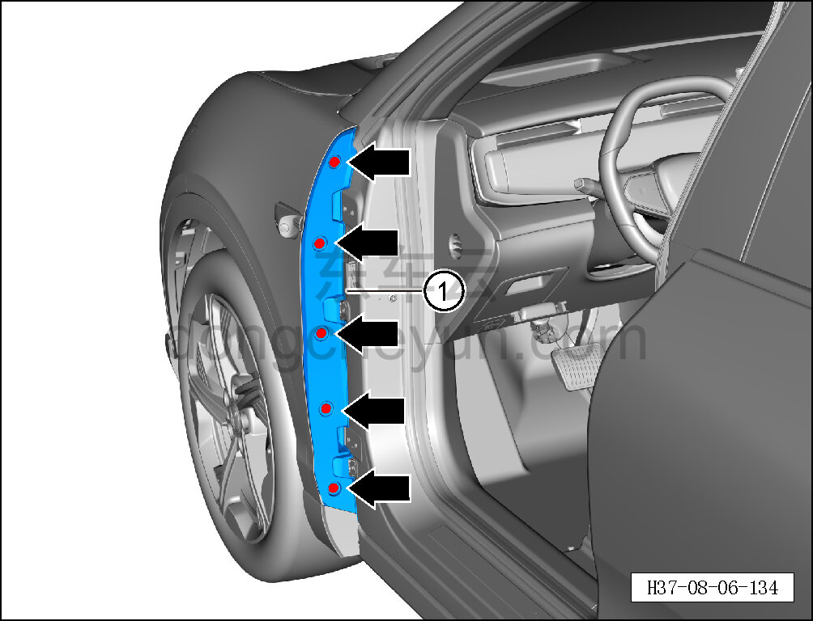

# Снятие и установка декоративной накладки левого крыла

> Внутренняя и внешняя отделка › Наружные элементы отделки › Система наружных декоративных элементов  
> Оригинал: `拆卸与安装左翼子板装饰板` · [dongcheyun 56746](https://dongcheyun.com/p/56746), страница `e4f461439957409ab8ebfd049b7e5905` · [оглавление](../README.md)

**Порядок снятия**

**Примечание:**

**- Далее описаны снятие и установка декоративной накладки левого крыла, для правой стороны действия аналогичны левой.**

1. Откройте левую переднюю дверь в сборе.

2. Снимите декоративную накладку левого крыла.

a. С помощью съёмника обивки отсоедините 5 фиксирующих клипс декоративной накладки левого крыла.

b. Извлеките декоративную накладку левого крыла ①.

**Порядок установки**

Установка выполняется в обратном порядке.

**Внимание:**

**-Проверьте крепёжные клипсы на отсутствие повреждений, при необходимости замените.**

**- После завершения установки проверьте, что декоративная накладка крыла установлена на месте.**
