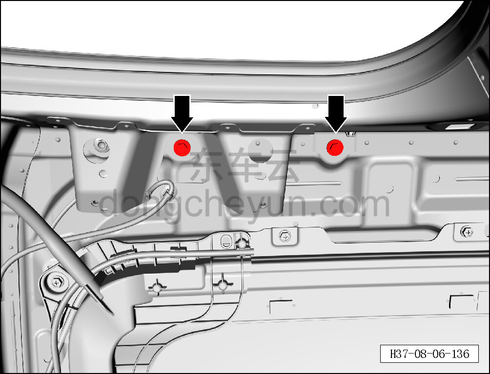
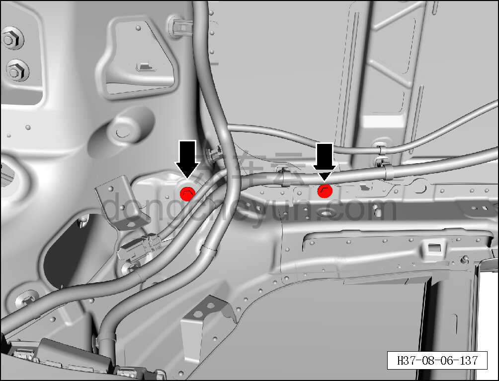
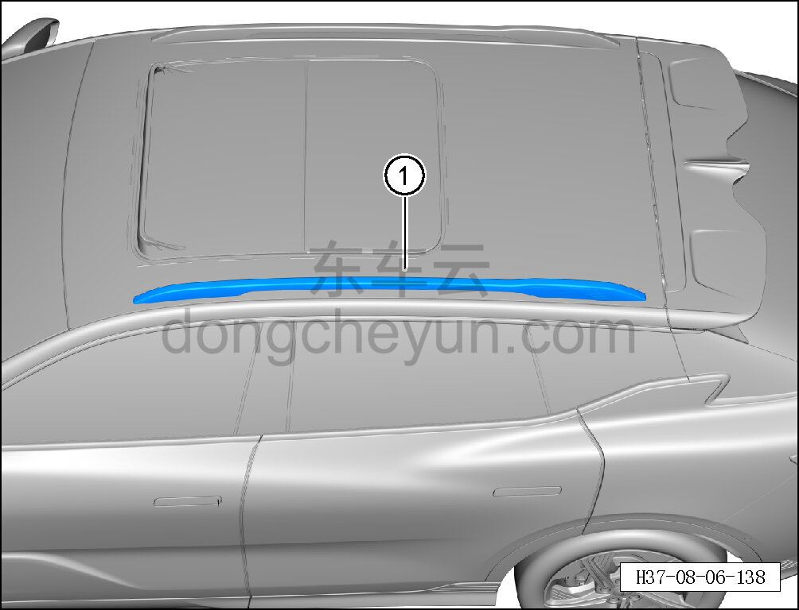

# Снятие и установка левого рейлинга крыши

> Внутренняя и внешняя отделка › Наружные элементы отделки › Система наружных декоративных элементов  
> Оригинал: `拆卸与安装左行李架` · [dongcheyun 56746](https://dongcheyun.com/p/56746), страница `43a303d5a3cb47cc96b5c103f4f161f1` · [оглавление](../README.md)

**Порядок снятия**

**Примечание:**

**- Далее описаны снятие и установка левого рейлинга крыши, для правой стороны действия аналогичны левой.**

1. Выключите все электроприборы, отключите питание.

2. Выполните операцию обесточивания автомобиля для ремонта. См. [3.1.4.1 Обесточивание автомобиля](../03-техническое-обслуживание/005-обесточивание-автомобиля.md)

3. Снимите обивку крыши. См. [8.5.6.1 Снятие и установка обивки крыши](142-снятие-и-установка-обивки-потолка.md)

4. Снимите левый рейлинг крыши.

a. С помощью торцевой головки на 10 мм выверните 2 крепёжных болта левого рейлинга крыши.

Момент затяжки болта: 9±1 Н·м

b. С помощью торцевой головки на 10 мм выверните 2 крепёжных болта левого рейлинга крыши.

Момент затяжки болта: 9±1 Н·м

c. Извлеките левый рейлинг крыши ①.

**Порядок установки**

Установка выполняется в обратном порядке.

**Внимание:**

**- Проверьте надёжность установки рейлинга крыши в сборе.**
