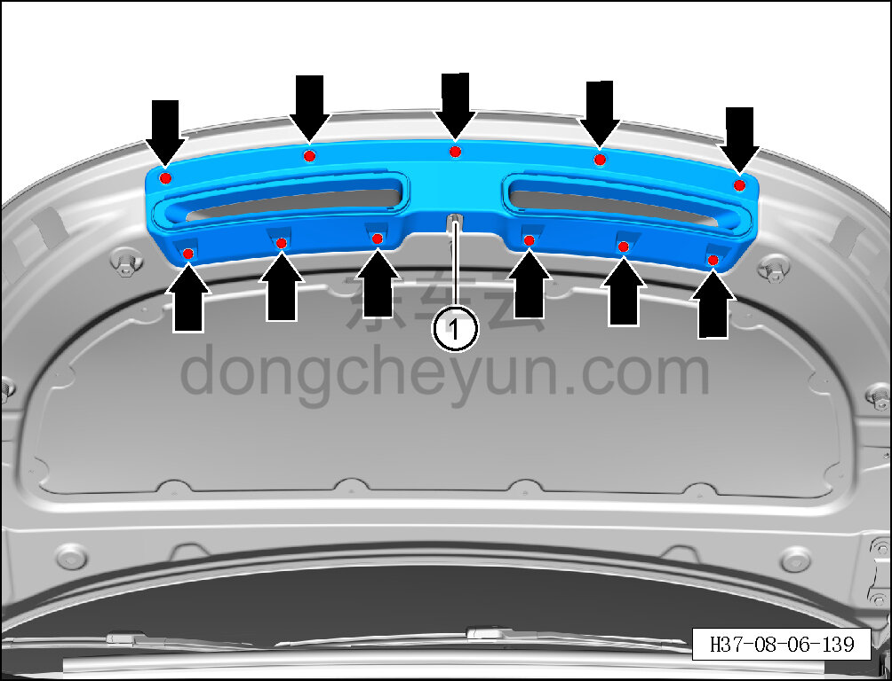

# Снятие и установка задней нижней накладки капота

> Внутренняя и внешняя отделка › Наружные элементы отделки › Система наружных декоративных элементов  
> Оригинал: `拆卸与安装发动机罩后下饰板` · [dongcheyun 56746](https://dongcheyun.com/p/56746), страница `7cfa266ad2f247b88c7161541daaa52f` · [оглавление](../README.md)

**Порядок снятия**

1. Откройте капот в сборе.

2. Снимите заднюю нижнюю накладку капота.

a. С помощью съёмника обивки отсоедините 11 фиксирующих клипс задней нижней накладки капота.

b. Извлеките заднюю нижнюю накладку капота ①.

**Порядок установки**

Установка выполняется в обратном порядке.

**Внимание:**

**- Проверьте крепёжные защёлки на повреждения и при необходимости замените их.**
