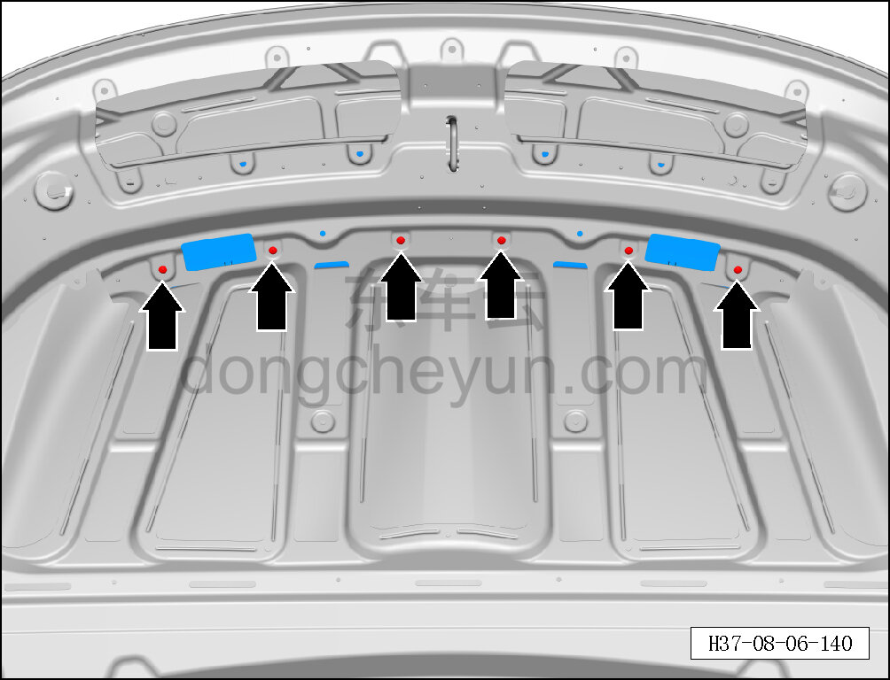
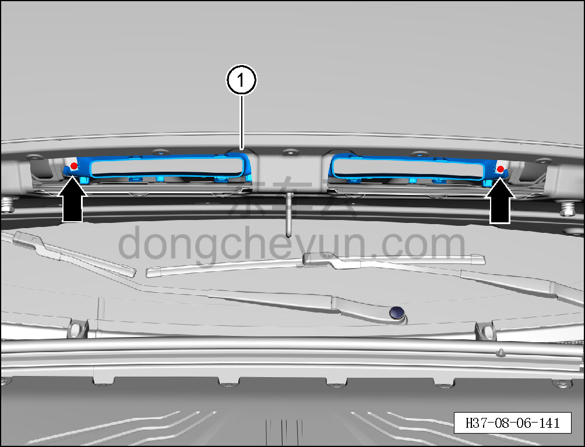

# Снятие и установка переднего воздуховода капота

> Внутренняя и внешняя отделка › Наружные элементы отделки › Система наружных декоративных элементов  
> Оригинал: `拆卸与安装发动机罩前段风道` · [dongcheyun 56746](https://dongcheyun.com/p/56746), страница `2f06585659824409b7174030d90b48c2` · [оглавление](../README.md)

**Порядок снятия**

1. Снимите заднюю нижнюю накладку капота. См. [8.6.6.13 Снятие и установка задней нижней накладки капота](226-снятие-и-установка-задней-нижней-накладки-капота.md)

4. Снимите звукоизоляционную прокладку капота. См. [8.5.10.1 Снятие и установка звукоизоляционной прокладки капота](154-снятие-и-установка-шумоизоляционной-накладки-капота.md)

5. Снимите передний воздуховод капота.

a. С помощью крестовой отвёртки выверните 6 крепёжных винтов переднего воздуховода капота.

Момент затяжки винта: 1.5±0.5 Н·м

b. С помощью крестовой отвёртки выверните 2 крепёжных винта переднего воздуховода капота.

Момент затяжки винта: 1.5±0.5 Н·м

c. Извлеките передний воздуховод капота ①.

**Порядок установки**

Установка выполняется в обратном порядке.

**Внимание:**

**- Проверьте крепёжные защёлки на повреждения и при необходимости замените их.**
