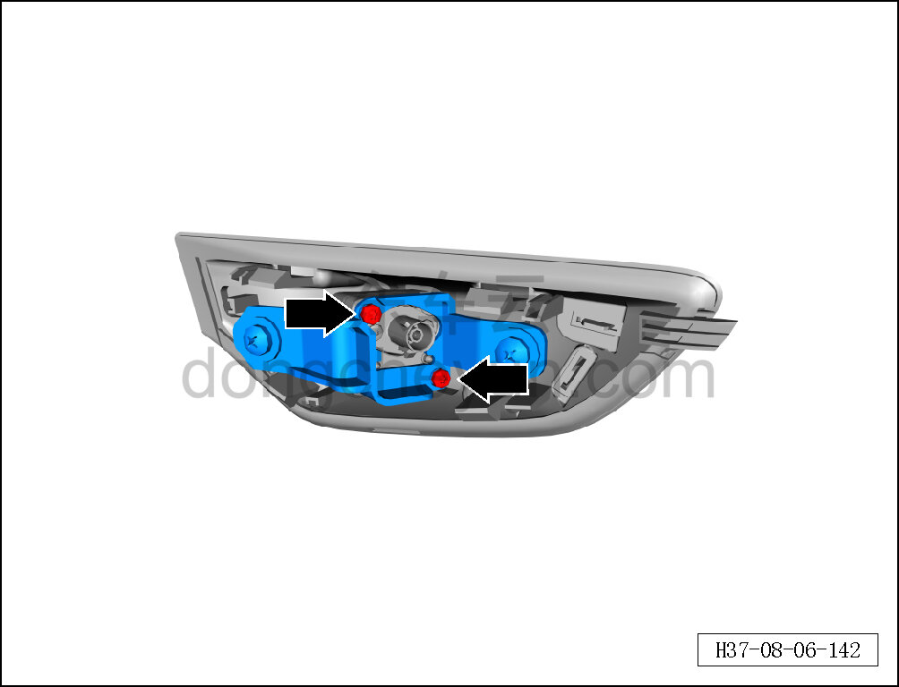
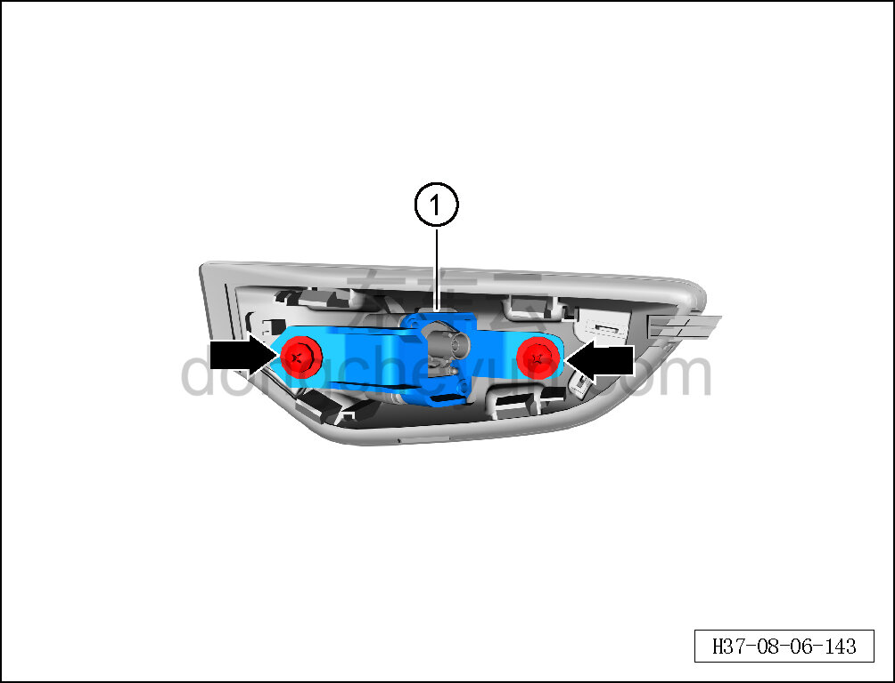

# Снятие и установка кронштейна камеры левого крыла

> Внутренняя и внешняя отделка › Наружные элементы отделки › Система наружных декоративных элементов  
> Оригинал: `拆卸与安装左翼子板摄像头支架` · [dongcheyun 56746](https://dongcheyun.com/p/56746), страница `92b5a3ab24a44b17865c223128cc2d0a` · [оглавление](../README.md)

**Порядок снятия**

**Примечание:**

**- Далее описаны снятие и установка кронштейна камеры левого крыла, для правой стороны действия аналогичны левой.**

1. Выключите все электроприборы, отключите питание.

2. Выполните операцию обесточивания автомобиля для ремонта. См. [3.1.4.1 Обесточивание автомобиля](../03-техническое-обслуживание/005-обесточивание-автомобиля.md)

3. Отсоедините защитную накладку камеры левого крыла от левого крыла. См. [8.6.6.16 Снятие и установка защитной накладки камеры левого крыла](229-снятие-и-установка-защитной-накладки-камеры-левого.md)

4. Снимите кронштейн камеры левого крыла.

a. С помощью биты T25 выверните 2 крепёжных винта левой задней камеры бокового обзора.

Момент затяжки винта: 0,5±0,1 Н·м

b. С помощью крестовой отвёртки выверните 2 крепёжных винта кронштейна камеры левого крыла.

Момент затяжки винта: 1±0,5 Н·м

c. Извлеките кронштейн камеры левого крыла ①.

**Порядок установки**

Установка выполняется в обратном порядке.

**Внимание:**

**- После завершения установки проверьте и убедитесь, что камера работает нормально, с помощью диагностического сканера проверьте наличие кодов неисправностей; если они есть, найдите причину, устраните коды неисправностей и выполните повторную калибровку.**
