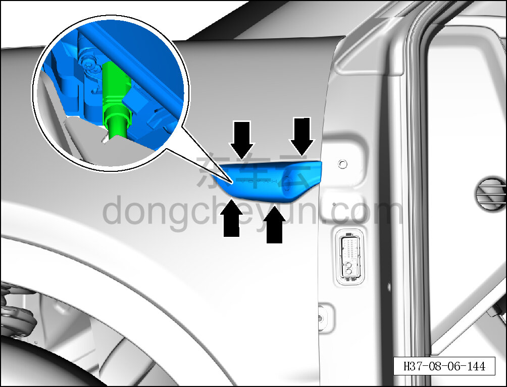
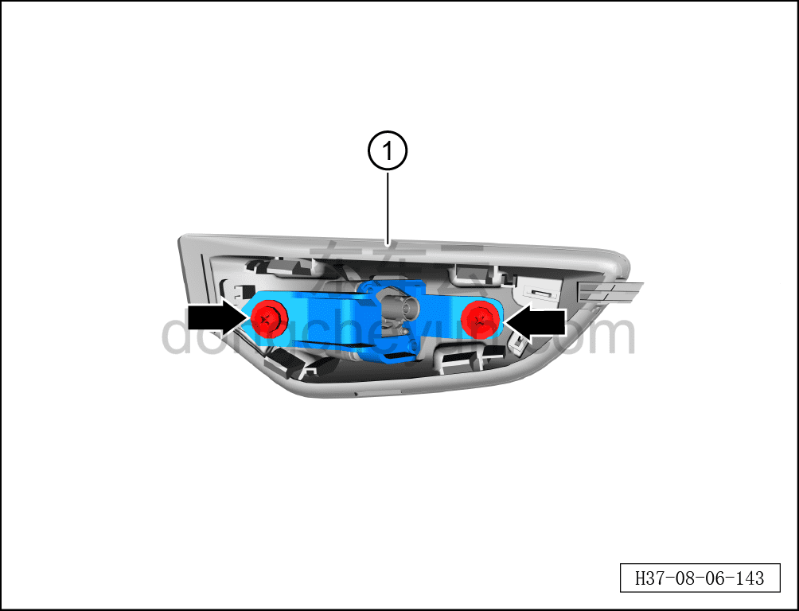

# Снятие и установка защитной накладки камеры левого крыла

> Внутренняя и внешняя отделка › Наружные элементы отделки › Система наружных декоративных элементов  
> Оригинал: `拆卸与安装左翼子板摄像头防护板` · [dongcheyun 56746](https://dongcheyun.com/p/56746), страница `326f8aa888bc40d09d41dbfc4797d599` · [оглавление](../README.md)

**Порядок снятия**

**Примечание:**

**- Далее описаны снятие и установка защитной накладки камеры левого крыла, для правой стороны действия аналогичны левой.**

1. Выключите все электроприборы, отключите питание.

2. Выполните операцию обесточивания автомобиля для ремонта. См. [3.1.4.1 Обесточивание автомобиля](../03-техническое-обслуживание/005-обесточивание-автомобиля.md)

3. Снимите защитную накладку камеры левого крыла.

a. С помощью съёмника обивки отсоедините 4 фиксирующие клипсы защитной накладки камеры левого крыла.

b. Нажав на фиксатор разъёма, отсоедините разъём левой задней камеры бокового обзора.

**Внимание:**

**- При отжиме защитной накладки инструментом для снятия обивки можно подложить под инструмент нетканый материал, чтобы избежать повреждения окружающих внешних декоративных элементов в процессе снятия.**

c. С помощью крестовой отвёртки выверните 2 крепёжных винта кронштейна камеры левого крыла.

Момент затяжки винта: 1±0,5 Н·м

d. Извлеките защитную накладку камеры левого крыла ①.

**Порядок установки**

Установка выполняется в обратном порядке.

**Внимание:**

**- После завершения установки проверьте и убедитесь, что камера работает нормально, с помощью диагностического сканера проверьте наличие кодов неисправностей; если они есть, найдите причину, устраните коды неисправностей и выполните повторную калибровку.**
