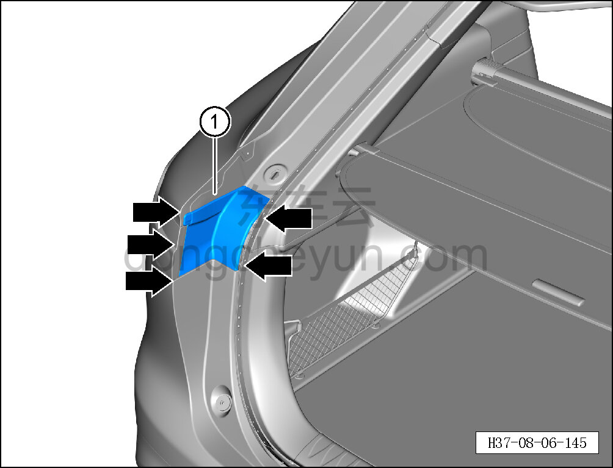
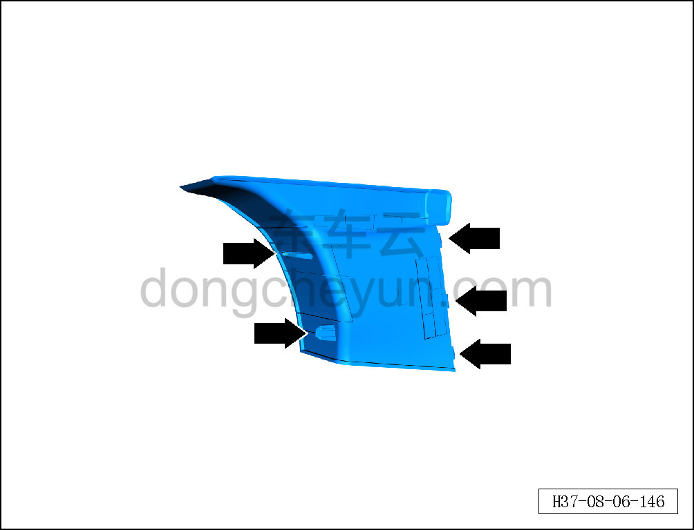

# Снятие и установка неподвижной боковой панели левого заднего комбинированного фонаря

> Внутренняя и внешняя отделка › Наружные элементы отделки › Система наружных декоративных элементов  
> Оригинал: `拆卸与安装左后组合灯固定侧侧板` · [dongcheyun 56746](https://dongcheyun.com/p/56746), страница `49979d77392843f88052200a2186e1f3` · [оглавление](../README.md)

**Порядок снятия**

**Примечание:**

**- Далее описаны снятие и установка неподвижной боковой панели левого заднего комбинированного фонаря, для правой стороны действия аналогичны левой.**

1. Снимите неподвижную боковую панель левого заднего комбинированного фонаря.

a. С помощью съёмника обивки отсоедините 5 фиксирующих клипс неподвижной боковой панели левого заднего комбинированного фонаря.

b. Извлеките неподвижную боковую панель левого заднего комбинированного фонаря ①.

c. Расположение фиксирующих клипс неподвижной боковой панели левого заднего комбинированного фонаря показано на рисунке слева.

**Порядок установки**

Установка выполняется в обратном порядке.

**Внимание:**

**- Проверьте крепёжные защёлки на повреждения и при необходимости замените их.**
