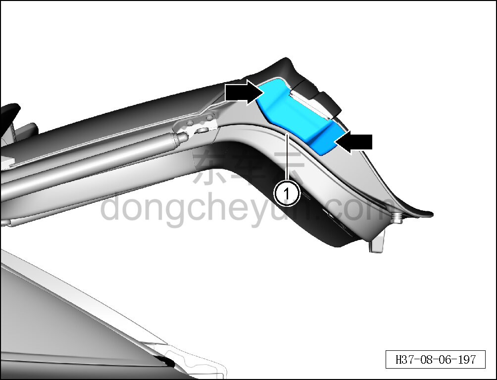
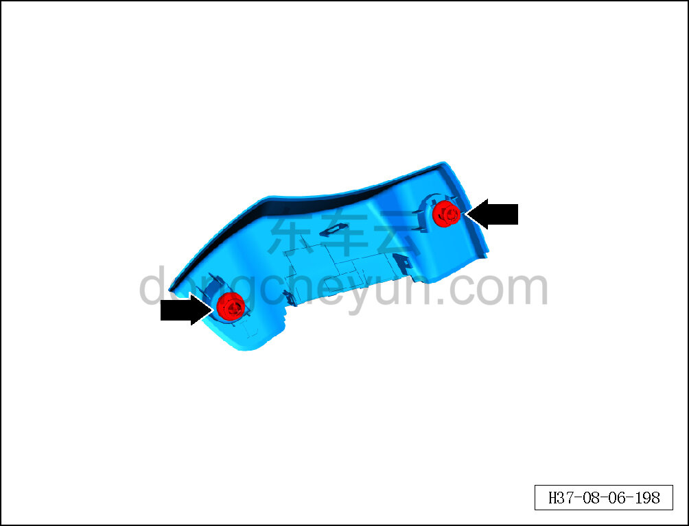

# Снятие и установка подвижной боковой панели левого заднего комбинированного фонаря

> Внутренняя и внешняя отделка › Наружные элементы отделки › Система наружных декоративных элементов  
> Оригинал: `拆卸与安装左后组合灯移动侧侧板` · [dongcheyun 56746](https://dongcheyun.com/p/56746), страница `db585a86d9104207a05719d3ddd45725` · [оглавление](../README.md)

**Порядок снятия**

**Примечание:**

**- Далее описаны снятие и установка подвижной боковой панели левого заднего комбинированного фонаря, для правой стороны действия аналогичны левой.**

1. Снимите подвижную боковую панель левого заднего комбинированного фонаря.

a. С помощью съёмника обивки отсоедините 2 фиксирующие клипсы подвижной боковой панели левого заднего комбинированного фонаря.

b. Извлеките подвижную боковую панель левого заднего комбинированного фонаря ①.

c. Расположение фиксирующих клипс подвижной боковой панели левого заднего комбинированного фонаря показано на рисунке слева.

**Порядок установки**

Установка выполняется в обратном порядке.

**Внимание:**

**- Проверьте крепёжные защёлки на повреждения и при необходимости замените их.**
